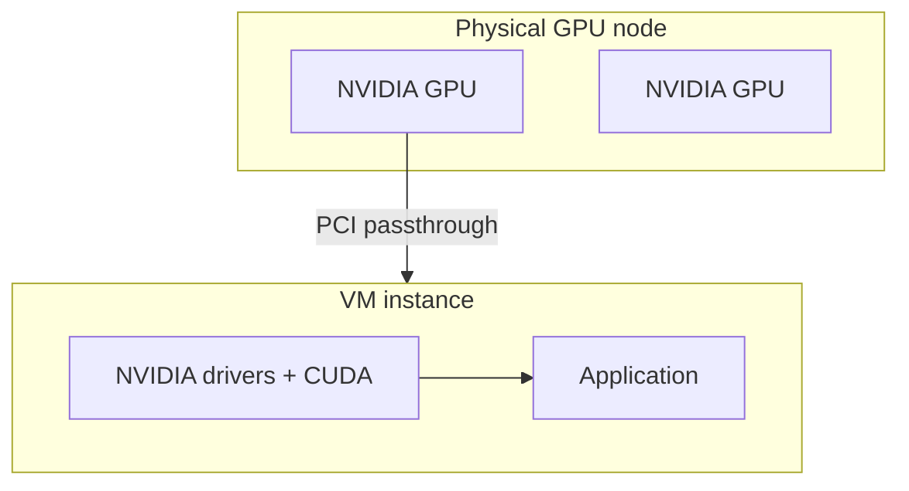
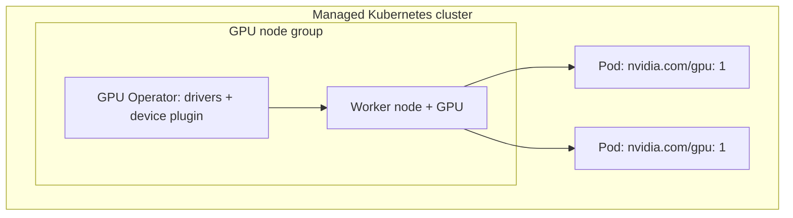

import NavigationFooter from '@site/src/components/NavigationFooter';

# GPUs on Hikube

Hikube offers **NVIDIA** accelerators attached in passthrough mode, for two types of workloads: **virtual machines** and **Kubernetes cluster nodes**. There is no GPU page in the console: you choose the GPU in the wizard of the resource that uses it.

---

## Usage modes

### GPU on a virtual machine

The physical GPU is assigned to the VM through PCI passthrough: the VM has exclusive access to it and native performance.

- Chosen in the **Create an Instance** wizard, **Configuration** step, **Hardware Acceleration (GPU)** section.
- One or more GPUs per VM, of one or more models.
- The NVIDIA drivers are installed in the VM's OS (see [Install CUDA](../compute/how-to/install-cuda-drivers.md)).

**Use cases:** CUDA development environments, applications requiring full control of the GPU, graphics rendering, specialized workloads.

### GPU on Kubernetes

GPUs are attached to the nodes of a cluster **node group**, then assigned to pods through `resources.limits`.

- Chosen in the **Create cluster** wizard (or **Edit**), **Nodes** step, **GPU** section of the node group.
- The **GPU Operator** addon is enabled automatically as soon as a group has GPUs; it installs the drivers and the device plugin.
- The **HAMi** addon lets several pods share the same GPU.

**Use cases:** containerized AI/ML, inference at scale, parallel jobs.

---

## Available models

| Model (console label) | Memory | Architecture | Typical use |
|-----------------------|--------|--------------|-------------|
| **NVIDIA L40S** | 48 GB | Ada Lovelace | Inference, generative AI, real-time rendering, prototyping |
| **NVIDIA A100 80GB** | 80 GB | Ampere | ML training, fine-tuning, scientific computing |
| **NVIDIA H100 80GB** | 80 GB | Hopper | Training and inference of large models |
| **NVIDIA RTX 6000 Pro** | 96 GB | Blackwell | LLM, intensive computing |

Each card in the selector shows the model name and its memory (for example **48 GB VRAM**). A model with no free unit left is greyed out and marked **Unavailable**.

:::note Availability
The console only shows whether a model is available or not, without displaying the number of free units. GPUs are resources shared between the platform's customers: a released GPU (stopped VM, deleted node) can be assigned to another workload. For a specific GPU capacity requirement, contact [sales@hidora.io](mailto:sales@hidora.io).
:::

---

## Architecture

### GPU on VM

```mermaid
flowchart TD
    subgraph NODE["Physical GPU node"]
        GPU1["NVIDIA GPU"]
        GPU2["NVIDIA GPU"]
    end

    subgraph VM1["VM instance"]
        DRV["NVIDIA drivers + CUDA"]
        APP1["Application"]
    end

    GPU1 -->|PCI passthrough| VM1
    DRV --> APP1
```

A VM runs on a single physical node: all the GPUs requested for a VM must be available **on the same node**.

### GPU on Kubernetes

```mermaid
flowchart TD
    subgraph CLUSTER["Managed Kubernetes cluster"]
        subgraph NG["GPU node group"]
            W1["Worker node + GPU"]
            OP["GPU Operator: drivers + device plugin"]
        end
        POD1["Pod: nvidia.com/gpu: 1"]
        POD2["Pod: nvidia.com/gpu: 1"]
    end

    OP --> W1
    W1 --> POD1
    W1 --> POD2
```

---

## Comparison

| Aspect | GPU on VM | GPU on Kubernetes |
|--------|-----------|-------------------|
| **Isolation** | GPU dedicated to the VM | GPU assigned to pods by the scheduler |
| **Performance** | Native (passthrough) | Native (device plugin) |
| **Drivers** | To be installed in the OS | Installed by the GPU Operator |
| **Scaling** | Vertical (edit the VM) | Horizontal (number of nodes in the group) |
| **GPU sharing** | No | Yes, with the HAMi addon |
| **Modification** | Add, remove or change GPUs (restart) | An existing group keeps at least one GPU; a group without GPUs cannot receive any |

---

## Billing and quotas

The cost estimate shown in the VM and Kubernetes wizards includes the selected GPUs. A VM's GPU is released when the VM is stopped.

---

## Next steps

- [Quick start: a VM with a GPU](./quick-start.md)
- [Provision a GPU on Kubernetes](./how-to/provision-gpu-kubernetes.md)
- [Concepts](./concepts.md)

<NavigationFooter
  nextSteps={[
    {label: "Concepts", href: "../concepts"},
    {label: "Quick start", href: "../quick-start"},
  ]}
  seeAlso={[
    {label: "Compute resources", href: "../../compute/"},
  ]}
/>
