# Managed Kubernetes on Hikube

Hikube offers managed Kubernetes clusters where the control plane is managed by the platform and worker nodes are virtual machines in your tenant.

---

## Architecture

### **Components**

- **Control plane** : Managed by Hikube (API Server, etcd, Scheduler, Controller Manager)
- **Worker nodes** : Virtual machines in your tenant
- **Storage** : Persistent volumes with `replicated` storage class
- **Network** : CNI with LoadBalancer and Ingress support

### **Multi-Datacenter**

Hikube clusters are deployed across 3 Swiss datacenters with automatic replication:

```mermaid
flowchart TD
    subgraph DC1["🏢 Geneva"]
        CP1["Control Plane 1"]
        ETCD1["etcd Cluster"]
        PVC1["PVC Replicas"]
        WN1["Worker Nodes"]
    end
    
    subgraph DC2["🏢 Lucerne"]
        CP2["Control Plane 2"]
        ETCD2["etcd Cluster"]
        PVC2["PVC Replicas"]
        WN2["Worker Nodes"]
    end
    
    subgraph DC3["🏢 Gland"]
        CP3["Control Plane 3"]
        ETCD3["etcd Cluster"]
        PVC3["PVC Replicas"]
        WN3["Worker Nodes"]
    end
    
    ETCD1 <-.-> ETCD2
    ETCD2 <-.-> ETCD3
    ETCD3 <-.-> ETCD1
    
    PVC1 <-.-> PVC2
    PVC2 <-.-> PVC3
    PVC3 <-.-> PVC1
    
    style DC1 fill:#e3f2fd
    style DC2 fill:#f3e5f5
    style DC3 fill:#e8f5e8
```



---

## ⚙️ Features

### **Node Groups**

- **Flexible instance types** : S1 (standard), U1 (universal), M1 (memory-optimized)
- **Automatic scaling** : Configurable `minReplicas` and `maxReplicas`
- **GPU support** : NVIDIA GPU attachment to workers
- **Specialized roles** : `ingress-nginx`, `monitoring`, etc.

### **Persistent Storage**

- **Storage class** : `replicated` (replication across 3 datacenters)
- **Dynamic provisioning** : Automatic volume creation
- **High availability** : PVCs automatically replicated across the 3 sites

### **Network and Exposure**

- **LoadBalancer services** : Automatic external exposure via dedicated IP
- **Ingress Controller** : Integrated NGINX with automatic certificates
- **Network Policies** : Traffic micro-segmentation

---

## 🔧 Available Add-ons

### **Cert-Manager**

- Automated SSL/TLS certificate management
- Let's Encrypt and other CA support
- Automatic renewal

### **Ingress NGINX**

- High-performance ingress controller
- Wildcard and SNI support
- Integrated Prometheus metrics

### **Flux CD**

- GitOps deployment
- Synchronization with Git repositories
- Automatic rollback

### **Monitoring Agents**

- FluentBit for logs
- Node Exporter for metrics
- Integration with tenant monitoring stack

---

## 📋 Use Cases

### **Web Applications**

```yaml
nodeGroups:
  web:
    minReplicas: 2
    maxReplicas: 10
    instanceType: "s1.large"
    roles: ["ingress-nginx"]
```

### **ML/AI Workloads**

```yaml
nodeGroups:
  ml:
    minReplicas: 1
    maxReplicas: 5
    instanceType: "u1.xlarge"
    gpus:
      - name: "nvidia.com/AD102GL_L40S"
```

### **Critical Applications**

```yaml
nodeGroups:
  production:
    minReplicas: 3
    maxReplicas: 20
    instanceType: "m1.large"
```

---

## 🚀 Next Steps

- **[Quick Start](./quick-start.md)** → Create your first cluster
- **[API Reference](./api-reference.md)** → Complete cluster configuration
- **[GPU](../gpu/overview.md)** → Use GPUs with Kubernetes

---

## 💡 Key Points

- **Managed control plane** : No master maintenance
- **Workers in your tenant** : Complete node control
- **Automatic scaling** : Adjustment based on demand
- **Multi-datacenter** : Native high availability
- **Standard Kubernetes API** : Full compatibility

