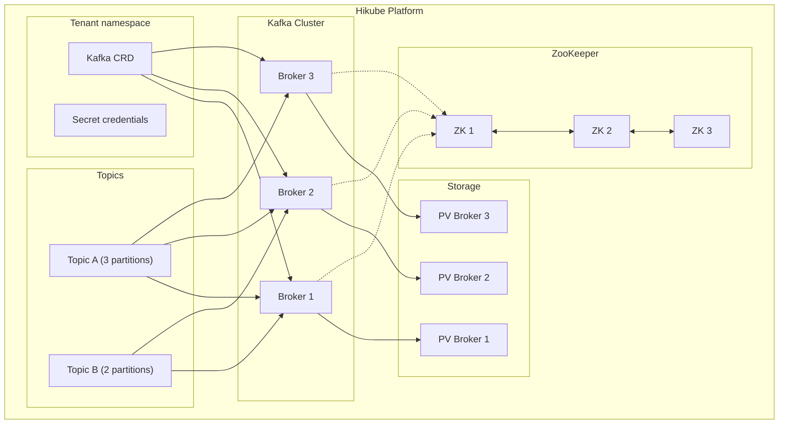
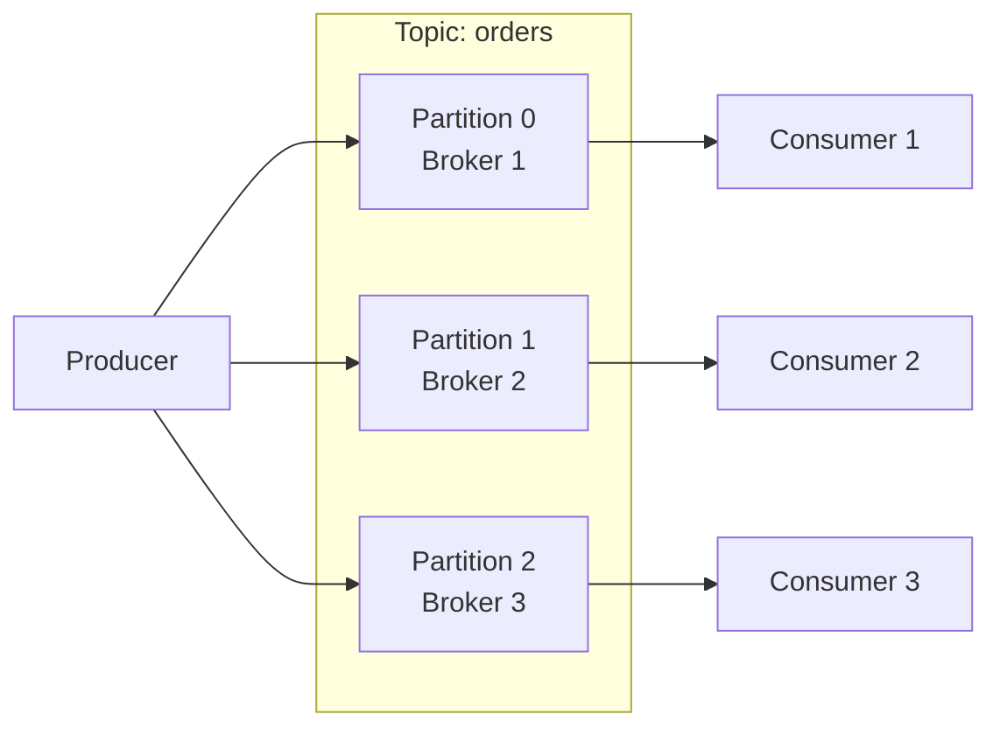

# Concepts — Kafka

## Architecture

Kafka on Hikube is a managed distributed streaming service. Each instance deployed via the `Kafka` resource creates a cluster of **brokers** coordinated by **ZooKeeper**, capable of handling millions of messages per second with guaranteed persistence.

---

## Terminology

| Term | Description |
|------|-------------|
| **Kafka** | Kubernetes resource (`apps.cozystack.io/v1alpha1`) representing a managed Kafka cluster. |
| **Broker** | Kafka instance that stores messages and serves producers/consumers. |
| **ZooKeeper** | Distributed coordination service that manages cluster metadata, leader election, and topic configuration. |
| **Topic** | Named message channel. Producers write to a topic, consumers read from a topic. |
| **Partition** | Subdivision of a topic. Each partition is an ordered log of messages, distributed on a broker. |
| **Replication Factor** | Number of copies of each partition across different brokers. |
| **Consumer Group** | Group of consumers that share the partitions of a topic for parallel processing. |
| **Retention** | Maximum duration or size for message retention in a topic. |
| **resourcesPreset** | Predefined resource profile (nano to 2xlarge). |

---

## Topics and partitions

### How it works

A **topic** is divided into **partitions**, each distributed on a different broker:

- More partitions = more parallelism
- Each partition has a **leader** (a broker) and **followers** (replicas)
- The `replicationFactor` determines the number of copies of each partition

### Topic configuration

Topics are declared directly in the Kafka manifest:

| Parameter | Description |
|-----------|-------------|
| `topics[name].partitions` | Number of partitions for the topic |
| `topics[name].config.replicationFactor` | Number of replicas per partition |
| `topics[name].config.retentionMs` | Retention duration in ms (e.g., `604800000` = 7 days) |
| `topics[name].config.cleanupPolicy` | `delete` (deletion by TTL) or `compact` (keep the last message per key) |

---

## ZooKeeper

ZooKeeper handles Kafka cluster coordination:

- **Leader election** for each partition
- **Metadata storage** (topics, partitions, offsets)
- **Failure detection** of brokers

:::tip
Always configure an odd number of ZooKeeper instances (`zookeeper.replicas: 3`) to guarantee quorum.
:::

ZooKeeper resources are configured independently from brokers via `zookeeper.resources` or `zookeeper.resourcesPreset`.

---

## Resource presets

Presets apply separately to **Kafka brokers** and **ZooKeeper**:

| Preset | CPU | Memory |
|--------|-----|--------|
| `nano` | 250m | 128Mi |
| `micro` | 500m | 256Mi |
| `small` | 1 | 512Mi |
| `medium` | 1 | 1Gi |
| `large` | 2 | 2Gi |
| `xlarge` | 4 | 4Gi |
| `2xlarge` | 8 | 8Gi |

---

## Limits and quotas

| Parameter | Value |
|-----------|-------|
| Max Kafka brokers | Depending on tenant quota |
| ZooKeeper instances | 3 recommended (odd number) |
| Topics per cluster | Unlimited (depending on resources) |
| Partitions per topic | Configurable |
| Storage size | Variable (`kafka.size`, `zookeeper.size`) |

---

## Further reading

- [Overview](./overview.md): service presentation
- [API Reference](./api-reference.md): all parameters of the Kafka resource
