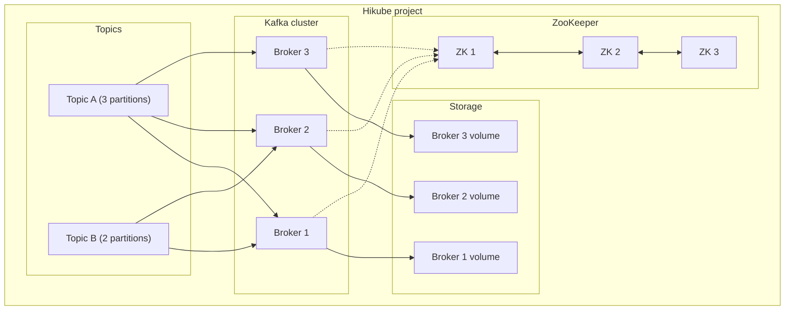
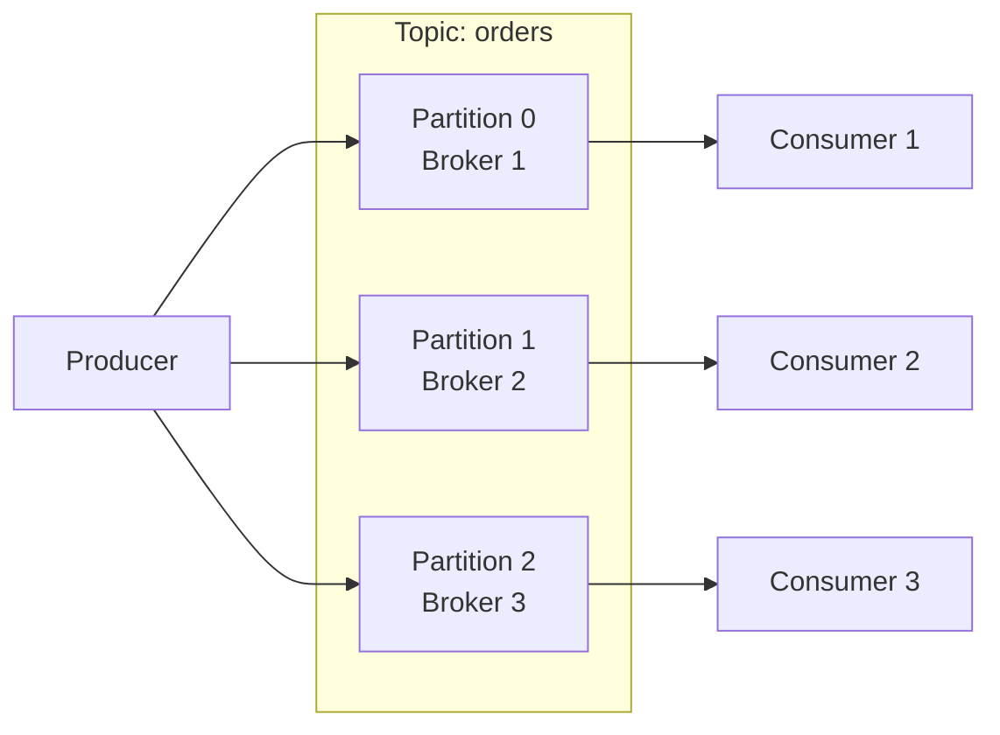

# Concepts — Kafka

:::info Availability
Kafka is not yet available as self-service in the [Hikube console](https://console.hikube.cloud).
To provision an instance or change its configuration, [contact support](mailto:support@hidora.io).
:::

## Architecture

Kafka on Hikube is a managed distributed streaming service. Each instance is a cluster of **brokers** coordinated by **ZooKeeper**, attached to a Hikube project, with persistent storage for each broker.

```mermaid
graph TB
    subgraph "Hikube project"
        subgraph "Kafka cluster"
            B1[Broker 1]
            B2[Broker 2]
            B3[Broker 3]
        end

        subgraph "ZooKeeper"
            Z1[ZK 1]
            Z2[ZK 2]
            Z3[ZK 3]
        end

        subgraph "Topics"
            T1["Topic A (3 partitions)"]
            T2["Topic B (2 partitions)"]
        end

        subgraph "Storage"
            PV1[Broker 1 volume]
            PV2[Broker 2 volume]
            PV3[Broker 3 volume]
        end
    end

    B1 --> PV1
    B2 --> PV2
    B3 --> PV3
    Z1 <--> Z2
    Z2 <--> Z3
    B1 -.-> Z1
    B2 -.-> Z1
    B3 -.-> Z1
    T1 --> B1
    T1 --> B2
    T1 --> B3
    T2 --> B1
    T2 --> B2
```

---

## Terminology

| Term | Description |
|------|-------------|
| **Kafka (instance)** | Kafka cluster managed by Hikube, attached to a project. Its configuration is defined at creation and changed on request to support. |
| **Broker** | Kafka instance that stores messages and serves producers/consumers. |
| **ZooKeeper** | Distributed coordination service that manages cluster metadata, leader election and topic configuration. |
| **Topic** | Named message channel. Producers write to a topic, consumers read from a topic. |
| **Partition** | Subdivision of a topic. Each partition is an ordered log of messages, hosted on a broker. |
| **Replication Factor** | Number of copies of each partition on different brokers. |
| **Consumer Group** | Group of consumers that share the partitions of a topic for parallel processing. |
| **Retention** | Maximum duration or size for keeping messages in a topic. |
| **Resource preset** | Predefined CPU/memory profile (nano to 2xlarge) applied to brokers and ZooKeeper. |

---

## Topics and partitions

### How it works

A **topic** is divided into **partitions**, each hosted on a different broker:

```mermaid
graph LR
    subgraph "Topic: orders"
        P0[Partition 0<br/>Broker 1]
        P1[Partition 1<br/>Broker 2]
        P2[Partition 2<br/>Broker 3]
    end

    Prod[Producer] --> P0
    Prod --> P1
    Prod --> P2

    P0 --> C1[Consumer 1]
    P1 --> C2[Consumer 2]
    P2 --> C3[Consumer 3]
```

- More partitions = more parallelism
- Each partition has a **leader** (a broker) and **followers** (replicas)
- The replication factor determines the number of copies of each partition

### Topic configuration

Managed topics are part of the instance configuration. For each topic, the following parameters can be defined:

| Parameter | Description |
|-----------|-------------|
| Partitions | Number of partitions of the topic |
| Replicas | Number of copies of each partition (cannot exceed the number of brokers) |
| `retention.ms` | Retention duration in ms (e.g. `604800000` = 7 days) |
| `cleanup.policy` | `delete` (deletion after retention) or `compact` (keeps the last message per key) |
| `min.insync.replicas` | Minimum number of in-sync replicas required to acknowledge a write |

This option is not available in the console; contact support.

---

## ZooKeeper

ZooKeeper coordinates the Kafka cluster:

- **Leader election** for each partition
- **Metadata storage** (topics, partitions, offsets)
- **Failure detection** for brokers

:::tip
An odd number of ZooKeeper instances (usually 3) is required to guarantee quorum. Specify it in your instance request.
:::

ZooKeeper resources (number of instances, preset, storage size) are defined independently of the broker resources.

---

## Resource presets

Presets apply separately to the **Kafka brokers** and to **ZooKeeper**:

| Preset | CPU | Memory |
|--------|-----|--------|
| `nano` | 250m | 128Mi |
| `micro` | 500m | 256Mi |
| `small` | 1 | 512Mi |
| `medium` | 1 | 1Gi |
| `large` | 2 | 2Gi |
| `xlarge` | 4 | 4Gi |
| `2xlarge` | 8 | 8Gi |

---

## Limits and quotas

| Parameter | Value |
|-----------|-------|
| Max Kafka brokers | Depends on project quotas |
| ZooKeeper instances | 3 recommended (odd) |
| Topics per cluster | Unlimited (depending on resources) |
| Partitions per topic | Configurable |
| Storage size | Defined separately for brokers and for ZooKeeper |

---

## Further reading

- [Overview](./overview.md): service presentation
- [Quick start](./quick-start.md): request an instance and test it
