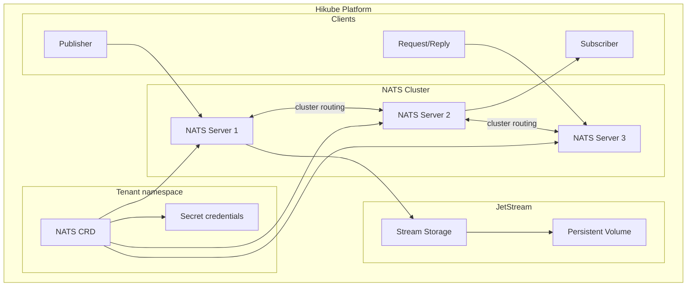
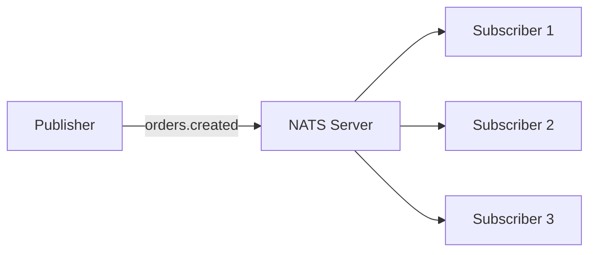
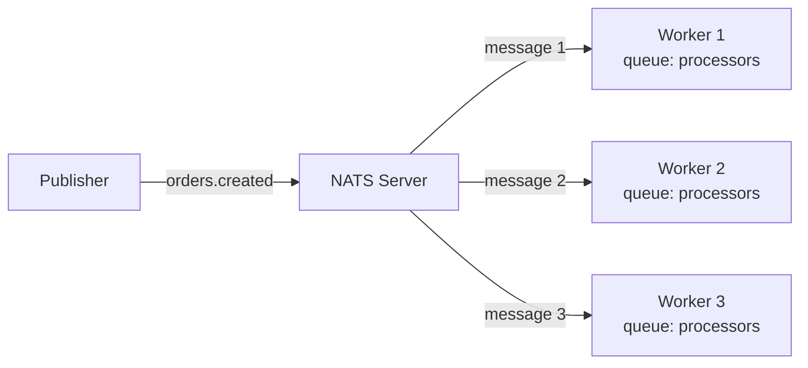
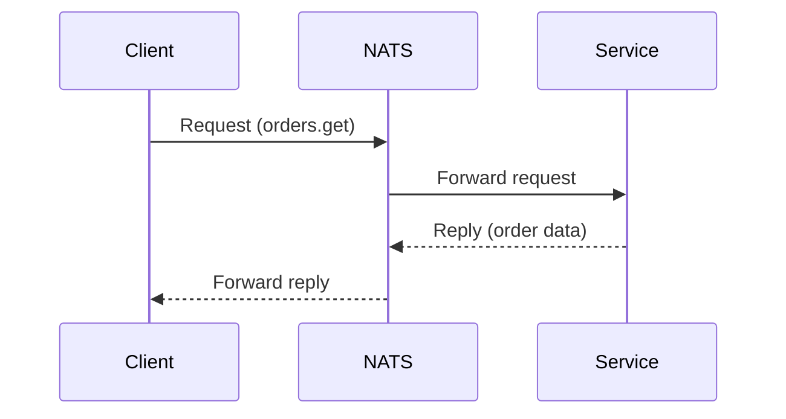

# Concepts — NATS

## Architecture

NATS on Hikube is a managed messaging service, ultra-lightweight and high-performance. Each instance deployed via the `NATS` resource creates a cluster of servers with optional **JetStream** support for message persistence.

---

## Terminology

| Term | Description |
|------|-------------|
| **NATS** | Kubernetes resource (`apps.cozystack.io/v1alpha1`) representing a managed NATS cluster. |
| **Subject** | Message routing address (e.g., `orders.created`). Supports wildcards (`*`, `>`). |
| **Publish/Subscribe** | Communication model where publishers send messages to a subject and subscribers receive them. |
| **JetStream** | NATS persistence extension — durable message storage with replay, acknowledgment, and consumers. |
| **Stream** | Persistent collection of messages in JetStream, with configurable retention policy. |
| **Consumer** | Durable subscription in JetStream with position (offset) tracking and acknowledgment. |
| **Request/Reply** | Synchronous communication model — a client sends a request and waits for a response. |
| **resourcesPreset** | Predefined resource profile (nano to 2xlarge). |

---

## Communication models

NATS supports three communication models:

### Publish/Subscribe

The simplest model — a publisher sends a message, all subscribers receive a copy:

### Queue Groups

Subscribers in the same queue group share messages (load balancing):

### Request/Reply

Synchronous communication with an expected response:

---

## JetStream

JetStream adds **persistence** to NATS:

- Messages are stored on disk in **streams**
- **Consumers** track their position and can replay messages
- Supports **at-least-once** and **exactly-once** delivery
- Configurable retention by duration, message count, or size

:::tip
Enable JetStream only if you need persistence. For ephemeral pub/sub, core NATS is lighter (< 10 MB of RAM per instance).
:::

---

## User management

NATS users are declared in the manifest with a password. Credentials are stored in the Secret `<instance>-credentials`.

---

## Resource presets

| Preset | CPU | Memory |
|--------|-----|--------|
| `nano` | 250m | 128Mi |
| `micro` | 500m | 256Mi |
| `small` | 1 | 512Mi |
| `medium` | 1 | 1Gi |
| `large` | 2 | 2Gi |
| `xlarge` | 4 | 4Gi |
| `2xlarge` | 8 | 8Gi |

---

## Limits and quotas

| Parameter | Value |
|-----------|-------|
| Max replicas | Depending on tenant quota |
| Minimum memory footprint | < 10 MB per instance (without JetStream) |
| JetStream storage size | Variable (in Gi) |
| Typical latency | < 1 ms (same datacenter) |

---

## Further reading

- [Overview](./overview.md): service presentation
- [API Reference](./api-reference.md): all parameters of the NATS resource
