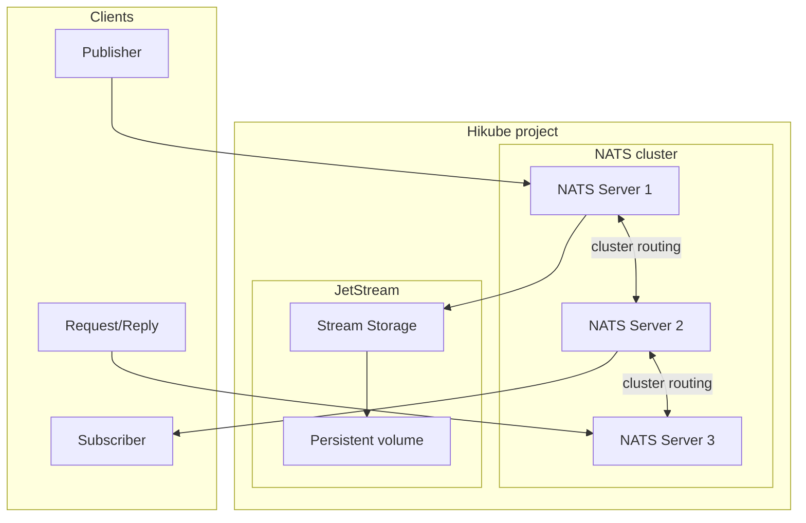
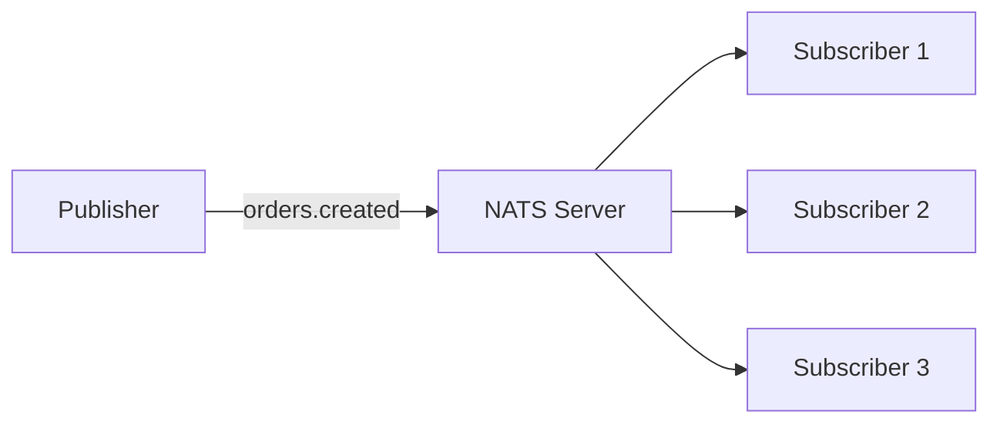
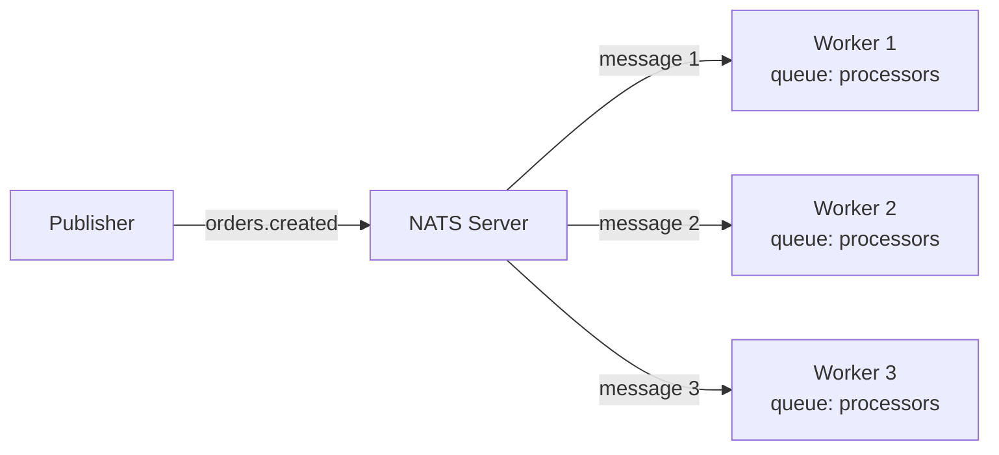
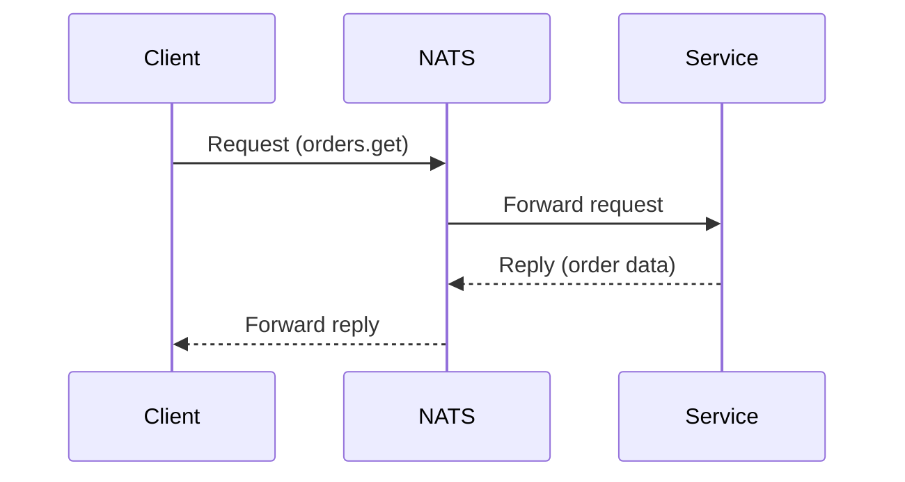

# Concepts — NATS

:::info Availability
NATS is not yet available as self-service in the [Hikube console](https://console.hikube.cloud).
To provision an instance or change its configuration, [contact support](mailto:support@hidora.io).
:::

## Architecture

NATS on Hikube is a managed, ultra-lightweight, high-performance messaging service. Each instance is a cluster of NATS servers attached to a Hikube project, with optional **JetStream** support for message persistence.

```mermaid
graph TB
    subgraph "Hikube project"
        subgraph "NATS cluster"
            N1[NATS Server 1]
            N2[NATS Server 2]
            N3[NATS Server 3]
        end

        subgraph "JetStream"
            JS[Stream Storage]
            PV[Persistent volume]
        end
    end

    subgraph "Clients"
        PUB[Publisher]
        SUB[Subscriber]
        REQ[Request/Reply]
    end

    N1 <-->|cluster routing| N2
    N2 <-->|cluster routing| N3
    N1 --> JS
    JS --> PV
    PUB --> N1
    N2 --> SUB
    REQ --> N3
```

---

## Terminology

| Term | Description |
|-------|-------------|
| **NATS (instance)** | NATS cluster managed by Hikube, attached to a project. Its configuration is set at creation and changed on request from support. |
| **Subject** | Message routing address (e.g. `orders.created`). Supports wildcards (`*`, `>`). |
| **Publish/Subscribe** | Communication model in which publishers send messages to a subject and subscribers receive them. |
| **JetStream** | NATS persistence extension — durable message storage with replay, acknowledgment and consumers. |
| **Stream** | Persistent collection of messages in JetStream, with a configurable retention policy. |
| **Consumer** | Durable subscription in JetStream with position tracking (offset) and acknowledgment. |
| **Request/Reply** | Synchronous communication model — a client sends a request and waits for a reply. |
| **Resource preset** | Predefined CPU/memory profile (nano to 2xlarge). |

---

## Communication models

NATS supports three communication models:

### Publish/Subscribe

The simplest model — a publisher sends a message, and every subscriber receives a copy:

```mermaid
graph LR
    PUB[Publisher] -->|"orders.created"| NATS[NATS Server]
    NATS --> SUB1[Subscriber 1]
    NATS --> SUB2[Subscriber 2]
    NATS --> SUB3[Subscriber 3]
```

### Queue Groups

Subscribers in the same queue group share the messages between them (load balancing):

```mermaid
graph LR
    PUB[Publisher] -->|"orders.created"| NATS[NATS Server]
    NATS -->|"message 1"| S1[Worker 1<br/>queue: processors]
    NATS -->|"message 2"| S2[Worker 2<br/>queue: processors]
    NATS -->|"message 3"| S3[Worker 3<br/>queue: processors]
```

### Request/Reply

Synchronous communication with an expected reply:

```mermaid
sequenceDiagram
    participant Client
    participant NATS
    participant Service

    Client->>NATS: Request (orders.get)
    NATS->>Service: Forward request
    Service-->>NATS: Reply (order data)
    NATS-->>Client: Forward reply
```

---

## JetStream

JetStream adds **persistence** to NATS:

- Messages are stored on disk in **streams**
- **Consumers** track their position and can replay messages
- Support for **at-least-once** and **exactly-once** delivery
- Retention configurable by duration, number of messages or size

Enabling JetStream and the size of its volume are part of the instance configuration. Streams and consumers are then created from your clients (`nats` CLI or SDK).

:::tip
JetStream is only useful if you need persistence. For ephemeral pub/sub, core NATS is lighter.
:::

---

## User management

NATS users (name and password) are part of the instance configuration. To create or change them, ask support, who will send you the credentials.

---

## Resource presets

| Preset | CPU | Memory |
|--------|-----|--------|
| `nano` | 250m | 128Mi |
| `micro` | 500m | 256Mi |
| `small` | 1 | 512Mi |
| `medium` | 1 | 1Gi |
| `large` | 2 | 2Gi |
| `xlarge` | 4 | 4Gi |
| `2xlarge` | 8 | 8Gi |

---

## Limits and quotas

| Parameter | Value |
|-----------|--------|
| Max replicas | Depends on the project quotas |
| Minimum memory footprint | Low (a few MB per instance without JetStream) |
| JetStream storage size | Set when the instance is created |
| Typical latency | < 1 ms (same datacenter) |

---

## Further reading

- [Overview](./overview.md): service presentation
- [Quick start](./quick-start.md): request an instance and test it
