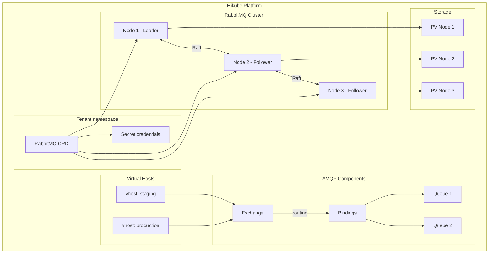
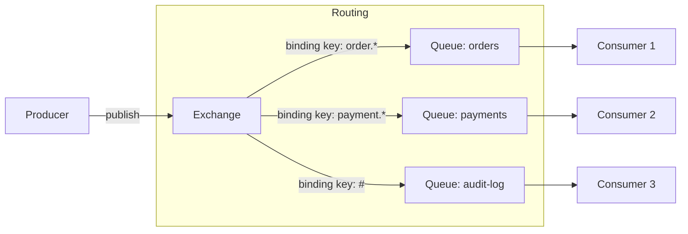
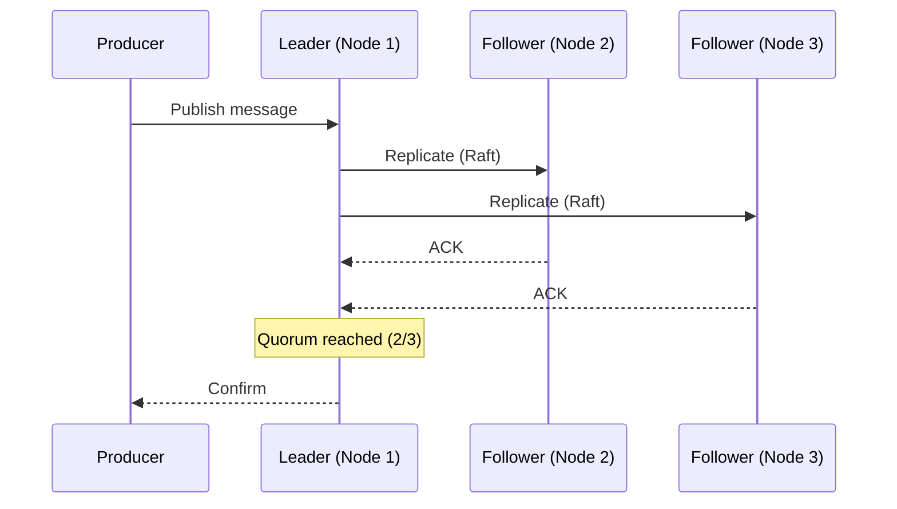

# Concepts — RabbitMQ

## Architecture

RabbitMQ on Hikube is a managed messaging service based on the **AMQP** protocol. Each instance deployed via the `RabbitMQ` resource creates a high-availability cluster with **quorum queues** (Raft protocol) for message replication.

---

## Terminology

| Term | Description |
|------|-------------|
| **RabbitMQ** | Kubernetes resource (`apps.cozystack.io/v1alpha1`) representing a managed RabbitMQ cluster. |
| **AMQP** | Advanced Message Queuing Protocol — standard messaging protocol supported by RabbitMQ. |
| **Exchange** | Message entry point. Routes messages to queues via bindings. |
| **Queue** | Message buffer that stores messages until a consumer processes them. |
| **Binding** | Routing rule between an exchange and a queue (based on a routing key). |
| **Quorum Queue** | Queue type using the **Raft** protocol to replicate messages across multiple nodes. |
| **Virtual Host (vhost)** | Logical namespace that isolates exchanges, queues, and permissions within the same cluster. |
| **Consumer** | Application that reads and processes messages from a queue. |
| **resourcesPreset** | Predefined resource profile (nano to 2xlarge). |

---

## Message routing

RabbitMQ uses a flexible routing model based on exchanges and bindings:

### Exchange types

| Type | Routing |
|------|---------|
| **direct** | Exact routing key |
| **topic** | Pattern matching with wildcards (`*`, `#`) |
| **fanout** | Broadcast to all bound queues |
| **headers** | Routing based on message headers |

---

## Quorum queues and high availability

Quorum queues use the **Raft** protocol to replicate messages:

1. A node is elected **leader** for each queue
2. Messages are replicated to **followers** before confirmation
3. If the leader fails, a follower is automatically promoted

:::tip
Configure `replicas: 3` minimum to guarantee Raft quorum and high availability of quorum queues.
:::

---

## Virtual Hosts

**Vhosts** isolate resources within the same cluster:

- Each vhost has its own exchanges, queues, and permissions
- Users can have different roles per vhost: `admin` or `readonly`
- Useful for separating environments (production, staging) on the same cluster

---

## User management

Users are declared in the manifest with:

- **Password** for authentication
- **Roles per vhost**: `admin` (read/write/configure), `readonly` (read-only)

Credentials are stored in the Secret `<instance>-credentials`.

---

## Resource presets

| Preset | CPU | Memory |
|--------|-----|--------|
| `nano` | 250m | 128Mi |
| `micro` | 500m | 256Mi |
| `small` | 1 | 512Mi |
| `medium` | 1 | 1Gi |
| `large` | 2 | 2Gi |
| `xlarge` | 4 | 4Gi |
| `2xlarge` | 8 | 8Gi |

---

## Limits and quotas

| Parameter | Value |
|-----------|-------|
| Max replicas | Depending on tenant quota |
| Storage size (`size`) | Variable (in Gi) |
| Vhosts per cluster | Unlimited (depending on resources) |
| Supported protocols | AMQP 0-9-1, AMQP 1.0, MQTT, STOMP |

---

## Further reading

- [Overview](./overview.md): service presentation
- [API Reference](./api-reference.md): all parameters of the RabbitMQ resource
