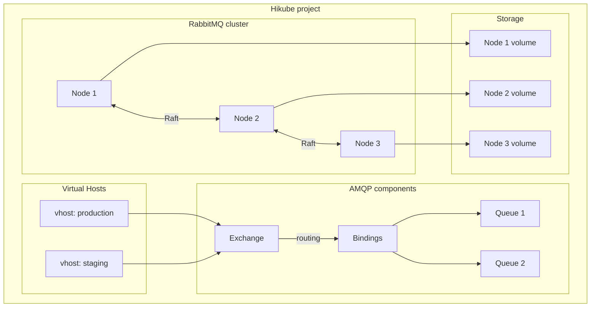
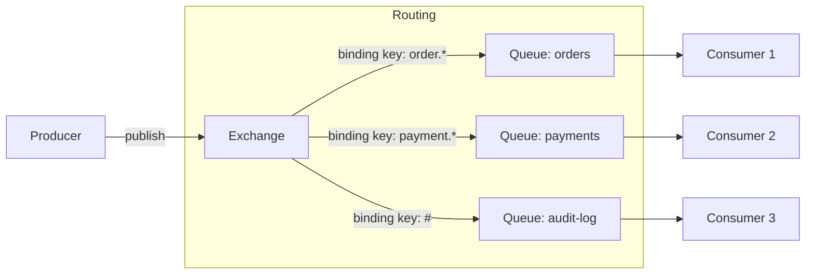
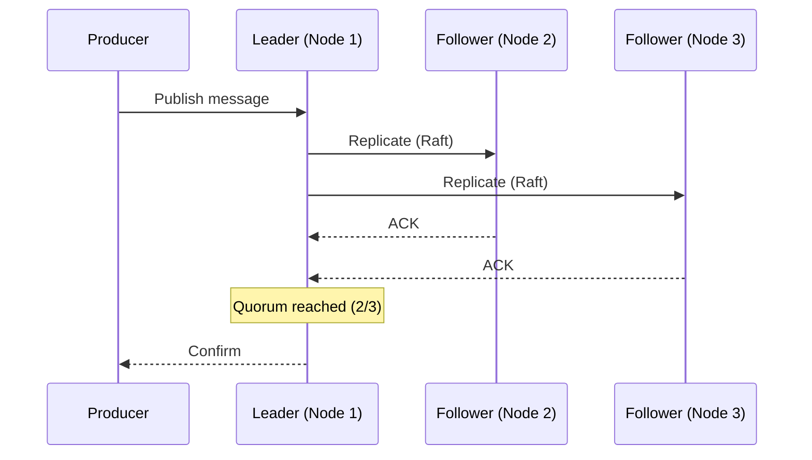

# Concepts — RabbitMQ

## Architecture

RabbitMQ on Hikube is a managed messaging service based on the **AMQP** protocol. Each cluster created from the [Hikube console](https://console.hikube.cloud) belongs to a **project** and consumes that project's quotas (CPU, memory, storage).

```mermaid
graph TB
    subgraph "Hikube project"
        subgraph "RabbitMQ cluster"
            N1[Node 1]
            N2[Node 2]
            N3[Node 3]
        end

        subgraph "Virtual Hosts"
            VH1[vhost: production]
            VH2[vhost: staging]
        end

        subgraph "AMQP components"
            EX[Exchange]
            Q1[Queue 1]
            Q2[Queue 2]
            B[Bindings]
        end

        subgraph "Storage"
            PV1[Node 1 volume]
            PV2[Node 2 volume]
            PV3[Node 3 volume]
        end
    end

    N1 <-->|Raft| N2
    N2 <-->|Raft| N3
    N1 --> PV1
    N2 --> PV2
    N3 --> PV3
    VH1 --> EX
    VH2 --> EX
    EX -->|routing| B
    B --> Q1
    B --> Q2
```

---

## Terminology

| Term | Description |
|-------|-------------|
| **RabbitMQ Cluster** | Managed RabbitMQ instance, created and managed from the console (menu **DB & Messaging** → **RabbitMQ**). |
| **AMQP** | Advanced Message Queuing Protocol, the standard messaging protocol supported by RabbitMQ. |
| **Exchange** | Entry point for messages. Routes messages to queues through bindings. |
| **Queue** | Queue that stores messages until a consumer processes them. |
| **Binding** | Routing rule between an exchange and a queue (based on a routing key). |
| **Quorum Queue** | Queue type that uses the **Raft** protocol to replicate messages across several nodes. |
| **Virtual Host (vhost)** | Logical namespace that isolates exchanges, queues and permissions within the same cluster. |
| **Consumer** | Application that reads and processes the messages of a queue. |
| **Preset** | Predefined CPU/memory resource profile, chosen when the cluster is created. |
| **Replicas** | Number of RabbitMQ nodes in the cluster. Determines the deployment mode. |

---

## Deployment modes

The **Number of replicas** field of the wizard offers three values:

| Value | Label in the console | Mode |
|--------|-------------------------|------|
| 1 | **1 (Standalone)** | A single node. The data volume is replicated at the platform storage level. |
| 3 | **3 (Max High Availability)** | 3-node cluster. Message replication is handled by RabbitMQ (quorum queues). |
| 5 | **5 (Ultra High Availability)** | 5-node cluster, tolerating the loss of two nodes. |

:::warning Mode set at creation
The mode (standalone or cluster) and the number of replicas cannot be changed after creation: the console displays "The mode cannot be changed after creation". To change mode, create a new cluster.
:::

---

## Message routing

RabbitMQ uses a flexible routing model based on exchanges and bindings:

```mermaid
graph LR
    P[Producer] -->|publish| EX[Exchange]

    subgraph "Routing"
        EX -->|binding key: order.*| Q1[Queue: orders]
        EX -->|binding key: payment.*| Q2[Queue: payments]
        EX -->|binding key: #| Q3[Queue: audit-log]
    end

    Q1 --> C1[Consumer 1]
    Q2 --> C2[Consumer 2]
    Q3 --> C3[Consumer 3]
```

### Exchange types

| Type | Routing |
|------|---------|
| **direct** | Exact routing key |
| **topic** | Pattern matching with wildcards (`*`, `#`) |
| **fanout** | Broadcast to all bound queues |
| **headers** | Routing based on message headers |

Exchanges, queues and bindings are created by your applications, with an AMQP client connected to the relevant vhost. The console manages the cluster, the vhosts and the users, not the AMQP objects themselves.

---

## Quorum queues and high availability

Quorum queues use the **Raft** protocol to replicate messages:

1. A node is elected **leader** for each queue
2. Messages are replicated to the **followers** before confirmation
3. If the leader fails, a follower is automatically promoted

```mermaid
sequenceDiagram
    participant P as Producer
    participant L as Leader (Node 1)
    participant F1 as Follower (Node 2)
    participant F2 as Follower (Node 3)

    P->>L: Publish message
    L->>F1: Replicate (Raft)
    L->>F2: Replicate (Raft)
    F1-->>L: ACK
    F2-->>L: ACK
    Note over L: Quorum reached (2/3)
    L-->>P: Confirm
```

:::tip
Choose **3 (Max High Availability)** or **5 (Ultra High Availability)** replicas to guarantee the Raft quorum, and declare your critical queues as quorum queues (argument `x-queue-type: quorum` on the client side).
:::

---

## Virtual hosts

**Vhosts** isolate resources within the same cluster:

- Each vhost has its own exchanges, queues and permissions
- A user can have a different right on each vhost
- Useful to separate environments (production, staging) or applications on the same cluster

The creation wizard requires at least one vhost. More vhosts can be added later from the cluster page (**Add a VHost** button).

---

## Users and rights

Each RabbitMQ user receives a **password generated by the platform**, displayed **only once** at creation (or after a rotation). Their rights are defined **per vhost**:

| Right in the console | Effect |
|-----------------------|-------|
| **Administrator** | Read, write and configure on the vhost |
| **Read-only** | Read-only on the vhost |
| **No access** | The user has no access to the vhost |

A user can only have one right per vhost. Rights can be changed at any time with the **Manage Access** action.

---

## Resource presets

The **Preset** sets the CPU and memory resources of each node. The console shows the values of each preset in the drop-down list.

| Preset | CPU | Memory |
|--------|-----|---------|
| **Micro** | 0.5 | 256 Mi |
| **Small** | 1 | 512 Mi |
| **Medium** | 1 | 1 Gi |
| **Large** | 2 | 2 Gi |
| **X-Large** | 4 | 4 Gi |
| **2X-Large** | 8 | 8 Gi |

The **Small** preset is selected by default. It **cannot be changed after creation**.

---

## Limits

| Parameter | Value |
|-----------|--------|
| Cluster name | 3 to 16 characters: lowercase letters, digits and hyphens; starts with a letter, ends with a letter or a digit |
| Available versions | 4.2, 4.1, 4.0, 3.13 |
| Replicas | 1, 3 or 5 (set at creation) |
| Disk size | 1 to 4096 GB per node, within the project's storage quota; increase only |
| External access | Can be enabled at creation or later |
| AMQP port | 5672, without TLS |

---

## Further reading

- [Overview](./overview.md): service presentation
- [Quick start](./quick-start.md): create your first cluster
- [Manage vhosts and users](./how-to/manage-vhosts-users.md)
