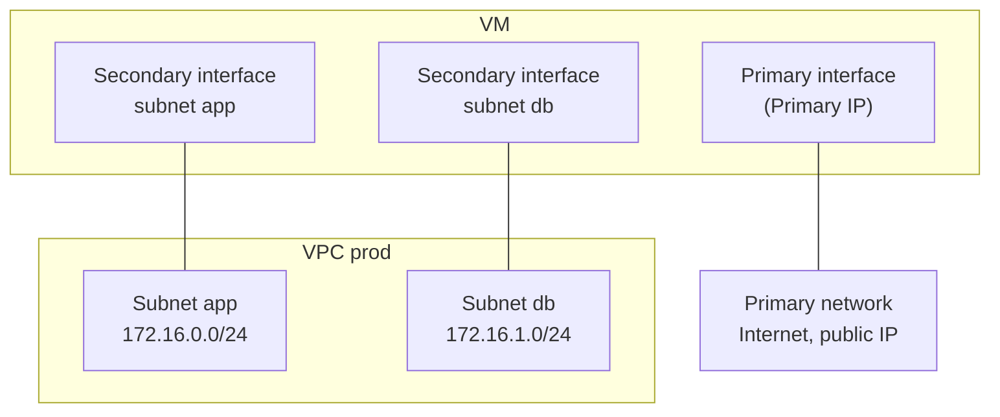

# Concepts — Networking

## Architecture

Each Hikube VM has a **primary network**, managed by the platform: Internet access and, if enabled, the public IP go through it. **VPCs** add **secondary** private networks: each subnet a VM is connected to gives it an additional network interface.

VPCs rely on a software-defined network: each VPC is an isolated virtual router, each subnet a virtual switch.

---

## Terminology

| Term | Description |
|------|-------------|
| **VPC** | Isolated private network of the project. It has no address range of its own: its subnets carry them. |
| **Subnet** | Private IPv4 address range (CIDR block) within a VPC. A VM connects to one or more subnets. |
| **CIDR block** | Notation for an address range, for example `172.16.0.0/24` (256 addresses, from `172.16.0.0` to `172.16.0.255`). |
| **Primary network** | Default network of every VM, with the default gateway and the public IP, if any. Shown as the **Primary** address on the VM's detail page. |
| **Secondary interface** | Network interface added to the VM for each connected subnet. Its addresses appear as **Secondary**. |

---

## Naming rules

| Item | Rule |
|------|------|
| **VPC Name** | 3 to 16 characters: lowercase letters, digits and hyphens; must start with a letter and end with a letter or a digit. Unique within the project. |
| **Subnet Name** | 1 to 63 characters: lowercase letters, digits and hyphens. Unique within the VPC. |

---

## Address ranges

A subnet must use a **private IPv4** range (RFC 1918):

| Allowed range | Example subnet |
|---------------|----------------|
| `10.0.0.0/8` | `10.10.0.0/24` |
| `172.16.0.0/12` | `172.16.0.0/24` (default suggested value) |
| `192.168.0.0/16` | `192.168.10.0/24` |

Constraints checked at creation:

- two subnets of the **same** VPC cannot overlap;
- a subnet cannot overlap the ranges reserved by the platform, `10.244.0.0/16` and `10.96.0.0/12`;
- two **different** VPCs can use the same ranges, since they are isolated.

:::tip Recommendation
Use subsets of `172.16.0.0/12`, for example one `/24` per subnet (`172.16.0.0/24`, `172.16.1.0/24`…). This way you avoid the reserved `10.x` ranges.
:::

---

## Isolation

- A VPC belongs to a project; it is only visible in that project.
- Two VPCs are isolated from each other. To route traffic between two VPCs, connect a VM to both and configure routing in its OS.
- A VPC has no Internet access of its own: the VM's Internet traffic goes through its primary network.

---

## Lifecycle

| Action | Behavior |
|--------|----------|
| **Create VPC** | Three-step wizard: **General** (name), **Subnets** (at least one, up to ten), **Review**. |
| Add a subnet | **View Subnets** > **Create Subnet**, or from the VM wizard. |
| Delete a subnet | Refused as long as a VM is connected to it (**Cannot delete**, with the list of VMs). |
| Delete a VPC | Also deletes all its subnets. Refused as long as a VM is connected to it. |
| Modify a VPC or a subnet | Not offered: create a new one. |

Status of a VPC in the list: **Provisioning** while it is being set up, then **Ready** when it is usable.

---

## Further reading

- [Overview](./overview.md)
- [Quick start](./quick-start.md)
- [Virtual machine concepts](../compute/concepts.md)
