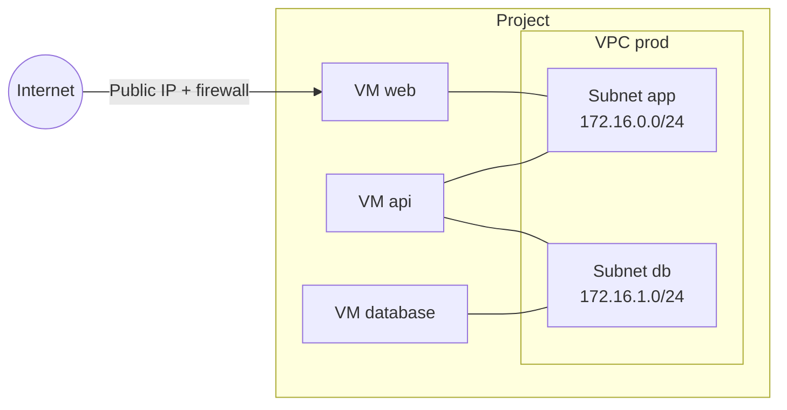

import NavigationFooter from '@site/src/components/NavigationFooter';

# Private networks on Hikube

A **VPC** (*Virtual Private Cloud*) is an isolated virtual network that belongs to your project. It consists of one or more **subnets**, each carrying a private IPv4 address range. A VM connected to a subnet receives an additional network interface and an address in that range: it can then reach the other VMs of the same subnet privately.

In the [Hikube console](https://console.hikube.cloud), VPCs are managed from the **Infrastructure** > **Networking** menu (**Virtual Private Clouds** page).

---

## What you can do from the console

| Need | Where to do it |
|------|----------------|
| Create a VPC and its first subnets | **Networking** > **Create VPC** |
| View and add subnets | **Actions** menu of a VPC > **View Subnets** > **Create Subnet** |
| Connect a VM to a VPC | VM wizard, **Network** step, **VPC Networks (Secondary)** section; or **Edit** on an existing VM |
| Create a VPC or a subnet without leaving the VM wizard | **+ VPC** and **Add subnet** buttons of the **VPC Networks (Secondary)** section |
| Delete a subnet or a VPC | **Actions** menu > **Delete** (refused as long as VMs use it) |

---

## How it fits together

- Each VM keeps its **primary network** (the one carrying the public IP and Internet access). VPC subnets are added as **secondary** interfaces.
- A VM can be connected to several subnets, including subnets of different VPCs.
- A VPC is not exposed on the Internet: inbound access from outside goes through the VM's **public IP** and **firewall** (see [Configure a VM's network](../compute/how-to/configure-network.md)).

---

## Use cases

- **Multi-tier architecture**: only the front-end VM has a public IP; the application and database VMs only communicate privately.
- **Bastion**: an administration VM exposed over SSH, used as a jump host to VMs without a public IP.
- **Segmentation**: separate traffic by environment or by function, with one subnet per role.

---

## Limits

- VPCs apply to **VM instances**. Kubernetes clusters and managed databases cannot be connected to them from the console.
- A VPC cannot be renamed or modified: you add subnets to it or delete subnets from it.
- Interconnecting two VPCs (*peering*) and static routes are not offered in the console; contact [support](mailto:support@hidora.io).

---

## Next steps

- [Concepts](./concepts.md)
- [Quick start](./quick-start.md)
- [Connect an existing VM to a VPC](./how-to/attach-vm-to-vpc.md)

<NavigationFooter
  nextSteps={[
    {label: "Concepts", href: "../concepts"},
    {label: "Quick start", href: "../quick-start"},
  ]}
  seeAlso={[
    {label: "Compute resources", href: "../../compute/"},
  ]}
/>
