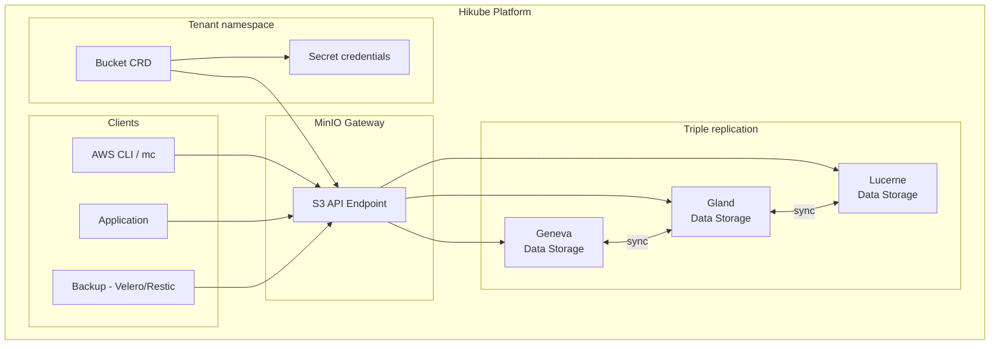

# Concepts — S3 Buckets

## Architecture

Hikube's Object Storage service is built on **MinIO**, an S3-compatible object storage solution. Data is automatically **triple-replicated** across 3 geographically distinct datacenters, ensuring high availability even in the event of a complete datacenter loss.



---

## Terminology

| Term | Description |
|------|-------------|
| **Bucket** | Kubernetes resource (`apps.cozystack.io/v1alpha1`) representing an S3 bucket. Only one required field: the `name`. |
| **Object Storage** | Unstructured storage based on objects (files) identified by a unique key. |
| **S3-compatible** | API compatible with the Amazon S3 protocol, supported by the vast majority of tools and SDKs. |
| **MinIO** | Open-source S3-compatible object storage server, used as the backend by Hikube. |
| **Access Key / Secret Key** | Credential pair for S3 authentication, automatically generated in a Kubernetes Secret. |
| **BucketInfo** | JSON field in the Secret containing the S3 endpoint, protocol, and port. |
| **Endpoint** | Hikube S3 service URL: `https://prod.s3.hikube.cloud` |

---

## How it works

### Creation

Creating a bucket is the simplest of all Hikube resources:

```yaml title="bucket.yaml"
apiVersion: apps.cozystack.io/v1alpha1
kind: Bucket
metadata:
  name: my-data
spec: {}
```

The operator automatically creates:
1. The **bucket** in MinIO
2. A **Kubernetes Secret** containing the access credentials

### Automatic credentials

The Secret `<bucket-name>-credentials` contains:

| Key | Description |
|-----|-------------|
| `accessKeyID` | S3 access key |
| `accessSecretKey` | S3 secret key |
| `bucketInfo` | JSON with endpoint, protocol, and port |

---

## Multi-datacenter triple replication

Data is automatically replicated across **3 datacenters**:

| Datacenter | Location |
|-----------|----------|
| Region 1 | Geneva |
| Region 2 | Gland |
| Region 3 | Lucerne |

This architecture guarantees:
- **Zero data loss** in case of a datacenter failure
- **Service continuity** with automatic failover
- **Optimized latency** from Switzerland and Europe

:::tip
Triple replication is transparent — you have nothing to configure. All data is automatically replicated.
:::

---

## Compatible tools

The service is compatible with all tools supporting the S3 protocol:

| Tool | Use case |
|------|----------|
| **AWS CLI** | Command-line file management |
| **MinIO Client (mc)** | Native MinIO client |
| **rclone** | Data synchronization and migration |
| **s3cmd** | Alternative S3 management |
| **Velero** | Kubernetes cluster backup |
| **Restic** | Database backup (PostgreSQL, MySQL, ClickHouse) |
| **SDKs** | boto3 (Python), AWS SDK (Go, Java, Node.js) |

---

## Use cases

| Use case | Description |
|----------|-------------|
| **Asset storage** | Images, videos, static files for web applications |
| **Backup** | Destination for database and K8s cluster backups |
| **Data lake** | Raw data storage for analytics |
| **Archival** | Long-term retention of documents and logs |

---

## Limits and quotas

| Parameter | Value |
|-----------|-------|
| Max object size | Depending on MinIO configuration |
| Number of buckets | Depending on tenant quota |
| Replication | Triple (3 DC), automatic |
| Endpoint | `https://prod.s3.hikube.cloud` |

---

## Further reading

- [Overview](./overview.md): detailed service presentation
- [API Reference](./api-reference.md): Bucket resource parameters
