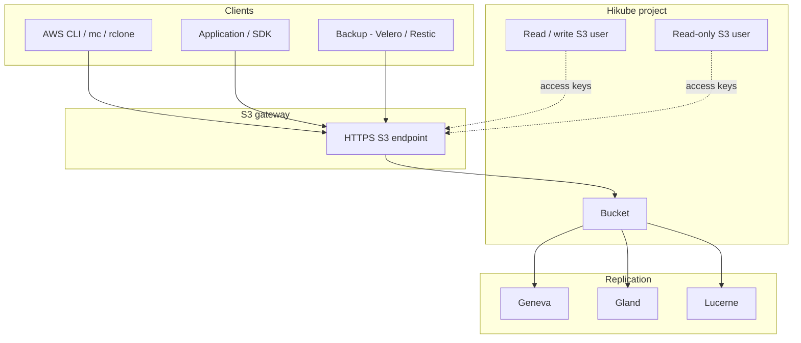

# Concepts — S3 Buckets

## Architecture

The Hikube Object Storage service is S3-compatible. Data is automatically **replicated** across 3 geographically distinct datacenters, which keeps it available even if an entire datacenter is lost.

```mermaid
graph TB
    subgraph "Hikube project"
        BK[Bucket]
        U1[Read / write S3 user]
        U2[Read-only S3 user]
    end

    subgraph "S3 gateway"
        GW[HTTPS S3 endpoint]
    end

    subgraph "Replication"
        DC1[Geneva]
        DC2[Gland]
        DC3[Lucerne]
    end

    subgraph "Clients"
        CLI[AWS CLI / mc / rclone]
        APP[Application / SDK]
        BKP[Backup - Velero / Restic]
    end

    U1 -.->|access keys| GW
    U2 -.->|access keys| GW
    CLI --> GW
    APP --> GW
    BKP --> GW
    GW --> BK
    BK --> DC1
    BK --> DC2
    BK --> DC3
```

---

## Terminology

| Term | Description |
|------|-------------|
| **Bucket** | Object storage space created from the console (**Infrastructure** → **S3 Buckets** menu). |
| **Bucket name (console)** | Name chosen at creation. It identifies the bucket in the console and cannot be changed. |
| **S3 Bucket Name** | Actual name of the bucket on the S3 side, generated by the platform. **This is the name** your S3 clients must use. It is displayed on the bucket page. |
| **S3 Endpoint** | Address of the S3 service (for example `prod.s3.hikube.cloud`), displayed on the bucket page. |
| **S3 user** | Identity attached to a bucket, with a **Read-only** or **Read / Write** permission. A bucket can have several users. |
| **Access Key ID / Secret Access Key** | A user's S3 authentication key pair, generated when the user is created. The secret key is displayed only once. |
| **Locking (WORM)** | Object Lock: prevents objects from being deleted or modified for 365 days, in `COMPLIANCE` mode (*Write Once, Read Many*). |
| **Encryption at rest (LUKS)** | Encryption of the data stored on disk. |

---

## How it works

### Creation

A bucket is created with the **Create a bucket** wizard. Only the name is required; two options can be enabled at creation:

- **Enable Object Lock (WORM)**
- **Enable encryption at rest (LUKS)**

The wizard also asks you to create **at least one S3 user**. At the end, the console displays, for each user, the **S3 Bucket Name**, the **Access Key**, the **Secret Key** and the **API Endpoint (S3)**.

:::warning Options set at creation
The name, locking and encryption are chosen at creation. The console does not let you change them afterwards.
:::

### Users and permissions

| Permission | Console label | Effect |
|------------|---------------|--------|
| Read / write | **Read / Write** | List, read, write and delete objects in the bucket |
| Read-only | **Read-only** | List and read objects only |

A user's permission can be changed at any time with **Edit access**. A user's keys cannot be displayed again: to get new keys, create a new user and then delete the old one.

### Key scope

A user's keys give access **only to the bucket the user is attached to**. They do not allow listing all the buckets of the endpoint: commands must always target the bucket (`s3://<s3-bucket-name>/`).

---

## Multi-datacenter replication

| Datacenter | Location |
|------------|----------|
| Region 1 | Geneva |
| Region 2 | Gland |
| Region 3 | Lucerne |

:::tip
Replication is transparent: there is nothing for you to configure.
:::

---

## Pricing

The wizard displays an **Estimated Cost** per GB per month (and per hour). The rate depends on encryption: an encrypted bucket uses a different rate from a standard bucket.

---

## Compatible tools

| Tool | Use case |
|------|----------|
| **AWS CLI** | Command-line file management |
| **MinIO Client (mc)** | S3-compatible client |
| **rclone** | Data synchronization and migration |
| **s3cmd** | Alternative S3 management |
| **Velero** | Kubernetes cluster backup |
| **Restic** | File and database backup |
| **SDK** | boto3 (Python), AWS SDK (Go, Java, Node.js) |

---

## Limits

| Parameter | Value |
|-----------|-------|
| Bucket name | 3 to 16 characters: lowercase letters, digits and hyphens; starts with a letter, ends with a letter or a digit |
| S3 username | 3 to 16 characters, same rules; some names are reserved |
| Users per bucket | At least one at creation |
| Replication | 3 datacenters, automatic |

---

## Further reading

- [Overview](./overview.md): service presentation
- [Quick start](./quick-start.md): create your first bucket
- [Manage users and access keys](./how-to/configure-access.md)
