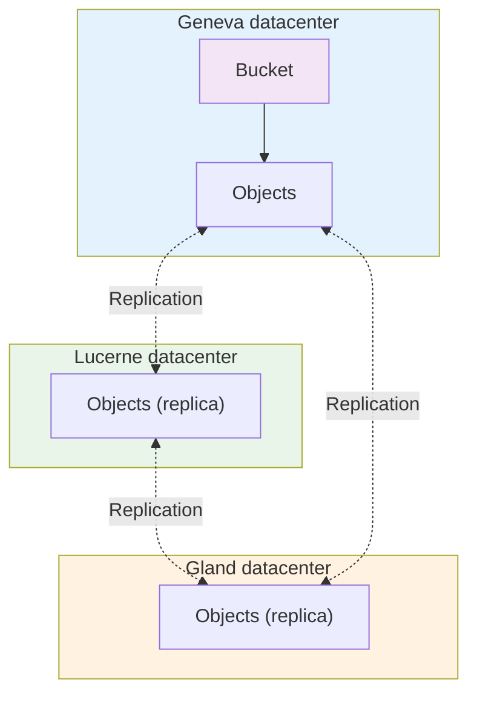

import NavigationFooter from '@site/src/components/NavigationFooter';

# S3 Buckets on Hikube

Hikube **S3 Buckets** provide a **highly available**, **replicated** and **S3-compatible** object storage solution for your cloud-native applications, backups, CI/CD artifacts or analytics data.
The platform offers a sovereign alternative to Amazon S3, operated in Switzerland.

You create and manage your buckets self-service from the [Hikube console](https://console.hikube.cloud), in the **Infrastructure** → **S3 Buckets** menu of your project.

---

## What the console lets you do

- **Create a bucket**, optionally with **object locking (Object Lock / WORM)** and **encryption at rest (LUKS)**;
- **Create S3 users** for each bucket, **Read-only** or **Read / Write**, with their access key pair;
- **View the actual S3 name and the endpoint** of the bucket, with ready-to-copy command examples;
- **Change the permissions** of a user and **delete** a user or a bucket.

---

## Architecture and operation

### Distributed object storage

Hikube buckets rely on an S3 architecture that is **distributed and replicated** across several datacenters.
Unlike the [disks](../disks/overview.md) used by virtual machines, object storage is not attached to any machine: it is accessible through the **standard S3 API** from any authorized application or service.

#### Storage layer

- Each bucket is hosted on a **multi-node infrastructure** spread across several Swiss datacenters
- Objects are **automatically replicated** to 3 distinct physical sites
- The system is designed to tolerate the failure of an entire datacenter without data loss

#### Access layer

- Buckets are accessible through an **HTTPS endpoint** compatible with S3 v4 signatures
- Access is authenticated with **S3 access keys** (Access Key ID / Secret Access Key) specific to each user of the bucket
- Each bucket belongs to a **project** and its users only have access to that bucket

---

### Multi-datacenter architecture

This architecture ensures the **availability and durability** of data, while remaining fully operated in Switzerland.

---

## Typical use cases

| **Use case**                    | **Description**                                                   |
| ------------------------------- | ----------------------------------------------------------------- |
| **Backups**                     | Automated backups of applications or persistent volumes           |
| **CI/CD artifacts**             | Storage of images, binaries and GitOps pipelines                  |
| **Static content**              | Files served by your applications (web assets, PDFs, images)      |
| **Analytics data**              | Centralizing CSV/Parquet/JSON files for ETL and BI tools          |
| **Logs and archives**           | Long-term storage of application and audit logs                   |
| **Regulatory archiving**        | Immutable retention with WORM locking                             |
| **S3-compatible applications**  | Direct use by applications through an SDK or the AWS CLI          |

---

## Isolation and security

- Each S3 user has **their own keys** and only has access to the bucket they are attached to
- The **read-only** permission lets you distribute view access with no risk of modification
- All access goes through **HTTPS** with S3 key authentication; anonymous access is not possible
- **Encryption at rest (LUKS)** protects the data stored on disk
- **Locking (WORM)** prevents objects from being deleted or modified for 365 days

---

## Connectivity and integration

### S3 endpoint

The S3 endpoint and the actual bucket name are displayed on the bucket page, in the **Access & Configuration** card (for example `prod.s3.hikube.cloud`).

### Compatibility

Hikube buckets are compatible with standard S3 tools and SDKs:

- **AWS CLI**: `aws --endpoint-url https://<endpoint> s3 ...`
- **MinIO Client (`mc`)**: alias configured with the access key and the secret key
- **rclone, s3cmd, Velero, Restic**: native support for v4 signatures
- **SDK**: boto3 (Python), AWS SDK (Go, Java, Node.js…)

---

## Next steps

- [Create your first bucket](./quick-start.md)
- [Manage users and access keys](./how-to/configure-access.md)

:::tip Production recommendation
Use a dedicated bucket per application or per environment, and a separate S3 user per application.
:::

<NavigationFooter
  nextSteps={[
    {label: "Concepts", href: "../concepts"},
    {label: "Quick start", href: "../quick-start"},
  ]}
/>
