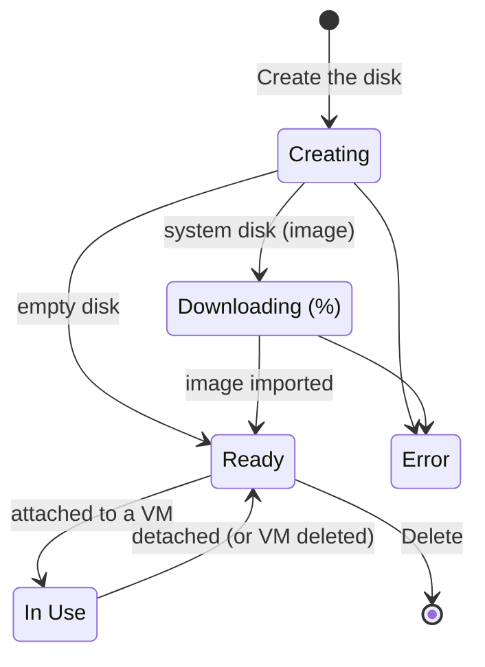

# Concepts — Disks

## Architecture

A Hikube disk is a **persistent block volume** belonging to a **project**. It consumes the project's **storage** quota and can be attached to a virtual machine in the same project.

---

## Terminology

| Term | Description |
|------|-------------|
| **Disk** | Persistent block storage volume, managed from the **Infrastructure** → **Disks** menu. |
| **Empty Disk** | Raw data disk, to format and mount in the VM (shown as **Data Disk** in the list). |
| **System Disk** | Disk created from a system image, usable as the boot disk of a VM. |
| **Cloud image** | Operating system image from the Hikube catalog, chosen by OS and version. |
| **Custom image** | ISO or QCOW2 image imported from an HTTPS URL that you provide. |
| **Replication** | Copy of the disk data across several nodes, in synchronous or asynchronous mode. |
| **Encryption (LUKS)** | Encryption of data at rest on the disk. |
| **Attached to** | VM currently using the disk. |

---

## Statuses

| Status | Meaning |
|--------|---------|
| **Creating** | The disk is being provisioned |
| **Downloading** | The image of a system disk is being imported; progress is shown as a percentage |
| **Ready** | The disk is provisioned and not attached to any VM |
| **In Use** | The disk is attached to a VM |
| **Error** | The image download or the provisioning failed |
| **Unknown** | The disk status could not be determined yet |

---

## Disk source

The **Source** step of the wizard offers two choices:

- **Empty Disk**: "Raw storage space that can be formatted and mounted on a virtual machine."
- **System Disk**: "A disk containing a pre-installed operating system." You then choose an image in **OS Image / Source**:
  - a **cloud image** from the catalog (OS, then **Version**);
  - or **Custom Image**: an **Image URL (ISO/QCOW2)**. The URL must use HTTPS; private or local IP addresses are rejected.

:::note Windows
A Windows system disk must be at least **50 GB**. Its estimated cost includes the Windows license.
:::

---

## Replication

| Mode | Label | Behavior | RTO | RPO |
|------|-------|----------|-----|-----|
| Asynchronous | **Asynchronous Replication** (Recommended) | Deferred replication: if several nodes fail simultaneously, a small amount of recent data may be lost | < 5 min | < 5 min |
| Synchronous | **Synchronous Replication** | Real-time replication across several nodes: minimal data loss in case of failure | < 5 min | < 1 min |

**Asynchronous Replication** is selected by default.

---

## Encryption

The **Disk Encryption** toggle enables **LUKS** encryption of data at rest. An encrypted disk is flagged with the **Encrypted** badge in the list and uses a different rate.

:::warning Options set at creation
The source, replication and encryption are chosen at creation. Only the **size** of a disk can be changed afterwards, and only upwards.
:::

---

## Size and quota

- Minimum size: **20 GB** (50 GB for a Windows system disk).
- The size is limited by the project's **storage quota**; the wizard displays the **Estimated project usage** gauge.
- A disk can be **expanded**, never shrunk (see [Resize a disk](./how-to/resize.md)).

---

## Pricing

The wizard displays an **Estimated Cost**: the rate per GB per month, and the monthly cost of the disk. The rate depends on encryption; a Windows system disk adds the license cost.

---

## Limits

| Parameter | Value |
|-----------|-------|
| Disk name | 3 to 16 characters: lowercase letters, digits and hyphens; starts with a letter, ends with a letter or a digit |
| Size | From 20 GB, within the limit of the project's storage quota |
| Attachment | A single VM at a time |
| Size reduction | Not supported |

---

## Further reading

- [Quick start](./quick-start.md): create a disk and use it in a VM
- [Attach a disk to a VM](./how-to/attach-to-vm.md)
- [Create a system disk from an image](./how-to/create-from-image.md)
