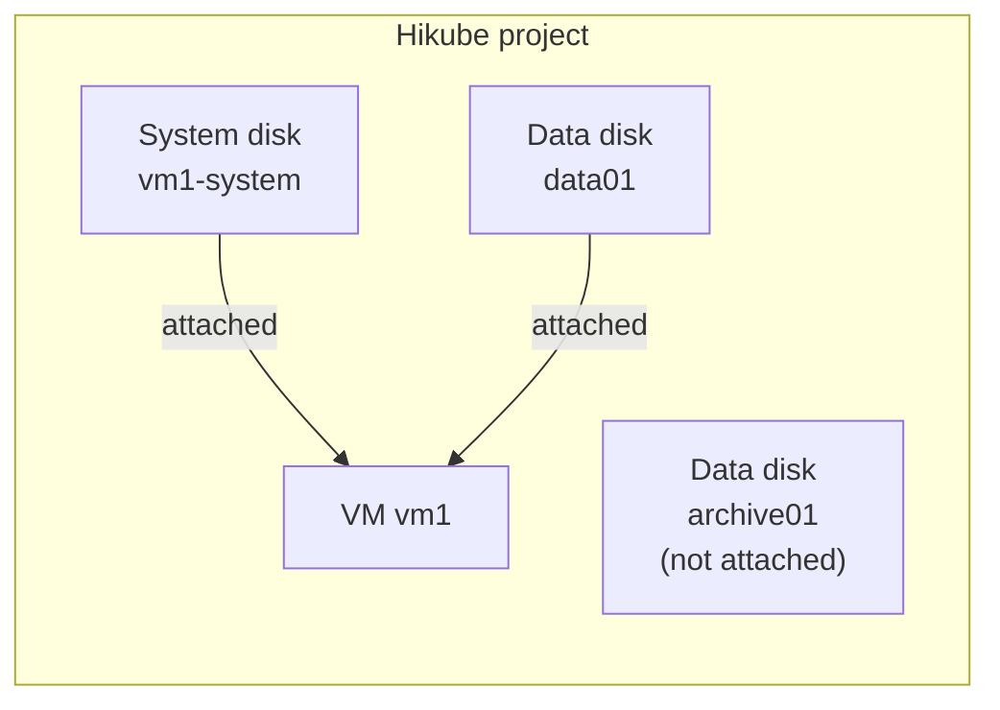

import NavigationFooter from '@site/src/components/NavigationFooter';

# Disks on Hikube

Hikube **disks** are replicated **persistent block storage volumes** that you attach to your [virtual machines](../../compute/overview.md). A disk exists independently of the VM that uses it: you can create it in advance, attach it, detach it, expand it or reattach it to another VM, without losing its data.

You manage your disks self-service from the [Hikube console](https://console.hikube.cloud), in the **Infrastructure** → **Disks** menu of your project.

---

## What the console lets you do

- **Create an empty disk** (data disk) or a **system disk** from an image (cloud image from the catalog or custom ISO/QCOW2 image);
- **Choose the replication** (**Asynchronous Replication** or **Synchronous Replication**) and enable **encryption (LUKS)**;
- **Track the status** of each disk, including the download progress of an image;
- **See which VM** a disk is attached to;
- **Expand** a disk;
- **Delete** a disk that is not attached to any VM.

Attaching a disk to a VM is done from the VM creation wizard or the VM edit page (see [Attach a disk to a VM](./how-to/attach-to-vm.md)).

---

## Disk types

| Type | Console label | Usage |
|------|---------------|-------|
| Data disk | **Empty Disk** / **Data Disk** | Raw storage space to format and mount in a VM |
| System disk | **System Disk** | Disk containing a pre-installed operating system, used as the boot disk of a VM |

---

## Disks and VMs

- A disk is attached to **a single VM** at a time.
- The **Storage Disks** list shows, for each disk, the VM it is **Attached to**.
- Deleting a VM **detaches** its disks without deleting them: they remain in the list and can be reused.

---

## Replication and security

- **Asynchronous Replication** (recommended): deferred replication, RTO < 5 min, RPO < 5 min.
- **Synchronous Replication**: real-time replication across several nodes, RTO < 5 min, RPO < 1 min.
- **Disk Encryption**: LUKS encryption of data at rest.

Details are provided in the [concepts](./concepts.md).

---

## Typical use cases

| Use case | Description |
|----------|-------------|
| **Application data** | Dedicated volume for a database or files, separate from the system disk |
| **Preparing a VM** | System disk created in advance from an image, then attached to a new VM |
| **Migration between VMs** | Detach a disk from one VM and attach it to another |
| **Sensitive data** | Encrypted disk (LUKS) with synchronous replication |

:::tip
For file storage accessible through an API from several applications, use [S3 Buckets](../buckets/overview.md) instead.
:::

<NavigationFooter
  nextSteps={[
    {label: "Concepts", href: "../concepts"},
    {label: "Quick start", href: "../quick-start"},
  ]}
  seeAlso={[
    {label: "Virtual machines", href: "../../../compute/overview"},
  ]}
/>
