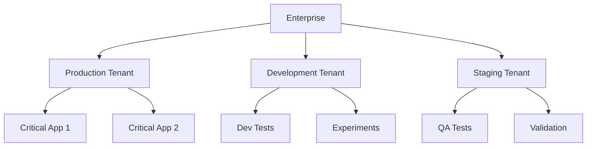
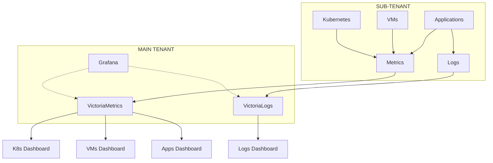

# Hikube Key Concepts

This page explains the **fundamental concepts** that make Hikube a unique cloud platform. Understanding these concepts will allow you to get the most out of your infrastructure and make informed decisions.

---

## Tenants: Your Private Space

### **What is a Tenant?**

A **tenant** is your isolated and secure environment within Hikube. It's like having your own "virtual datacenter" with:

- **Isolated network**
- **Separate users and permissions**
- **Custom security policies**
- **Sub-tenants** available

### **Why This Approach?**

**Concrete Advantages:**

- **Complete isolation** : No impact between environments
- **Team management** : Granular permissions per tenant
- **Differentiated policies** : Production vs development
- **Separate billing** : Cost tracking per project

### **Typical Use Cases**

| Tenant | Usage |
|--------|-------|
| **Production** | Critical applications |
| **Staging** | Pre-production testing |
| **Development** | Active development |
| **Sandbox** | Training/demonstration |

---

## Infrastructure as Code (IaC)

### **Designed for Industrialization**

Hikube is designed for automation and industrialization of your infrastructure. All features are accessible via:

- **Complete API** : Native integration into your CI/CD pipelines
- **Powerful CLI** : Automation and scripts for your DevOps teams
- **Declarative** : Describe the desired state, Hikube handles the rest

### **Advantages of the Industrial Approach**

- **Reproducibility** : Identical deployments every time
- **Versioning** : Complete tracking of infrastructure changes
- **Collaboration** : Code shared between development and ops teams
- **Automation** : Seamless integration into your workflows

---

## Observability and Monitoring

### **Complete Monitoring Stack**

Hikube allows you to deploy your own monitoring stack in your tenant with **Grafana + VictoriaMetrics + VictoriaLogs**. This stack can centralize data from all your sub-tenants for a global view of your infrastructure.

### **Multi-Tenant Monitoring Architecture**

#### **Intelligent Centralization**

- **Main tenant** : Hosts the Grafana + VictoriaMetrics + VictoriaLogs stack
- **Sub-tenants** : Automatically generate metrics and logs
- **Secure aggregation** : Centralized aggregation with data isolation
- **Global view** : Unified dashboard of your entire infrastructure

#### **Resource Dashboards**

Hikube provides **preconfigured dashboards** for each resource type:

| **Resource Type** | **Included Dashboard** | **Key Metrics** |
|---------------------------|-------------------------|------------------------|
| **Kubernetes** | Cluster, Nodes, Pods, Services | CPU, RAM, network, storage |
| **Virtual Machines** | Host, VM, Performance | Utilization, I/O, availability |
| **Databases** | MySQL, PostgreSQL, Redis | Connections, queries, cache |
| **Applications** | Performance, Errors | Latency, throughput, 5xx |
| **Network** | LoadBalancer, VPN | Traffic, latency, connections |
| **Storage** | Buckets, Volumes | Capacity, IOPS, transfers |

---

## Next Steps

Now that you master Hikube concepts, you can:

### **Put into Practice**

- **[Deploy Kubernetes](../services/kubernetes/overview.md)** → Create your first cluster
- **[Configure VMs](../services/compute/overview.md)** → Hybrid infrastructure
- **[Manage Storage](../services/storage/buckets/overview.md)** → Persistent data

### **Automate**

- **[Terraform](../tools/terraform.md)** → Infrastructure as Code
<!--- **[CLI](../tools/cli.md)** → Scripts and automation-->

### **Go Deeper**

- **[FAQ](../resources/faq.md)** → Frequently asked questions
- **[Troubleshooting](../resources/troubleshooting.md)** → Problem resolution

---

**Recommendation:** Start by exploring **[Kubernetes Services](../services/kubernetes/overview.md)** or **[Compute Services](../services/compute/overview.md)** to see how these concepts apply concretely to each Hikube component.
