# S3 Buckets on Hikube

Hikube **S3 Buckets** offer a **highly available**, **replicated**, and **S3-compatible** object storage solution for your cloud-native applications, backups, CI/CD artifacts, or analytical data.  
The platform provides a sovereign and performant alternative to Amazon S3, with native Kubernetes integration.

---

## 🏗️ Architecture and Operation

### **Distributed Object Storage**

Hikube buckets are based on a **100% distributed and replicated** S3 architecture across multiple datacenters.  
Unlike block volumes used for VMs, object storage is not attached to a machine: it is accessible via **standardized S3 APIs** from any authorized application or service.

#### 📦 Storage Layer

- Each bucket is hosted on a **multi-node infrastructure** distributed across several Swiss datacenters  
- Objects are **automatically replicated** across 3 distinct physical zones to guarantee maximum durability  
- The system is designed to tolerate the failure of an entire datacenter without data loss or unavailability

#### 🌐 Access Layer

- Buckets are accessible via a **unique HTTPS endpoint** compatible with S3 v4 signature  
- Access is authenticated by **S3 Access Keys** automatically generated when creating the bucket  
- Each bucket is isolated in its Kubernetes tenant and has its own credentials

---

### **Multi-Datacenter Architecture**

```mermaid
flowchart TD
    subgraph DC1["🏢 Geneva Datacenter"]
        B1["🪣 Bucket Data"]
        S1["📦 Objects"]
    end

    subgraph DC2["🏢 Lucerne Datacenter"]
        S2["📦 Objects (Replica)"]
    end

    subgraph DC3["🏢 Gland Datacenter"]
        S3["📦 Objects (Replica)"]
    end

    B1 --> S1
    S1 <-.->|"Replication"| S2
    S2 <-.->|"Replication"| S3
    S1 <-.->|"Replication"| S3

    style DC1 fill:#e3f2fd
    style DC2 fill:#e8f5e8
    style DC3 fill:#fff2e1
    style B1 fill:#f3e5f5
```



This architecture guarantees **availability and durability** of data, while remaining entirely operated in Switzerland 🇨🇭.

---

## ⚙️ Typical Use Cases

Hikube buckets are designed to cover a wide range of cloud storage scenarios:

| **Use Case**                 | **Description**                                                   |
| ------------------------------- | ----------------------------------------------------------------- |
| **Backups**                     | Automated backups of applications or persistent volumes |
| **CI/CD Artifacts**             | Storage of images, binaries and GitOps pipelines                   |
| **Static content**            | Hosting of public files (web assets, PDF, images)         |
| **Analytical data**         | Centralization of CSV/Parquet/JSON files for ETL and BI tools |
| **Logs and archives**            | Long-term storage of application logs and audit logs         |
| **VM Snapshots and exports**     | Storage of KubeVirt snapshots, RAW or QCOW2 exports              |
| **S3-compatible applications** | Direct use by third-party apps via SDK or AWS CLI       |

---

## 🔒 Isolation and Security

### **Separation by Tenant**

Each bucket is **provisioned in a specific Kubernetes namespace**, ensuring strict isolation:

- Credentials are unique per bucket and stored in an automatically generated Kubernetes Secret
- No data or access key is shared between tenants

### **Encryption and Secure Access**

- All access goes through **HTTPS/TLS** with S3 key authentication
- The endpoint does not allow anonymous access: a valid key is always required

---

## 🌐 Connectivity and Integration

### **Unique S3 Endpoint**

All buckets are accessible via the unique endpoint:

```url
https://prod.s3.hikube.cloud
```

### **Full Compatibility**

Hikube is compatible with standard AWS S3 tools and SDKs:

- **AWS CLI** : `aws s3 --endpoint-url https://prod.s3.hikube.cloud ...`
- **MinIO Client (`mc`)** : simple alias configuration with Access Key / Secret Key
- **Rclone / S3cmd / Velero / Restic** : native support via v4 signature

This allows seamless integration into existing CI/CD pipelines, backup tools, and analytical applications, without specific adaptation.

---

## 📦 Management and Portability

### **Simple Lifecycle**

- Bucket creation and deletion are done via a simple Kubernetes manifest
- Credentials are automatically generated and stored in a Secret in JSON format (`BucketInfo`)
- No manual configuration required

### **Standard Interoperability**

Thanks to S3 compatibility, your data remains **interoperable** with:

- Existing cloud tools (AWS CLI, MinIO, Velero…)
- Standard S3 migration pipelines (rclone sync, s3cmd mirror…)
- External analysis services (Spark, DuckDB, etc.)

---

## 🚀 Next Steps

Now that you understand Hikube Buckets architecture:

**🏃‍♂️ Immediate Start**
→ [Create your first bucket](./quick-start.md)

**📖 Advanced Configuration**
→ [Complete API Reference](./api-reference.md)

:::tip Production Recommendation
Use a dedicated bucket per application or environment.
:::

