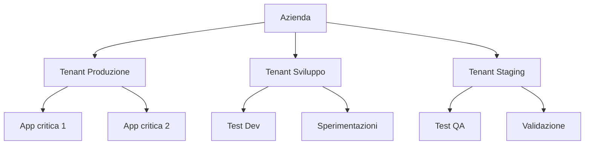
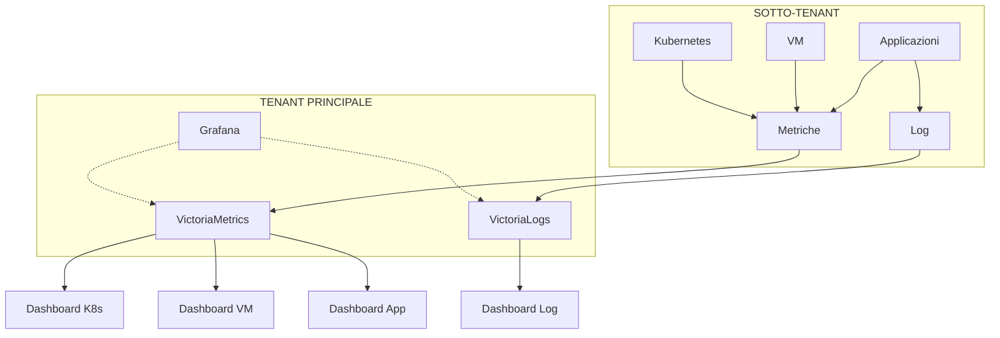

# Concetti chiave di Hikube

Questa pagina spiega i **concetti fondamentali** che rendono Hikube una piattaforma cloud unica. Comprendere questi concetti vi permetterà di sfruttare al meglio la vostra infrastruttura e di prendere decisioni informate.

---

## Tenant: Il Vostro Spazio Privato

### **Cos'è un Tenant?**
Un **tenant** è il vostro ambiente isolato e sicuro all'interno di Hikube. È come avere il vostro "datacenter virtuale" con:
- **Rete isolata**
- **Utenti e permessi** separati
- **Politiche di sicurezza** personalizzate
- **Sotto-tenant** a disposizione

### **Perché questo approccio?**

**Vantaggi concreti:**
- **Isolamento totale**: Nessun impatto tra gli ambienti
- **Gestione dei team**: Permessi granulari per tenant
- **Politiche differenziate**: Produzione vs sviluppo
- **Fatturazione separata**: Monitoraggio dei costi per progetto

### **Casi d'uso tipici**
| Tenant | Utilizzo |
|--------|----------|
| **Produzione** | Applicazioni critiche |
| **Staging** | Test pre-produzione |
| **Sviluppo** | Sviluppo attivo |
| **Sandbox** | Formazione/dimostrazione |

---

## Infrastructure as Code (IaC)

### **Pensato per l'Industrializzazione**
Hikube è progettato per l'automazione e l'industrializzazione della vostra infrastruttura. Tutte le funzionalità sono accessibili tramite:

- **API completa**: Integrazione nativa nelle vostre pipeline CI/CD
- **CLI potente**: Automazione e script per i vostri team DevOps
- **Dichiarativo**: Descrivete lo stato desiderato, Hikube si occupa del resto

### **Vantaggi dell'Approccio Industriale**
- **Riproducibilità**: Deployment identici ogni volta
- **Versionamento**: Tracciamento completo delle modifiche all'infrastruttura
- **Collaborazione**: Codice condiviso tra team di sviluppo e operations
- **Automazione**: Integrazione trasparente nei vostri workflow

---

## Osservabilità e Monitoring

### **Stack di Monitoring Completo**

Hikube vi permette di distribuire il vostro stack di monitoring nel vostro tenant con **Grafana + VictoriaMetrics + VictoriaLogs**. Questo stack può centralizzare i dati di tutti i vostri sotto-tenant per una visione globale della vostra infrastruttura.

### **Architettura Multi-Tenant del Monitoring**

#### **Centralizzazione Intelligente**
- **Tenant principale**: Ospita lo stack Grafana + VictoriaMetrics + VictoriaLogs
- **Sotto-tenant**: Generano metriche e log automaticamente
- **Raccolta sicura**: Aggregazione centralizzata con isolamento dei dati
- **Vista globale**: Dashboard unificata di tutta la vostra infrastruttura

#### **Dashboard per Risorsa**

Hikube fornisce **dashboard preconfigurate** per ogni tipo di risorsa:

| **Tipo di Risorsa** | **Dashboard Inclusa** | **Metriche Chiave** |
|---------------------------|-------------------------|------------------------|
| **Kubernetes** | Cluster, Nodi, Pod, Servizi | CPU, RAM, rete, storage |
| **Macchine Virtuali** | Host, VM, Prestazioni | Utilizzo, I/O, disponibilità |
| **Database** | MySQL, PostgreSQL, Redis | Connessioni, query, cache |
| **Applicazioni** | Prestazioni, Errori | Latenza, throughput, 5xx |
| **Rete** | LoadBalancer, VPN | Traffico, latenza, connessioni |
| **Storage** | Bucket, Volumi | Capacità, IOPS, trasferimenti |

---

## Prossimi Passi

Ora che avete padroneggiato i concetti di Hikube, potete:

### **Mettere in Pratica**
- **[Distribuire Kubernetes](../services/kubernetes/overview.md)** → Create il vostro primo cluster
- **[Configurare delle VM](../services/compute/overview.md)** → Infrastruttura ibrida
- **[Gestire lo storage](../services/storage/buckets/overview.md)** → Dati persistenti

### **Automatizzare**
- **[Terraform](../tools/terraform.md)** → Infrastructure as Code
<!--- **[CLI](../tools/cli.md)** → Script e automazione-->

### **Approfondire**
- **[FAQ](../resources/faq.md)** → Domande frequenti
- **[Troubleshooting](../resources/troubleshooting.md)** → Risoluzione dei problemi

---

**Raccomandazione:** Iniziate esplorando i **[Servizi Kubernetes](../services/kubernetes/overview.md)** o **[Servizi Compute](../services/compute/overview.md)** per vedere come questi concetti si applicano concretamente a ogni componente di Hikube.
