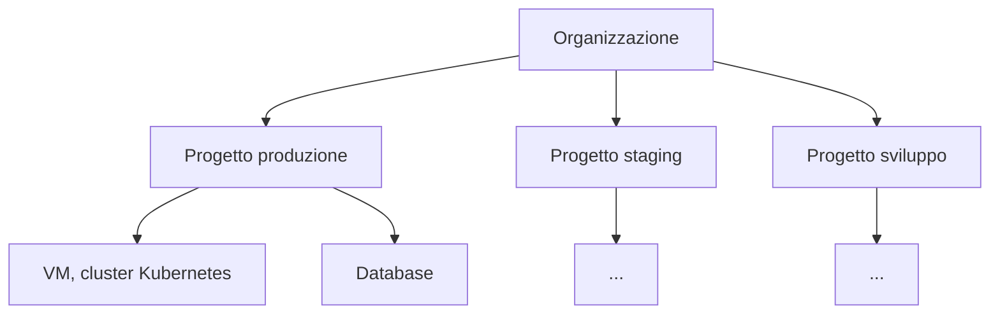

# Concetti chiave di Hikube

Questa pagina presenta le nozioni da conoscere per utilizzare Hikube: come sono organizzate le sue risorse, come le gestisce e che cosa la piattaforma gestisce al posto suo.

---

## La console Hikube

Tutte le operazioni correnti si svolgono nella **console web**: [https://console.hikube.cloud](https://console.hikube.cloud). Vi si accede con il proprio account Hikube (autenticazione unica). Dalla console si creano, modificano ed eliminano le risorse, se ne consultano lo stato e il costo stimato e si recuperano le informazioni di connessione.

Il menu laterale di un progetto raggruppa i servizi:

| Sezione | Servizi |
|---------|----------|
| **Dashboard** | Panoramica del progetto, quota, costi, risorse recenti |
| **Infrastructure** | **VM Instances**, **Disks**, **S3 Buckets**, **Kubernetes**, **Networking** |
| **DB & Messaging** | **PostgreSQL**, **MariaDB**, **MongoDB**, **Redis**, **RabbitMQ** |

---

## Organizzazione e progetti

```mermaid
graph TB
    O[Organizzazione] --> P1[Progetto produzione]
    O --> P2[Progetto staging]
    O --> P3[Progetto sviluppo]

    P1 --> R1[VM, cluster Kubernetes]
    P1 --> R2[Database]
    P2 --> R3[...]
    P3 --> R4[...]
```

### Organizzazione

L'**organizzazione** rappresenta la sua azienda. Viene creata da Hidora all'apertura dell'account e raggruppa i suoi utenti e i suoi progetti. Se ha accesso a più organizzazioni, può cambiarla dal menu del profilo (**Change organization**).

### Progetto

Un **progetto** è uno spazio isolato all'interno dell'organizzazione. Ogni risorsa (VM, disco, cluster, database…) appartiene a un solo progetto. Un progetto offre:

- **l'isolamento**: le risorse di un progetto non vedono quelle degli altri progetti;
- **le quota**: limiti di CPU, memoria e storage, che pongono un tetto al consumo del progetto;
- **il monitoraggio dei costi**: la dashboard del progetto stima il costo mensile delle sue risorse.

Un uso comune consiste nel creare un progetto per ambiente (produzione, staging, sviluppo) o per team.

:::note Terminologia precedente
Nelle versioni precedenti della documentazione, un progetto era chiamato **tenant**.
:::

### Quota

Le quota di un progetto si definiscono alla sua creazione (passaggio **Quotas** della procedura guidata) e si modificano in seguito nelle impostazioni del progetto. Le procedure guidate di creazione mostrano l'impatto di ogni nuova risorsa sulla quota prima di crearla. Una quota non può scendere al di sotto di quanto il progetto consuma già: liberi prima delle risorse.

### Eliminare un progetto

L'eliminazione di un progetto (impostazioni del progetto → **Danger Zone** → **Delete this project**) distrugge definitivamente tutte le sue risorse: VM, cluster Kubernetes, database, dischi, bucket S3 e reti. Questa azione è riservata agli amministratori del progetto o dell'organizzazione.

---

## Servizi gestiti

Hikube gestisce per lei l'infrastruttura sottostante di ogni servizio: alta disponibilità, replica dello storage tra datacenter, aggiornamenti della piattaforma. Lei sceglie la dimensione e la configurazione; la piattaforma esegue il provisioning e la manutenzione.

| Famiglia | Servizi |
|---------|----------|
| Calcolo | [Macchine virtuali](../services/compute/overview.md), [GPU](../services/gpu/overview.md) |
| Container | [Kubernetes gestito](../services/kubernetes/overview.md) |
| Storage | [Dischi](../services/storage/disks/overview.md), [Bucket S3](../services/storage/buckets/overview.md) |
| Rete | [VPC e sottoreti](../services/networking/overview.md) |
| Database | [PostgreSQL](../services/databases/postgresql/overview.md), [MariaDB](../services/databases/mariadb/overview.md), [MongoDB](../services/databases/mongodb/overview.md), [Redis](../services/databases/redis/overview.md) |
| Messaggistica | [RabbitMQ](../services/messaging/rabbitmq/overview.md) |

Alcuni servizi (ClickHouse, Kafka, NATS) non sono ancora disponibili in modalità self-service nella console: vengono forniti su richiesta dal supporto.

---

## Sovranità e disponibilità

- **Dati in Svizzera**: tutti i dati restano ospitati sul territorio svizzero.
- **Tre datacenter**: lo storage replicato è distribuito su tre datacenter geograficamente distinti.
- **Isolamento di rete**: ogni progetto dispone del proprio perimetro di rete.

---

## Prossimi passi

- **[Avvio rapido](./quick-start.md)**: crei il suo primo progetto e il suo primo cluster
- **[Macchine virtuali](../services/compute/overview.md)**: distribuisca una VM Linux o Windows
- **[FAQ](../resources/faq.md)**: domande frequenti
