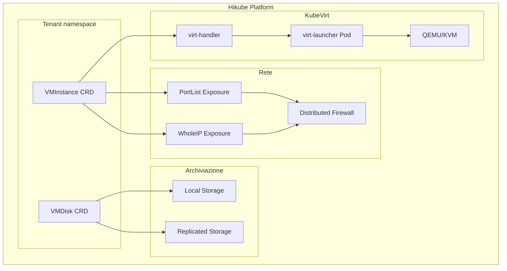
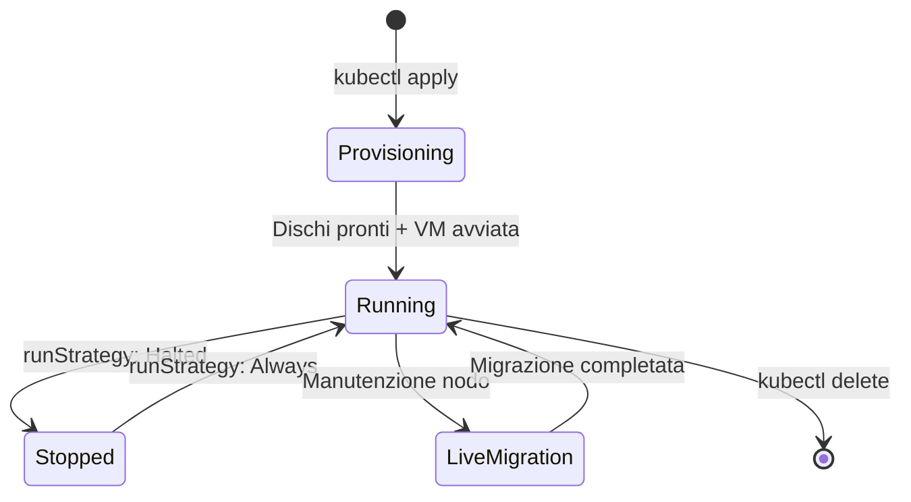

# Concetti — Macchine virtuali

## Architettura

Hikube fornisce macchine virtuali (VM) grazie a **KubeVirt**, una tecnologia che permette di eseguire VM direttamente all'interno dell'infrastruttura Kubernetes. Ogni VM è gestita come una risorsa Kubernetes nativa, offrendo un'integrazione trasparente con l'ecosistema cloud-native.

---

## Terminologia

| Termine | Descrizione |
|-------|-------------|
| **VMInstance** | Risorsa Kubernetes (`apps.cozystack.io/v1alpha1`) che rappresenta una macchina virtuale. Gestisce il ciclo di vita, i dischi, la rete e il cloud-init. |
| **VMDisk** | Risorsa Kubernetes che rappresenta un disco virtuale. Può essere creato a partire da un'immagine Golden, da una sorgente HTTP o vuoto. |
| **Golden Image** | Immagine OS preconfigurata è ottimizzata per KubeVirt (AlmaLinux, Rocky, Debian, Ubuntu, ecc.). |
| **Instance Type** | Profilo di risorse CPU/RAM definito da una serie (S, U, M) e una dimensione. |
| **cloud-init** | Meccanismo di inizializzazione automatica delle VM al primo avvio (utenti, pacchetti, script). |
| **PortList** | Metodo di esposizione di rete che espone porte specifiche con firewalling automatico sull'IP dedicato (raccomandato). |
| **WholeIP** | Metodo di esposizione di rete che assegna un IP pubblico dedicato alla VM. |

---

## Tipi di istanze

Hikube propone tre serie di istanze con rapporti CPU/RAM differenti:

| Serie | Rapporto CPU:RAM | Caso d'uso |
|-------|---------------|-------------|
| **S (Standard)** | 1:2 | Workload generali, CPU condiviso, burstable |
| **U (Universal)** | 1:4 | Workload bilanciati, più memoria |
| **M (Memory)** | 1:8 | Applicazioni memory-intensive (cache, database) |

Ogni serie va da `small` (1-2 vCPU) a `8xlarge` (32-64 vCPU).

---

## Archiviazione

Due classi di storage sono disponibili per i dischi delle VM:

| Classe | Caratteristica | Caso d'uso |
|--------|-----------------|-------------|
| **local** | Storage sul nodo fisico, prestazioni massime | Dati effimeri, cache, test |
| **replicated** | Replica su più nodi/regioni | Dati di produzione, alta disponibilità |

:::tip
Utilizzate `storageClass: replicated` per i dischi di sistema in produzione. Lo storage `local` offre migliori prestazioni I/O ma non sopravvive a un guasto del nodo.
:::

---

## Rete ed esposizione

### PortList (raccomandato)

La modalità **PortList** espone unicamente le porte specificate tramite un IP dedicato alla VM con firewalling automatico sul Service. È il metodo raccomandato perché:
- Limita la superficie d'attacco
- Assegna un IP dedicato alla VM
- Supporta le porte TCP standard (22, 80, 443, ecc.)

### WholeIP

La modalità **WholeIP** assegna un IP pubblico dedicato con tutte le porte aperte. Utile quando:
- La VM deve essere accessibile su porte dinamiche
- Un protocollo necessità un IP dedicato (VPN, SIP, ecc.)
- La VM funge da gateway o VPN

---

## Ciclo di vita di una VM

Le VM Hikube supportano:
- **Avvio/arresto** tramite il campo `spec.runStrategy`
- **Live migration** trasparente durante le manutenzioni
- **Auto-restart** in caso di guasto del nodo host
- **Snapshot** per il backup puntuale

---

## Isolamento e sicurezza

Ogni VM beneficia di un isolamento multi-livello:

- **Isolamento kernel**: KubeVirt esegue ogni VM nel proprio processo QEMU/KVM
- **Isolamento di rete**: firewall distribuito tra i tenant
- **Isolamento storage**: ogni disco è un volume dedicato

---

## Limiti e quote

| Parametro | Limite |
|-----------|--------|
| vCPU per VM | Fino a 64 (serie S `s1.8xlarge`) |
| RAM per VM | Fino a 256 GB (serie M `m1.8xlarge`) |
| Dischi per VM | Multipli (sistema + dati) |
| Dimensione disco | Variabile, secondo la quota del tenant |

---

## Per approfondire

- [Panoramica](./overview.md): presentazione dettagliata del servizio
- [Riferimento API](./api-reference.md): lista completa dei parametri VMInstance e VMDisk
