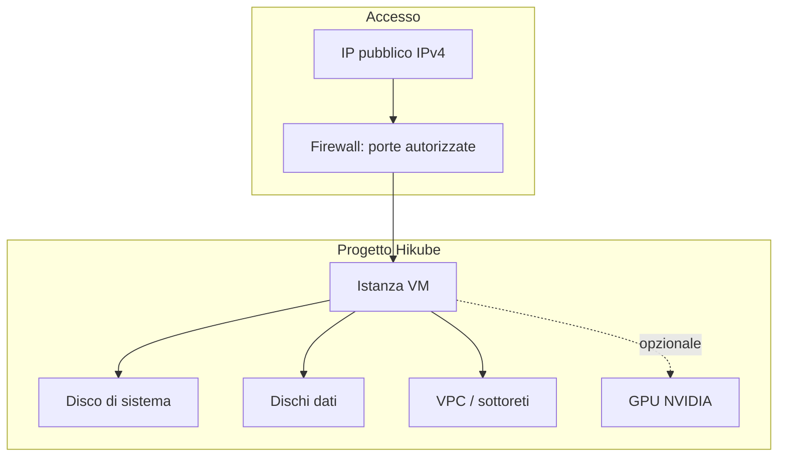
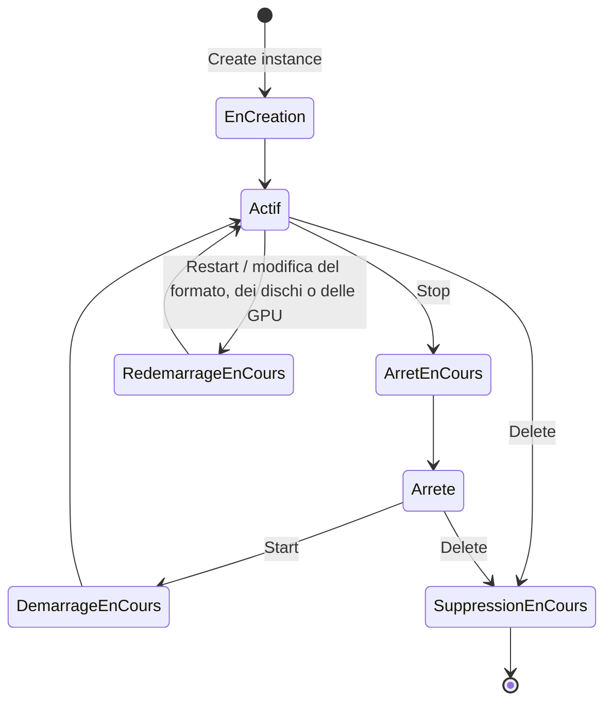

# Concetti — Macchine virtuali

## Architettura

Un'**istanza VM** Hikube riunisce un formato di calcolo (vCPU e RAM), uno o più dischi, una configurazione di rete e, in opzione, delle GPU. La gestisce dalla console.

```mermaid
graph TB
    subgraph "Progetto Hikube"
        VM[Istanza VM]
        SYS[Disco di sistema]
        DATA[Dischi dati]
        VPC[VPC / sottoreti]
        GPU[GPU NVIDIA]
    end

    subgraph "Accesso"
        PUB[IP pubblico IPv4]
        FW[Firewall: porte autorizzate]
    end

    VM --> SYS
    VM --> DATA
    VM --> VPC
    VM -.opzionale.-> GPU
    PUB --> FW --> VM
```

---

## Terminologia

| Termine | Descrizione |
|-------|-------------|
| **Progetto** | Spazio isolato che raggruppa le sue risorse e dispone di quote (CPU, memoria, storage). In precedenza chiamato *tenant*. |
| **Istanza VM** | Macchina virtuale. Il suo nome (da 3 a 16 caratteri, lettere minuscole, cifre e trattini, che inizia con una lettera) non è più modificabile dopo la creazione. |
| **Tipo di istanza** | Formato CPU/RAM, definito da una serie (S, U, M) e da una dimensione (ad esempio `u1.xlarge`). |
| **Immagine di sistema** | Sistema operativo installato sul disco di sistema (Ubuntu, Debian, Rocky Linux, Windows Server…). |
| **Disco di sistema** | Primo disco della VM, quello da cui si avvia. Per impostazione predefinita porta il nome della VM. |
| **Disco dati** | Disco aggiuntivo, vuoto alla creazione. Compare nel sistema operativo come dispositivo a blocchi aggiuntivo (`/dev/vdb`, `/dev/vdc`…). |
| **Replica** | Modalità di copia dei dati di un disco su più nodi: **Asynchronous** o **Synchronous**. |
| **Firewall** | Filtraggio del traffico in ingresso sull'IP pubblico: solo le porte autorizzate sono aperte. |
| **VPC** | Rete privata del progetto, suddivisa in sottoreti, a cui una VM può essere collegata. Vedere [Rete](../networking/concepts.md). |
| **cloud-init (User Data)** | Script di inizializzazione eseguito all'avvio della VM (pacchetti, utenti, comandi). Non disponibile per Windows. |

---

## Tipi di istanza

| Serie | Etichetta nella console | Rapporto vCPU:RAM | Dimensioni |
|-------|-------------------------|----------------|---------|
| `s1` | **Standard (S)** | 1:2 | da `small` (1 vCPU) a `8xlarge` (64 vCPU) |
| `u1` | **Universal (U)** | 1:4 | da `medium` (1 vCPU) a `8xlarge` (32 vCPU) |
| `m1` | **Memory (M)** | 1:8 | da `large` (2 vCPU) a `8xlarge` (32 vCPU) |

Il dettaglio delle dimensioni si trova nella [panoramica](./overview.md#tipi-di-istanza).

---

## Storage

Ogni disco creato con la VM si configura nel passaggio **Storage** della procedura guidata:

| Parametro | Valori | Note |
|-----------|---------|-----------|
| **Volume Name** | Generato a partire dal nome della VM (`ma-vm`, `ma-vm-2`…) | Modificabile |
| **Size (GB)** | Minimo 20 GB, massimo 4096 GB | Minimo 50 GB per Windows, 40 GB per Oracle Linux |
| **Replication Type** | **Asynchronous Replication** (Recommended) o **Synchronous Replication** | Vedere sotto |
| **Disk Encryption** | Attivata / disattivata | Cifratura LUKS dei dati a riposo |

| Modalità | RTO | RPO | Uso |
|------|-----|-----|-------|
| **Asynchronous Replication** | < 5 min | < 5 min | Scelta predefinita, adatta alla maggior parte degli usi |
| **Synchronous Replication** | < 5 min | < 1 min | Dati per i quali la perdita massima tollerata deve essere minima |

Un disco può anche essere **Existing**: viene allora scelto tra i dischi del progetto che non sono collegati ad alcuna VM. Il disco di sistema può essere solo un disco che contiene un'immagine; i dischi dati possono essere solo dischi senza immagine.

I dischi sono risorse a sé stanti, gestite nel menu **Disks**: vedere [Dischi](../storage/disks/concepts.md).

---

## Rete

| Opzione della procedura guidata | Predefinito | Effetto |
|-----------------------|--------|-------|
| **Public IPv4 Address** | Attivata | La VM riceve un IP pubblico raggiungibile da Internet. |
| **Enable Firewall** | Attivato | Solo le **Allowed Ports** sono aperte in ingresso (SSH 22 selezionata per impostazione predefinita; HTTP 80, HTTPS 443 e porte personalizzate in opzione). |
| Firewall disattivato | — | Tutte le porte dell'IP pubblico sono aperte. Protegga allora la VM con un firewall nel sistema operativo. |
| **VPC Networks (Secondary)** | Nessuno | Ogni sottorete selezionata aggiunge un'interfaccia di rete privata alla VM. |

---

## Ciclo di vita

```mermaid
stateDiagram-v2
    [*] --> EnCreation: Create instance
    EnCreation --> Actif
    Actif --> ArretEnCours: Stop
    ArretEnCours --> Arrete
    Arrete --> DemarrageEnCours: Start
    DemarrageEnCours --> Actif
    Actif --> RedemarrageEnCours: Restart / modifica del formato, dei dischi o delle GPU
    RedemarrageEnCours --> Actif
    Actif --> SuppressionEnCours: Delete
    Arrete --> SuppressionEnCours: Delete
    SuppressionEnCours --> [*]
```

Stati mostrati nella console: **Creating**, **Running**, **Starting**, **Stopping**, **Stopped**, **Restarting**, **Deleting**, **Error**, **Failed**, **Unknown**.

L'opzione **Automatic Restart** (passaggio **Configuration** della procedura guidata, oppure **Advanced Configuration** in modifica) fa riavviare automaticamente la VM in caso di crash imprevisto. È disattivata per impostazione predefinita.

---

## Cosa è modificabile dopo la creazione

| Elemento | Modificabile | Effetto |
|---------|-----------|-------|
| Nome, immagine di sistema | No | — |
| Tipo di istanza | Sì | Riavvio della VM |
| Dischi (aggiunta, scollegamento) | Sì | Riavvio della VM |
| GPU | Sì | Riavvio della VM |
| IP pubblico, firewall, porte, VPC | Sì | Applicato senza riavvio |
| Chiavi SSH | Sì | Proposta di ricaricare lo user-data, applicato al riavvio successivo |
| Script cloud-init, riavvio automatico | Sì | Script rieseguito dopo **Reload UserData** e riavvio |

---

## Quote

Ogni progetto dispone di quote **CPU**, **Memory** e **Storage**. La procedura guidata mostra il consumo attuale, l'aggiunta prevista e il totale; il pulsante **Next** resta disattivato finché la nuova VM supera una quota. Lo stesso controllo si applica al pulsante **Save** durante una modifica.

La procedura guidata mostra anche una stima del costo della VM: tipo di istanza, nuovi dischi, GPU, licenza Windows se applicabile e IP pubblico.

---

## Per approfondire

- [Panoramica](./overview.md)
- [Avvio rapido](./quick-start.md)
- [Dischi](../storage/disks/overview.md)
- [Rete: VPC e sottoreti](../networking/overview.md)
