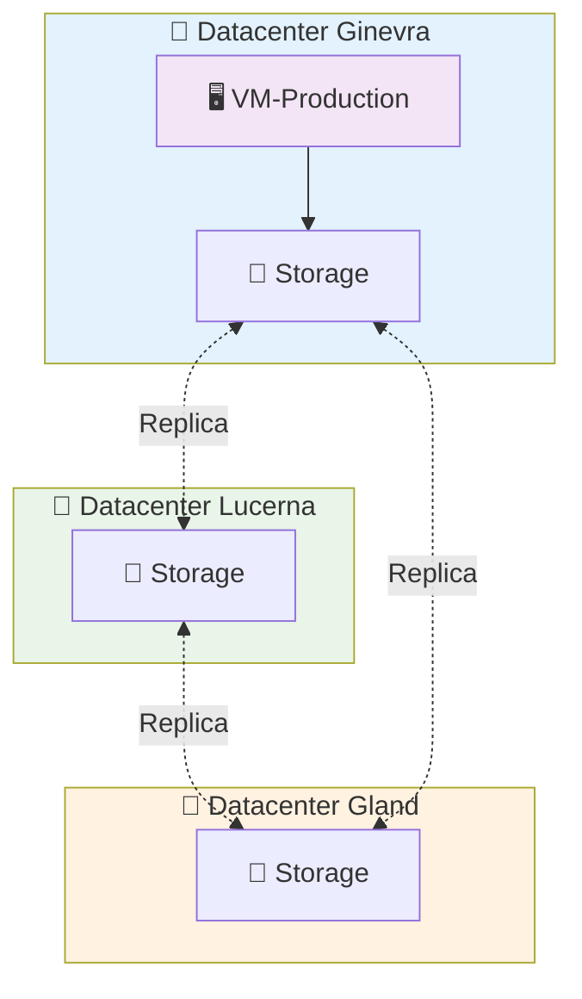

# Macchine Virtuali su Hikube

Le **Macchine Virtuali (VM)** di Hikube offrono una virtualizzazione completa dell'infrastruttura hardware, garantendo l'esecuzione di sistemi operativi eterogenei e di applicazioni aziendali in ambienti isolati e conformi ai requisiti di sicurezza enterprise.

---

## 🏗️ Architettura e Funzionamento

### **Separazione Compute e Storage**

Hikube utilizza un'architettura **disaccoppiata** tra calcolo e archiviazione che garantisce una resilienza ottimale:

**💻 Livello Compute**

- La VM viene eseguita su **server fisici** in uno dei 3 datacenter
- Se un nodo si guasta, la VM viene **automaticamente riavviata** su un altro nodo
- Se un datacenter si guasta, la VM viene **automaticamente riavviata** su un altro nodo in uno dei 2 datacenter rimanenti
- Il tempo di indisponibilità si limita al riavvio (generalmente < 2 minuti)

**💾 Livello Storage (Persistente)**

- I dischi delle VM sono **replicati automaticamente** su più nodi fisici con lo storage "replicated"
- **Nessuna perdita di dati** anche in caso di guasto hardware multiplo
- I dischi sopravvivono ai guasti e rimangono collegabili alla VM rilocalizzata

Questa separazione garantisce che **i vostri dati sono sempre al sicuro**, anche se il server fisico che ospita la vostra VM diventa indisponibile o un datacenter diventa indisponibile.
Garantiamo le risorse!

### **Architettura Multi-Datacenter**

---

## ⚙️ Tipi di Istanze

### **Gamma Completa per Tutte le Esigenze**

Hikube propone tre serie di istanze ottimizzate per differenti profili d'uso, garantendo prestazioni adatte a ogni workload:

### **Serie S - Standard (Rapporto 1:2)**

Istanze **orientate al calcolo** con un rapporto CPU/memoria di 1:2, ideali per i carichi CPU-intensivi.

| **Istanza** | **vCPU** | **RAM** | **Casi d'Uso Tipici** |
|--------------|----------|---------|---------------------------|
| `s1.small`   | 1        | 2 GB    | Servizi leggeri, proxy |
| `s1.medium`  | 2        | 4 GB    | Worker, batch processing |
| `s1.large`   | 4        | 8 GB    | Calcolo scientifico |
| `s1.xlarge`  | 8        | 16 GB   | Rendering, compilazione |
| `s1.3large`  | 12       | 24 GB   | Applicazioni intensive |
| `s1.2xlarge` | 16       | 32 GB   | HPC, simulazioni |
| `s1.3xlarge` | 24       | 48 GB   | Calcolo distribuito |
| `s1.4xlarge` | 32       | 64 GB   | Calcolo massivo |
| `s1.8xlarge` | 64       | 128 GB  | Calcolo exascale |

### **Serie U - Universal (Rapporto 1:4)**

Istanze **polivalenti** che offrono un equilibrio ottimale tra CPU e memoria per la maggior parte delle applicazioni aziendali.

| **Istanza** | **vCPU** | **RAM** | **Casi d'Uso Tipici** |
|--------------|----------|---------|---------------------------|
| `u1.medium`  | 1        | 4 GB    | Dev, test, micro-servizi |
| `u1.large`   | 2        | 8 GB    | Applicazioni web, API |
| `u1.xlarge`  | 4        | 16 GB   | Applicazioni aziendali |
| `u1.2xlarge` | 8        | 32 GB   | Workload intensivi |
| `u1.4xlarge` | 16       | 64 GB   | Applicazioni critiche |
| `u1.8xlarge` | 32       | 128 GB  | Applicazioni enterprise |

### **Serie M - Memory (Rapporto 1:8)**

Istanze **ad alta memoria** con un rapporto CPU/memoria di 1:8 per le applicazioni ad alto consumo di RAM.

| **Istanza** | **vCPU** | **RAM** | **Casi d'Uso Tipici** |
|--------------|----------|---------|---------------------------|
| `m1.large`   | 2        | 16 GB   | Cache Redis, Memcached |
| `m1.xlarge`  | 4        | 32 GB   | Database in-memory |
| `m1.2xlarge` | 8        | 64 GB   | Analytics, Big Data |
| `m1.4xlarge` | 16       | 128 GB  | SAP HANA, Oracle |
| `m1.8xlarge` | 32       | 256 GB  | Data warehouse |

:::tip **Guida alla Selezione**

- **Calcolo intensivo, CI/CD** → Serie **S** (rapporto 1:2, CPU ottimizzato)
- **Applicazioni web classiche** → Serie **U** (rapporto 1:4, bilanciata)
- **Database, Analytics** → Serie **M** (rapporto 1:8, memoria ottimizzata)
:::

---

## 🔒 Isolamento e Sicurezza

### **Multi-Tenant by Design**

Ogni VM beneficia di un **isolamento completo** grazie a un'architettura sicura che isola rigorosamente le risorse tra i diversi tenant. Questo isolamento si basa su diversi livelli di protezione complementari:

- **Tenant**: Separazione logica delle risorse a livello applicativo, ogni tenant dispone del proprio spazio di esecuzione
- **Isolamento kernel**: Isolamento di rete e processi a livello del kernel Linux, che garantisce che nessuna VM possa accedere alle risorse di un'altra
- **Storage class**: Crittografia automatica e isolamento dei dati, con separazione crittografica dei volumi per tenant

---

## 🌐 Connettività e Accesso

### **Metodi di Accesso Nativi**

L'accesso alle macchine virtuali Hikube avviene tramite meccanismi nativi integrati nella piattaforma, eliminando la necessità di un'infrastruttura di rete complessa. La **console seriale** fornisce un accesso diretto di basso livello indipendente dalla rete, ideale per il debugging e la manutenzione di sistema. Per gli ambienti grafici, **VNC** permette una connessione all'interfaccia utente della VM tramite tunnel sicuri. L'accesso **SSH** tradizionale resta disponibile sia tramite `virtctl ssh` che gestisce automaticamente la connettività, sia direttamente tramite l'IP esterno assegnato. I servizi applicativi possono essere esposti selettivamente tramite **liste di porte controllate** che filtrano intelligentemente il traffico senza compromettere la sicurezza del tenant.

### **Rete Definita dal Software**

L'architettura di rete di Hikube si basa su un approccio Software-Defined che virtualizza completamente il livello di rete. Ogni VM riceve automaticamente un **IP privato** in un segmento di rete isolato per tenant, garantendo l'isolamento permettendo al contempo la comunicazione interna. Il sistema può opzionalmente assegnare un **IP pubblico IPv4** per l'esposizione esterna, con un routing automatico che mantiene la segmentazione sicura. Il **firewall distribuito** applica politiche di sicurezza granulari direttamente a livello di ogni VM, con regole restrittive di default che si adattano dinamicamente alle esigenze dell'applicazione.

---

## 📦 Migrazione e Portabilità

### **Import di Workload Esistenti**

La piattaforma Hikube facilita la migrazione di infrastrutture esistenti grazie a meccanismi di import universali che preservano l'integrità dei workload. Le **immagini cloud standardizzate** (Ubuntu Cloud Images, CentOS Cloud) si integrano nativamente per un deployment immediato con le ottimizzazioni cloud native. Per le installazioni personalizzate, l'import di **immagini ISO** permette di ricreare ambienti su misura conservando tutte le configurazioni specifiche. Gli **snapshot VMware** vengono convertiti automaticamente dal formato VMDK a RAW, assicurando una transizione trasparente dalle infrastrutture di virtualizzazione tradizionali. La compatibilità con i **formati Proxmox e OpenStack** (QCOW2) garantisce l'interoperabilità con la maggior parte delle soluzioni cloud esistenti.

### **Gestione del Ciclo di Vita**

Il sistema di gestione del ciclo di vita integra meccanismi automatizzati che assicurano la continuità operativa delle macchine virtuali. Gli **snapshot** catturano istantaneamente lo stato completo della VM, inclusa la memoria e lo storage, per permettere rollback precisi durante la manutenzione o gli incidenti. Il **backup automatico** orchestra salvataggi programmati dei dischi con retention configurabile, replicati automaticamente sui tre datacenter per garantire il recupero in caso di disastro. La **live migration** sposta le VM tra nodi fisici senza interruzione di servizio, facilitando la manutenzione hardware e l'ottimizzazione dei carichi senza impatto sulle applicazioni critiche.

---

## 🚀 Prossimi Passi

Ora che comprendete l'architettura delle VM Hikube:

**🏃‍♂️ Avvio Immediato**
→ [Creare la vostra prima VM in 5 minuti](./quick-start.md)

**📖 Configurazione Avanzata**
→ [Riferimento API completo](./api-reference.md)

:::tip Architettura Raccomandata
Per la produzione, utilizzate sempre la classe di storage `replicated` e dimensionate le vostre VM con almeno 2 vCPU per beneficiare di migliori prestazioni.
:::
