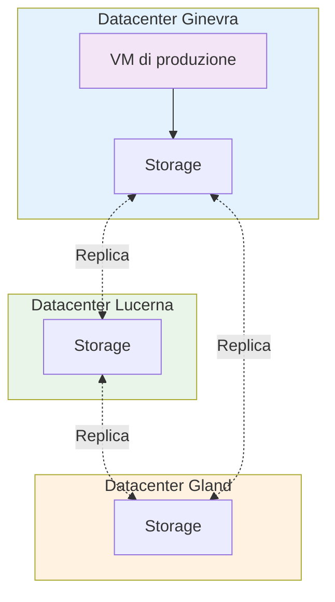

import NavigationFooter from '@site/src/components/NavigationFooter';

# Macchine virtuali su Hikube

Le **macchine virtuali (VM)** di Hikube offrono una virtualizzazione completa dell'infrastruttura hardware, per eseguire sistemi operativi eterogenei e applicazioni aziendali in ambienti isolati.

Nella [console Hikube](https://console.hikube.cloud), le VM si gestiscono dal menu **Infrastructure** > **VM Instances**: creazione guidata, avvio e arresto, modifica delle risorse, dei dischi e della rete, eliminazione.

---

## Cosa può fare dalla console

| Esigenza | Dove farlo |
|--------|-------------|
| Creare una VM (immagine, formato, dischi, rete, chiavi SSH, cloud-init, GPU) | **VM Instances** > **Create an Instance** |
| Avviare, arrestare, riavviare | Menu **Actions** dell'elenco, oppure sezione **Actions** della pagina di dettaglio |
| Cambiare formato, aggiungere un disco o una GPU, modificare le porte aperte | Pagina di dettaglio > **Edit** |
| Rieseguire lo script cloud-init | **Reload UserData**, poi **Restart** |
| Ottenere il comando SSH pronto da copiare | Pagina di dettaglio, sezione **Network & Security** > **SSH Connection** |
| Collegare la VM a una rete privata | Passaggio **Network** della procedura guidata, oppure menu **Networking** (vedere [VPC e sottoreti](../networking/overview.md)) |

---

## Architettura e funzionamento

### Separazione tra calcolo e storage

Hikube separa il calcolo dallo storage:

**Livello di calcolo**

- La VM viene eseguita su server fisici distribuiti su 3 datacenter.
- Se il nodo che la ospita si guasta, la VM viene riavviata su un altro nodo.
- L'indisponibilità si limita al tempo di riavvio.

**Livello di storage**

- I dischi delle VM sono **replicati** su più nodi fisici, in modalità sincrona o asincrona (scelta effettuata disco per disco nella procedura guidata).
- I dischi sopravvivono ai guasti hardware e restano collegabili alla VM riallocata.
- Esistono indipendentemente dalla VM: eliminare una VM ne scollega i dischi senza eliminarli. Restano visibili nel menu **Disks** (vedere [Dischi](../storage/disks/overview.md)).

### Architettura multi-datacenter

```mermaid
flowchart TD
    subgraph DC1["Datacenter Ginevra"]
        VM1["VM di produzione"]
        STORAGE1["Storage"]
    end

    subgraph DC2["Datacenter Lucerna"]
        STORAGE2["Storage"]
    end

    subgraph DC3["Datacenter Gland"]
        STORAGE3["Storage"]
    end

    VM1 --> STORAGE1

    STORAGE1 <-.->|"Replica"| STORAGE2
    STORAGE2 <-.->|"Replica"| STORAGE3
    STORAGE1 <-.->|"Replica"| STORAGE3

    style DC1 fill:#e3f2fd
    style DC2 fill:#e8f5e8
    style DC3 fill:#fff2e1
    style VM1 fill:#f3e5f5
```

---

## Tipi di istanza

Al passaggio **Configuration** della procedura guidata, la console propone tre serie. Scelga prima la serie, poi la dimensione dell'istanza.

### Serie Standard (S) — rapporto 1:2

*Uso economico, per lo sviluppo e i test.*

| Istanza | vCPU | RAM |
|----------|------|-----|
| `s1.small` | 1 | 2 GB |
| `s1.medium` | 2 | 4 GB |
| `s1.large` | 4 | 8 GB |
| `s1.xlarge` | 8 | 16 GB |
| `s1.3large` | 12 | 24 GB |
| `s1.2xlarge` | 16 | 32 GB |
| `s1.3xlarge` | 24 | 48 GB |
| `s1.4xlarge` | 32 | 64 GB |
| `s1.8xlarge` | 64 | 128 GB |

### Serie Universal (U) — rapporto 1:4

*Uso generale: server web, applicazioni.*

| Istanza | vCPU | RAM |
|----------|------|-----|
| `u1.medium` | 1 | 4 GB |
| `u1.large` | 2 | 8 GB |
| `u1.xlarge` | 4 | 16 GB |
| `u1.2xlarge` | 8 | 32 GB |
| `u1.4xlarge` | 16 | 64 GB |
| `u1.8xlarge` | 32 | 128 GB |

### Serie Memory (M) — rapporto 1:8

*Ottimizzata per la memoria: database, cache.*

| Istanza | vCPU | RAM |
|----------|------|-----|
| `m1.large` | 2 | 16 GB |
| `m1.xlarge` | 4 | 32 GB |
| `m1.2xlarge` | 8 | 64 GB |
| `m1.3xlarge` | 12 | 96 GB |
| `m1.4xlarge` | 16 | 128 GB |
| `m1.8xlarge` | 32 | 256 GB |

:::tip Guida alla scelta
- **Sviluppo, test, servizi leggeri**: serie **S**.
- **Applicazioni web e aziendali**: serie **U**.
- **Database, cache, analisi**: serie **M**.

Il formato si può cambiare in seguito da **Edit**; la VM si riavvia per applicare la modifica.
:::

---

## Sistemi operativi

Il disco di sistema viene creato a partire da un'immagine fornita da Hikube. La procedura guidata mostra le immagini disponibili sotto forma di schede, con un selettore di versione:

| Immagine | Versioni |
|-------|----------|
| AlmaLinux | 8, 9 |
| CentOS Stream | 9, 10 |
| CloudLinux | 8, 9 |
| Debian | 12, 13 |
| openSUSE | 15.6, 16.0 |
| Oracle Linux | 8, 9, 10 |
| Rocky Linux | 8, 9, 10 |
| Ubuntu | 22.04, 24.04 |
| Windows Server | 2022, 2025 |

Fa fede l'elenco mostrato nella console: evolve con le versioni supportate.

:::note Immagine personalizzata
L'importazione di un'immagine personalizzata (ISO o QCOW2 da un URL HTTPS) avviene creando un disco nel menu **Disks**. Questo disco può poi essere scelto come disco di sistema di una nuova VM (opzione **Existing**). Vedere [Creare un disco di sistema da un'immagine](../storage/disks/how-to/create-from-image.md).
:::

---

## Connettività e accesso

- **IP pubblico**: opzione **Public IPv4 Address**, attivata per impostazione predefinita. La VM è quindi raggiungibile da Internet.
- **Firewall**: opzione **Enable Firewall**, attivata per impostazione predefinita. Solo le porte selezionate (22 per impostazione predefinita; 80, 443 o qualsiasi porta personalizzata in opzione) sono aperte in ingresso. Senza firewall, tutte le porte dell'IP pubblico sono aperte.
- **Reti private**: la VM può essere collegata a uno o più [VPC](../networking/overview.md) per comunicare in privato con altre VM del progetto.
- **SSH**: la pagina di dettaglio mostra il comando `ssh <utente>@<ip>` pronto da copiare. L'accesso avviene con le chiavi SSH pubbliche inserite nella procedura guidata.
- **Windows**: una password di amministratore viene generata alla creazione e mostrata una sola volta. L'accesso avviene in RDP.

:::note Console seriale e VNC
L'accesso tramite console seriale o VNC non è disponibile nella console; contatti il [supporto](mailto:support@hidora.io) se ne ha bisogno per una diagnosi.
:::

---

## Isolamento e sicurezza

- Ogni **progetto** è uno spazio isolato: le VM di un progetto non vedono quelle di un altro.
- Ogni VM viene eseguita nel proprio processo di virtualizzazione, isolato a livello di kernel.
- I dischi possono essere **cifrati a riposo** (LUKS), opzione **Disk Encryption** alla creazione.

---

## Passi successivi

- [Creare la prima VM](./quick-start.md)
- [Comprendere i concetti](./concepts.md)
- [Configurare la rete e il firewall](./how-to/configure-network.md)

<NavigationFooter
  nextSteps={[
    {label: "Concetti", href: "../concepts"},
    {label: "Avvio rapido", href: "../quick-start"},
  ]}
/>
