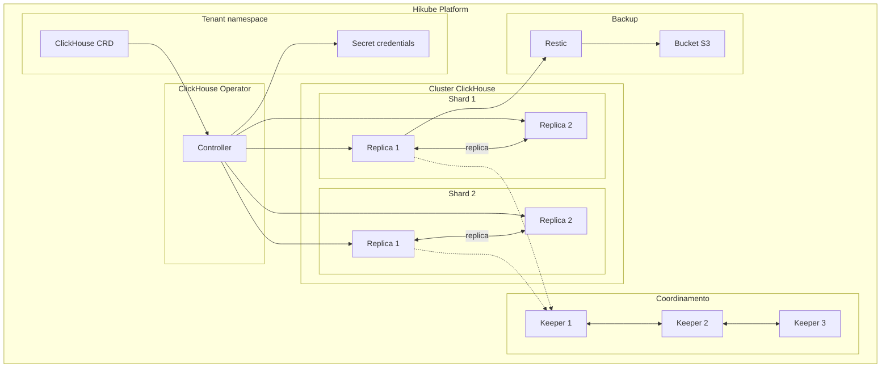
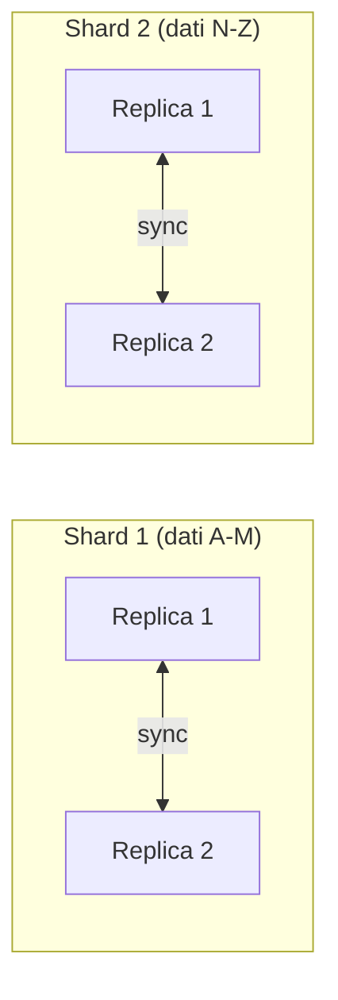

# Concetti — ClickHouse

## Architettura

ClickHouse su Hikube e un servizio gestito basato sull'operatore **ClickHouse Operator**. E un database SQL orientato per colonne, ottimizzato per l'analisi dei dati (OLAP). L'architettura si basa su **shard** (partizionamento orizzontale) e **repliche** (alta disponibilita), coordinati da **ClickHouse Keeper**.

---

## Terminologia

| Termine | Descrizione |
|---------|-------------|
| **ClickHouse** | Risorsa Kubernetes (`apps.cozystack.io/v1alpha1`) che rappresenta un cluster ClickHouse gestito. |
| **Shard** | Partizione orizzontale dei dati. Ogni shard contiene un sottoinsieme dei dati totali. |
| **Replica** | Copia di uno shard. Assicura la ridondanza e permette la lettura parallela. |
| **ClickHouse Keeper** | Servizio di coordinamento distribuito (alternativa a ZooKeeper) che gestisce la replica e il consenso tra i nodi. |
| **Restic** | Strumento di backup per creare snapshot cifrati verso uno storage S3. |
| **OLAP** | Online Analytical Processing — modello di accesso ai dati ottimizzato per le query analitiche (aggregazioni, scansioni di colonne). |
| **resourcesPreset** | Profilo di risorse predefinito (da nano a 2xlarge). |

---

## Sharding e replica

### Sharding

Lo sharding distribuisce i dati orizzontalmente tra piu nodi:

- Ogni **shard** contiene una parte dei dati
- Le query `SELECT` vengono eseguite in parallelo su tutti gli shard
- Il parametro `shards` nel manifesto determina il numero di partizioni

### Replica

Ogni shard puo avere piu repliche:

- Le repliche di uno stesso shard contengono **dati identici**
- Il coordinamento e assicurato da **ClickHouse Keeper**
- In caso di guasto di una replica, le letture vengono reindirizzate verso le altre

:::tip
Per piccoli volumi di dati, un solo shard con 2 repliche e sufficiente. Aggiungete shard quando il volume supera le capacita di un singolo nodo.
:::

---

## ClickHouse Keeper

ClickHouse Keeper sostituisce ZooKeeper per il coordinamento del cluster:

- Gestisce il **consenso** tra le repliche (protocollo Raft)
- Archivia i **metadati** del cluster (tabelle distribuite, replica)
- Necessita di un numero **dispari** di istanze (3 raccomandato) per il quorum

| Parametro Keeper | Descrizione |
|-------------------|-------------|
| `keeper.replicas` | Numero di istanze Keeper (3 raccomandato) |
| `keeper.resources` / `keeper.resourcesPreset` | Risorse allocate al Keeper |
| `keeper.size` | Dimensione dello storage Keeper |

---

## Backup

ClickHouse su Hikube utilizza **Restic** per i backup, con lo stesso modello di MySQL:

- Snapshot **cifrati** archiviati in un bucket S3
- Pianificazione tramite cron (`backup.schedule`)
- Strategia di retention configurabile (`backup.cleanupStrategy`)

---

## Gestione degli utenti

Gli utenti sono dichiarati nel manifesto con:

- **Password** per l'autenticazione
- **Flag readonly**: `true` per un accesso in sola lettura, `false` per l'accesso completo

Un utente `admin` viene creato automaticamente con i diritti completi.

---

## Preset di risorse

| Preset | CPU | Memoria |
|--------|-----|---------|
| `nano` | 250m | 128Mi |
| `micro` | 500m | 256Mi |
| `small` | 1 | 512Mi |
| `medium` | 1 | 1Gi |
| `large` | 2 | 2Gi |
| `xlarge` | 4 | 4Gi |
| `2xlarge` | 8 | 8Gi |

---

## Limiti e quote

| Parametro | Valore |
|-----------|--------|
| Shard max | Secondo la quota del tenant |
| Repliche per shard | Secondo la quota del tenant |
| Dimensione archiviazione (`size`) | Variabile (in Gi) |
| Istanze Keeper | 3 raccomandato (dispari) |

---

## Per approfondire

- [Panoramica](./overview.md): presentazione del servizio
- [Riferimento API](./api-reference.md): tutti i parametri della risorsa ClickHouse
