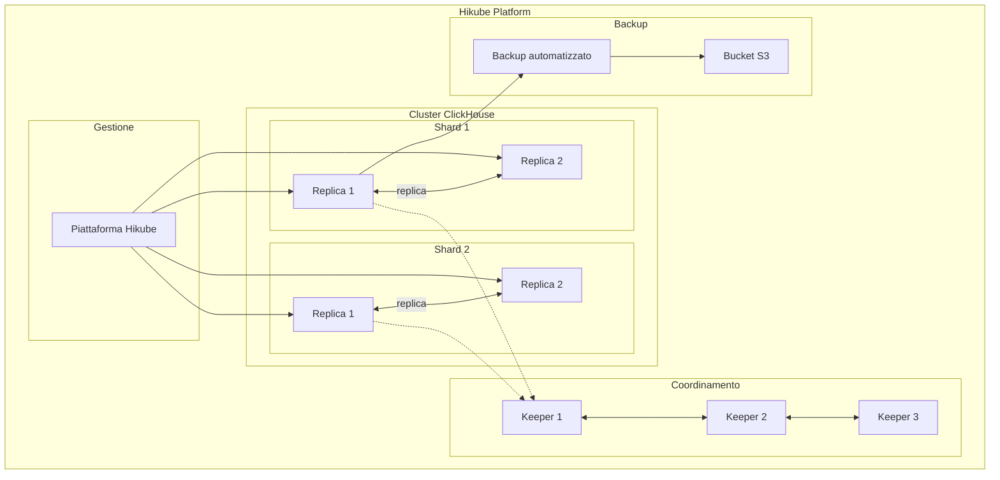
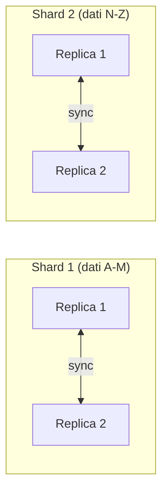

# Concetti — ClickHouse

:::info Disponibilità
ClickHouse non è ancora disponibile in modalità self-service nella [console Hikube](https://console.hikube.cloud).
Per effettuare il provisioning di un'istanza o modificarne la configurazione, [contatti il supporto](mailto:support@hidora.io).
:::

## Architettura

ClickHouse su Hikube è un servizio gestito. È un database SQL orientato alle colonne, ottimizzato per l'analisi dei dati (OLAP). L'architettura si basa su **shard** (partizionamento orizzontale) e **repliche** (alta disponibilità), coordinati da **ClickHouse Keeper**.

```mermaid
graph TB
    subgraph "Hikube Platform"
        subgraph "Gestione"
            OP[Piattaforma Hikube]
        end

        subgraph "Cluster ClickHouse"
            subgraph "Shard 1"
                S1R1[Replica 1]
                S1R2[Replica 2]
            end
            subgraph "Shard 2"
                S2R1[Replica 1]
                S2R2[Replica 2]
            end
        end

        subgraph "Coordinamento"
            K1[Keeper 1]
            K2[Keeper 2]
            K3[Keeper 3]
        end

        subgraph "Backup"
            S3[Bucket S3]
            RES[Backup automatizzato]
        end
    end

    OP --> S1R1
    OP --> S1R2
    OP --> S2R1
    OP --> S2R2
    S1R1 <-->|replica| S1R2
    S2R1 <-->|replica| S2R2
    K1 <--> K2
    K2 <--> K3
    S1R1 -.-> K1
    S2R1 -.-> K1
    S1R1 --> RES
    RES --> S3
```

---

## Terminologia

| Termine | Descrizione |
|---------|-------------|
| **Cluster ClickHouse** | Istanza gestita di ClickHouse, fornita su richiesta nel suo progetto. |
| **Shard** | Partizione orizzontale dei dati. Ogni shard contiene un sottoinsieme dei dati totali. |
| **Replica** | Copia di uno shard. Garantisce la ridondanza e permette la lettura parallela. |
| **ClickHouse Keeper** | Servizio di coordinamento distribuito (alternativa a ZooKeeper) che gestisce la replica e il consenso tra i nodi. |
| **OLAP** | Online Analytical Processing — modello di accesso ai dati ottimizzato per le query analitiche (aggregazioni, scansioni di colonne). |
| **Preset** | Profilo di risorse predefinito (da nano a 2xlarge) assegnato a ogni replica. |

---

## Sharding e replica

### Sharding

Lo sharding distribuisce i dati orizzontalmente tra più nodi:

- Ogni **shard** contiene una parte dei dati
- Le query `SELECT` vengono eseguite in parallelo su tutti gli shard
- Il numero di shard viene fissato al momento del provisioning

### Replica

Ogni shard può avere più repliche:

- Le repliche di uno stesso shard contengono **dati identici**
- Il coordinamento è garantito da **ClickHouse Keeper**
- In caso di guasto di una replica, le letture vengono reindirizzate verso le altre

```mermaid
graph LR
    subgraph "Shard 1 (dati A-M)"
        R1A[Replica 1]
        R1B[Replica 2]
    end
    subgraph "Shard 2 (dati N-Z)"
        R2A[Replica 1]
        R2B[Replica 2]
    end

    R1A <-->|sync| R1B
    R2A <-->|sync| R2B
```

:::tip
Per piccoli volumi di dati è sufficiente un solo shard con 2 repliche. Aggiunga shard quando il volume supera le capacità di un singolo nodo.
:::

---

## ClickHouse Keeper

ClickHouse Keeper sostituisce ZooKeeper per il coordinamento del cluster:

- Gestisce il **consenso** tra le repliche (protocollo Raft)
- Archivia i **metadati** del cluster (tabelle distribuite, replica)
- Richiede un numero **dispari** di istanze (3 consigliate) per il quorum

Il numero di istanze Keeper, le loro risorse e il loro storage vengono definiti al momento del provisioning.

---

## Backup

I backup ClickHouse su Hikube offrono:

- Snapshot **cifrati** archiviati in un bucket S3
- Pianificazione regolare
- Strategia di conservazione configurabile

L'attivazione dei backup avviene su richiesta al supporto.

---

## Gestione degli utenti

Gli utenti vengono definiti al momento del provisioning, con:

- **Password** per l'autenticazione
- **Sola lettura** o **accesso completo**

Un utente `admin` viene creato automaticamente con diritti completi.

---

## Preset di risorse

| Preset | CPU | Memoria |
|--------|-----|---------|
| `nano` | 250m | 128Mi |
| `micro` | 500m | 256Mi |
| `small` | 1 | 512Mi |
| `medium` | 1 | 1Gi |
| `large` | 2 | 2Gi |
| `xlarge` | 4 | 4Gi |
| `2xlarge` | 8 | 8Gi |

---

## Limiti e quote

| Parametro | Valore |
|-----------|--------|
| Shard max | In base alle quote del progetto |
| Repliche per shard | In base alle quote del progetto |
| Dimensione dello storage | Variabile (in GB) |
| Istanze Keeper | 3 consigliate (dispari) |

---

## Per approfondire

- [Panoramica](./overview.md): presentazione del servizio
- [FAQ](./faq.md): domande frequenti
