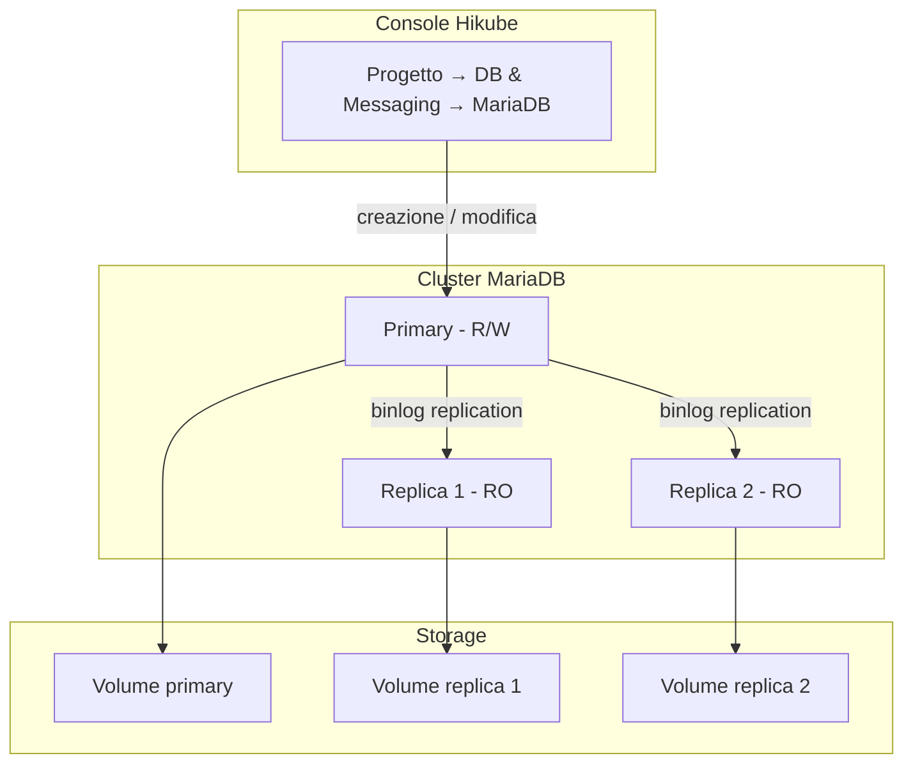
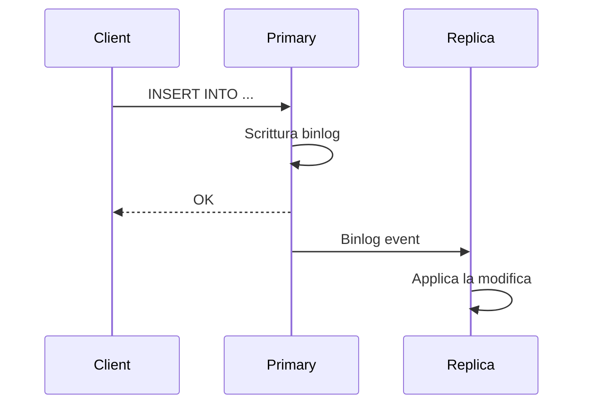

# Concetti — MariaDB

## Architettura

MariaDB su Hikube è un servizio gestito. MariaDB è un fork di MySQL compatibile con i suoi client e il suo protocollo. Ogni cluster creato dalla console è un insieme replicato composto da un primary e da eventuali repliche. Appartiene a un **progetto** e consuma la quota di tale progetto.

---

## Terminologia

| Termine | Descrizione |
|---------|-------------|
| **Cluster MariaDB** | Istanza gestita creata dalla console, composta da un primary e da eventuali repliche. |
| **Progetto** | Spazio isolato che raggruppa le sue risorse e a cui è associata la quota. |
| **Primary** | Nodo principale che accetta letture e scritture. |
| **Replica** | Nodo in sola lettura, sincronizzato dal primary tramite la replica binlog. |
| **Preset** | Profilo di risorse (CPU, memoria) assegnato a ogni nodo del cluster. |
| **Accesso esterno** | Opzione che espone il cluster su Internet tramite un indirizzo IP pubblico. |
| **Ruolo** | Diritto di un utente su un database: **Administrator** o **Read-only**. |

---

## Replica e alta disponibilità

Il cluster utilizza la **replica binlog** di MariaDB:

1. **Il primary** scrive tutte le modifiche nel binary log
2. **Le repliche** consumano il binlog e applicano le modifiche
3. **In caso di guasto** del primary, la piattaforma promuove automaticamente una replica

Il **Number of replicas** si sceglie al momento della creazione:

| Valore proposto | Utilizzo |
|-----------------|----------|
| **1 (Standalone)** | Sviluppo, test |
| **3 (Max High Availability)** | Produzione |
| **5 (Ultra High Availability)** | Produzione critica |

:::warning
Il numero di repliche e il preset non possono essere modificati dopo la creazione. Per cambiarli, [contatti il supporto](mailto:support@hidora.io).
:::

Il passaggio manuale del primary (switchover) non è proposto nella console; contatti il supporto.

---

## Utenti, database e ruoli

La pagina di un cluster MariaDB comprende una sezione **Users**; non esiste una scheda dedicata ai database. I diritti si gestiscono per utente:

- **Global Role (Optional)**: **No global role**, **Administrator** o **Read-only (global)**;
- **Specific Access (Databases)**: un elenco di coppie **Database name** / **Rights** (**Administrator (Admin)** o **Read-only**). Concedere un accesso su un database che non esiste ancora lo crea.

Gli utenti dichiarati nella procedura guidata di creazione del cluster ricevono il **Role** scelto sul database di sistema `mysql`, visibile nella colonna **Databases** dell'elenco degli utenti: **Administrator** concede tutti i privilegi (`ALL`, con diritto di delega), **Read-only** il diritto `SELECT`. Conceda poi a questi utenti l'accesso ai suoi database applicativi tramite **Manage Access**.

:::warning
Il database `mysql` contiene gli account e i diritti del server. Un accesso **Administrator** su questo database consente di modificare i diritti di tutti gli utenti, e un accesso **Read-only** consente di leggere gli hash delle password. Riservi questi accessi a un account di amministrazione e li rimuova dagli account applicativi tramite **Manage Access**.
:::

La password di un utente è generata dalla piattaforma e mostrata **una sola volta**. In caso di smarrimento, ne generi una nuova con **Change Password**.

### Regole di denominazione

| Elemento | Regola |
|----------|--------|
| Nome del cluster | Da 3 a 16 caratteri: lettere minuscole, cifre e trattini; inizia con una lettera, termina con una lettera o una cifra |
| Nome utente | Lettere minuscole, cifre e trattini; inizia con una lettera, termina con una lettera o una cifra (da 3 a 16 caratteri nella procedura guidata di creazione del cluster) |
| Nome del database | Da 1 a 63 caratteri: lettere minuscole, cifre e trattini; inizia con una lettera, termina con una lettera o una cifra |

:::note
I trattini bassi (`_`) non sono accettati né nei nomi dei database né nei nomi utente.
:::

---

## Preset

Il **Preset** definisce la capacità assegnata a **ogni nodo** del cluster. Fa fede l'elenco mostrato dalla procedura guidata; a titolo indicativo:

| Preset | CPU | Memoria |
|--------|-----|---------|
| `nano` | 250m | 128Mi |
| `micro` | 500m | 256Mi |
| `small` | 1 | 512Mi |
| `medium` | 1 | 1Gi |
| `large` | 2 | 2Gi |
| `xlarge` | 4 | 4Gi |
| `2xlarge` | 8 | 8Gi |

La definizione di risorse CPU/memoria libere non è proposta nella console; contatti il supporto.

---

## Accesso di rete

- **Accesso esterno disattivato** (impostazione predefinita): il cluster non è esposto su Internet. Il campo **Host** del riquadro **Connection and network** mostra **Not defined**.
- **Accesso esterno attivato**: la piattaforma assegna un indirizzo IP pubblico, mostrato nel campo **Host**. La porta è la porta MySQL standard, `3306`.

---

## Backup e ripristino

La configurazione dei backup e il ripristino non sono proposti nella console; contatti il supporto. Consulti [Configurare i backup](./how-to/configure-backups.md).

---

## Quota e costo

La procedura guidata mostra l'**Estimated cost** e l'impatto del cluster sulla quota del progetto. Se il cluster supera la quota disponibile, il pulsante **Next** resta inattivo.

| Parametro | Valore |
|-----------|--------|
| Versioni | 10.6, 10.11, 11.4, 11.8 |
| Repliche | 1, 3 o 5 |
| Dimensione del disco | Da 1 a 4.096 GB, entro il limite della quota di storage del progetto |

---

## Per approfondire

- [Panoramica](./overview.md): presentazione del servizio
- [Avvio rapido](./quick-start.md): creare il suo primo cluster
