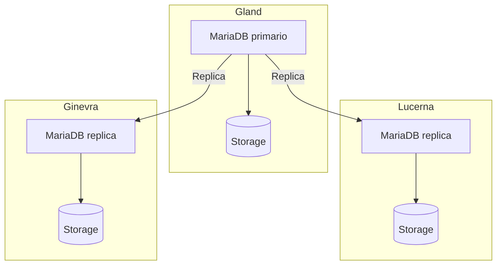

import NavigationFooter from '@site/src/components/NavigationFooter';

# MariaDB su Hikube

Hikube offre un servizio **MariaDB gestito**. MariaDB è compatibile con il protocollo e i client MySQL: le sue applicazioni e i suoi strumenti MySQL esistenti (`mysql`, `mysqldump`, connettori JDBC, PDO, ecc.) funzionano senza modifiche.

Il servizio si occupa del deployment di un cluster replicato e auto-riparante, che lei crea e amministra dalla [console Hikube](https://console.hikube.cloud) (menu **DB & Messaging** → **MariaDB**).

:::note
In precedenza, questo servizio era presentato in questa documentazione con il nome « MySQL ». Il motore, MariaDB, è invariato.
:::

---

## Architettura e funzionamento

La piattaforma automatizza la gestione del ciclo di vita del database: deployment, aggiornamento, replica e ripristino dopo un incidente.

L'architettura si basa su un **cluster replicato**:

- Un **nodo primario** (primary) gestisce tutte le operazioni di scrittura e garantisce la coerenza dei dati.
- Una o più **repliche** ricevono in modo continuo le transazioni tramite replica.
- Un meccanismo di **auto-failover** promuove automaticamente una replica a nuovo primario in caso di guasto.

Questo approccio offre:

- **Resilienza** in caso di guasto hardware o software
- **Scalabilità in lettura** grazie alla distribuzione delle query tra le repliche
- **Semplicità di gestione**, poiché la piattaforma si occupa del coordinamento e della manutenzione del cluster

---

## Cosa gestisce dalla console

| Funzione | Disponibile |
|----------|-------------|
| Creazione di un cluster (versione 10.6, 10.11, 11.4 o 11.8, preset, dimensione del disco, 1, 3 o 5 repliche, accesso esterno) | Sì |
| Utenti, ruolo globale e accesso per database (admin / sola lettura), rotazione della password | Sì |
| Modifica della versione, della dimensione del disco e dell'accesso esterno | Sì |
| Modifica del preset o del numero di repliche dopo la creazione | No, [contatti il supporto](mailto:support@hidora.io) |
| Backup e ripristino | No, [contatti il supporto](mailto:support@hidora.io) |

---

## Casi d'uso

- **Applicazioni web transazionali (OLTP)**: e-commerce, ERP, CRM, dove l'affidabilità e la rapidità delle transazioni sono essenziali.
- **CMS e applicazioni PHP**: WordPress, Drupal, Magento e, più in generale, qualsiasi applicazione progettata per MySQL.
- **Applicazioni SaaS multi-cliente**: un database isolato per cliente, con l'alta disponibilità della piattaforma.
- **Carichi di lavoro a lettura intensiva**: le repliche consentono di ripartire le query.

<NavigationFooter
  nextSteps={[
    {label: "Concetti", href: "../concepts"},
    {label: "Avvio rapido", href: "../quick-start"},
  ]}
  seeAlso={[
    {label: "Tutti i database", href: "../../"},
  ]}
/>
