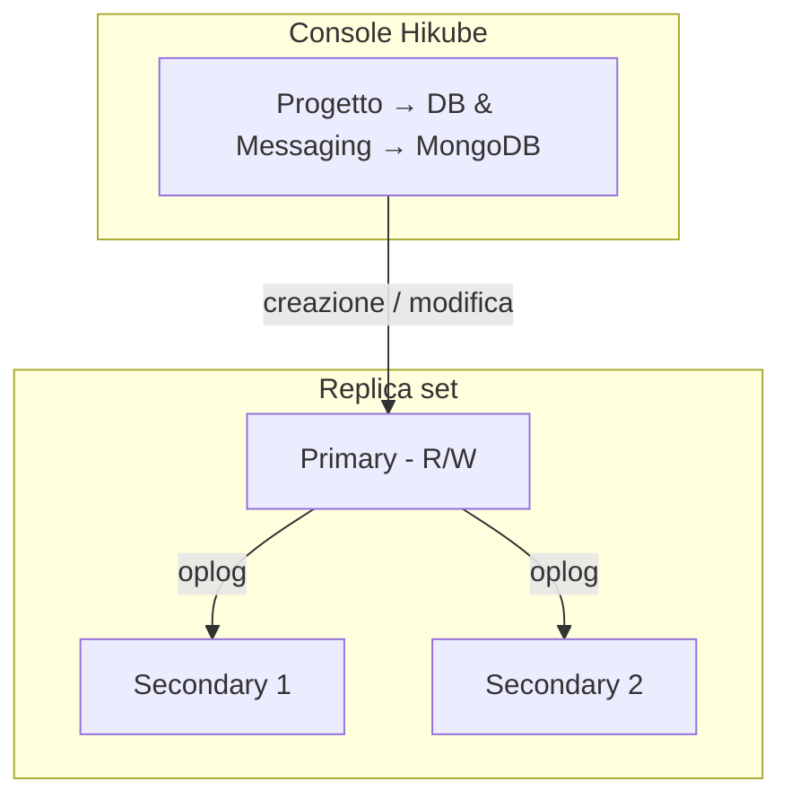

# Concetti — MongoDB

## Architettura

MongoDB su Hikube è un servizio gestito. Ogni cluster creato dalla console è, per impostazione predefinita, un **replica set**: un insieme di membri che contengono gli stessi dati, di cui uno solo accetta le scritture. Il cluster appartiene a un **progetto** e consuma le quote di tale progetto.

---

## Terminologia

| Termine | Descrizione |
|-------|-------------|
| **Cluster MongoDB** | Istanza gestita creata dalla console. |
| **Progetto** | Spazio isolato che raggruppa le sue risorse e a cui si applicano le quote. |
| **Replica set** | Gruppo di membri MongoDB che replicano gli stessi dati. |
| **Primary** | Membro che accetta le scritture. |
| **Secondary** | Membro che replica il primary e può essere eletto al suo posto in caso di guasto. |
| **Oplog** | Registro delle operazioni del primary, rieseguito dai secondary. |
| **Shard** | Sottoinsieme dei dati, ospitato dal proprio replica set (topologia shardata). |
| **Server di configurazione** | Membri che memorizzano i metadati della topologia shardata. |
| **Mongos** | Router che riceve le richieste dei client e le indirizza verso gli shard corretti. |
| **Preset** | Modello di risorse (CPU, memoria) allocato a ogni nodo. |

---

## Replicazione e alta disponibilità

I secondary rieseguono in continuo l'oplog del primary. Se il primary diventa indisponibile, i membri restanti eleggono un nuovo primary; perché l'elezione vada a buon fine deve essere disponibile la maggioranza dei membri.

Il valore **Number of replicas** si sceglie alla creazione:

| Valore proposto | Utilizzo |
|-----------------|-------|
| **1 (Standalone)** | Sviluppo, test |
| **3 (Max High Availability)** | Produzione: tollera la perdita di un membro |
| **5 (Ultra High Availability)** | Produzione critica: tollera la perdita di due membri |

:::warning
Il numero di repliche, il preset e lo sharding non possono essere modificati dopo la creazione. Per cambiarli, [contatti il supporto](mailto:support@hidora.io).
:::

---

## Sharding

L'opzione **Sharding (Distributed Topology)** della procedura guidata è descritta così: «Enable sharding (automatically deploys configuration servers and Mongos routers, and configures replica sets as shards)». La console crea quindi:

- **2 shard**, ciascuno composto dal numero di repliche scelto e da un disco della dimensione scelta;
- dei **server di configurazione**, con lo stesso numero di repliche e la stessa dimensione del disco;
- dei **router Mongos**, con lo stesso numero di repliche.

Il consumo di risorse e il costo stimato ne tengono conto. Si veda [Configurare lo sharding](./how-to/configure-sharding.md).

---

## Utenti, database e ruoli

La pagina di un cluster MongoDB comprende una sezione **Users**; non esiste una scheda dedicata ai database. I diritti si gestiscono per utente:

- **Global Role (Optional)**: **No global role**, **Administrator** o **Read-only (global)**;
- **Specific Access (Databases)**: un elenco di coppie **Database name** / **Rights** (**Administrator (Admin)** o **Read-only**).

Un utente deve avere almeno un ruolo: senza ruolo globale né accesso specifico, la console mostra «Please assign at least one role (global or specific) to the user.» e rifiuta il salvataggio.

Gli utenti dichiarati nella procedura guidata di creazione del cluster ricevono il **Role** scelto sul database `admin`, visibile nella colonna **Databases** dell'elenco degli utenti: **Administrator** corrisponde ai ruoli MongoDB `readWrite` e `dbAdmin` su tale database, **Read-only** al ruolo `read`. Questi ruoli non danno accesso ad alcun altro database: conceda poi l'accesso ai suoi database applicativi tramite **Manage Access**. Tutti gli utenti vengono creati nel database `admin`, che funge da database di autenticazione (`authSource=admin`).

La password di un utente è generata dalla piattaforma e mostrata **una sola volta**. In caso di smarrimento, ne generi una nuova con **Change Password**.

### Regole di denominazione

| Elemento | Regola |
|---------|-------|
| Nome del cluster | Da 3 a 16 caratteri: minuscole, cifre e trattini; inizia con una lettera, termina con una lettera o una cifra |
| Nome utente | Minuscole, cifre e trattini; inizia con una lettera, termina con una lettera o una cifra (da 3 a 16 caratteri nella procedura guidata di creazione del cluster) |
| Nome del database | Da 1 a 63 caratteri: minuscole, cifre e trattini; inizia con una lettera, termina con una lettera o una cifra |

:::note
I trattini bassi (`_`) e le maiuscole non sono accettati né nei nomi dei database né nei nomi utente.
:::

---

## Preset

Il **Preset** definisce la capacità allocata a **ogni nodo**. Fa fede l'elenco mostrato dalla procedura guidata; a titolo indicativo:

| Preset | CPU | Memoria |
|--------|-----|---------|
| `nano` | 250m | 128Mi |
| `micro` | 500m | 256Mi |
| `small` | 1 | 512Mi |
| `medium` | 1 | 1Gi |
| `large` | 2 | 2Gi |
| `xlarge` | 4 | 4Gi |
| `2xlarge` | 8 | 8Gi |

---

## Accesso di rete

- **External access** disattivato (impostazione predefinita): il cluster non è esposto su Internet. Il campo **Host** del riquadro **Network and Connection** mostra **Not defined**.
- **External access** attivato: la piattaforma assegna un indirizzo pubblico, mostrato nel campo **Host** per un cluster con sharding. Senza sharding, ciascun membro riceve il proprio indirizzo pubblico e il campo resta su **Not defined**: richieda l'indirizzo al [supporto](mailto:support@hidora.io). La porta è quella standard di MongoDB, `27017`. La procedura guidata fornisce una stringa di connessione nella forma `mongodb://<utente>:<password>@<host>`.

---

## Backup e ripristino

La configurazione dei backup e il ripristino non sono disponibili nella console; [contatti il supporto](mailto:support@hidora.io).

---

## Quote e costi

La procedura guidata mostra l'**Estimated Cost** e l'impatto del cluster sulle quote del progetto. Se il cluster supera le quote disponibili, il pulsante **Next** resta inattivo.

| Parametro | Valore |
|-----------|--------|
| Versioni | 6.0, 7.0, 8.0 |
| Repliche | 1, 3 o 5 |
| Dimensione del disco | Da 1 a 4.096 GB, entro il limite della quota di storage del progetto |

---

## Per approfondire

- [Panoramica](./overview.md): presentazione del servizio
- [Avvio rapido](./quick-start.md): creare il suo primo cluster
