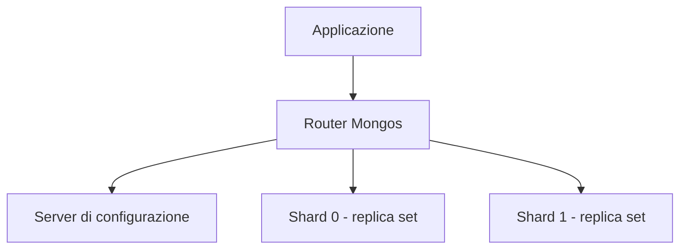

# Come configurare lo sharding MongoDB

Questa guida spiega come creare un cluster MongoDB shardato dalla [console Hikube](https://console.hikube.cloud) e come ripartire le sue collection tra gli shard.

## Prerequisiti

- Un **progetto** Hikube con quote sufficienti: una topologia shardata consuma molte più risorse di un replica set (si veda sotto)
- La shell **`mongosh`** e un utente con il diritto **Administrator** sul database interessato

:::warning
Lo sharding si decide **alla creazione**: non può essere attivato o disattivato in seguito. Per trasformare un cluster esistente, [contatti il supporto](mailto:support@hidora.io).
:::

## Comprendere la topologia distribuita

Quando l'opzione **Sharding (Distributed Topology)** è attivata, la console distribuisce:

| Componente | Numero | Risorse |
|-----------|--------|------------|
| Shard | 2 | Ciascuno con il **Number of replicas** e la **Disk size (GB)** scelti |
| Server di configurazione | 1 gruppo | Stesso numero di repliche e stessa dimensione del disco |
| Router Mongos | 1 gruppo | Stesso numero di repliche |

Le sue applicazioni si connettono ai router **Mongos**, che indirizzano ogni richiesta verso lo shard o gli shard interessati.



## Passaggi

### 1. Creare il cluster shardato

1. Apra **DB & Messaging** → **MongoDB**, quindi faccia clic su **Create a cluster**.
2. Passaggio **General**: inserisca il **Cluster Name**.
3. Passaggio **Configuration**: scelga la **MongoDB Version**, il **Preset**, la **Disk size (GB)** e il **Number of replicas** (`3` consigliato), quindi attivi **Sharding (Distributed Topology)**.
4. Controlli l'**Estimated Cost** e l'impatto sulle quote, che tengono conto dei componenti aggiuntivi.
5. Passaggio **Users**: aggiunga almeno un utente con il **Role** **Administrator**.
6. Passaggio **Summary**: verifichi che la riga **Sharding** indichi **Enabled**, quindi faccia clic su **Create cluster**.

### 2. Verificare la topologia

Quando il cluster è nello stato **Ready**, il riquadro **Network and Connection** della sua pagina indica **Sharding**: **Enabled**.

### 3. Attivare lo sharding su una collection

:::warning Diritti necessari
Il diritto **Administrator** assegnato dalla console corrisponde ai ruoli MongoDB `readWrite` e `dbAdmin` su un database. Non conferisce i privilegi di cluster richiesti da `sh.status()` e `sh.shardCollection()` (azioni `listShards` ed `enableSharding`). Per shardare una collection, [contatti il supporto](mailto:support@hidora.io) indicando la collection e la chiave di sharding desiderata.
:::

Lo sharding si configura collection per collection, scegliendo una **chiave di sharding**. Esempi dei comandi eseguiti da un account che dispone di tali privilegi:

```javascript
// Chiave hash: ripartizione uniforme delle scritture
sh.shardCollection("myapp.events", { deviceId: "hashed" })

// Chiave per intervallo: efficace per le query per intervallo
sh.shardCollection("myapp.orders", { customerId: 1, createdAt: 1 })
```

:::tip
Scelga una chiave ad alta cardinalità, presente nella maggior parte delle sue query. Una chiave monotona (solo data di creazione, identificativo incrementale) concentra le scritture su un unico shard.
:::

## Verifica

```javascript
db.events.getShardDistribution()
```

**Risultato atteso:** i documenti e i chunk si ripartiscono tra i due shard.

## Per approfondire

- [Concetti MongoDB](../concepts.md): replica set e sharding
- [Documentazione MongoDB sullo sharding](https://www.mongodb.com/docs/manual/sharding/)
