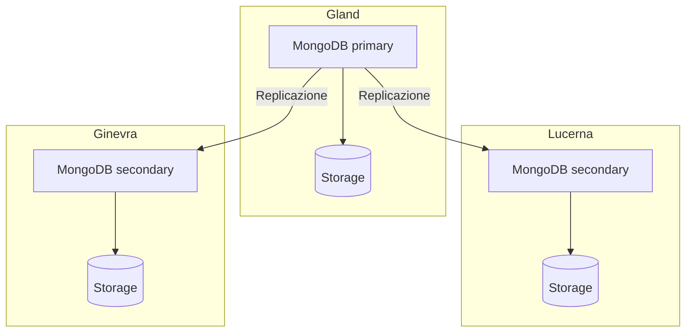

import NavigationFooter from '@site/src/components/NavigationFooter';

# MongoDB su Hikube

Hikube offre un servizio **MongoDB gestito**. MongoDB è un database orientato ai documenti: i dati sono memorizzati sotto forma di documenti JSON (BSON), senza uno schema imposto, il che lo rende adatto a modelli di dati in evoluzione.

Il servizio distribuisce un **replica set** replicato e auto-riparante, con in opzione una topologia **shardata** per ripartire i dati su più gruppi di nodi. I cluster si creano e si amministrano dalla [console Hikube](https://console.hikube.cloud) (menu **DB & Messaging** → **MongoDB**).

---

## Architettura e funzionamento

### Replica set (predefinito)

- Un **membro primario** (primary) riceve tutte le scritture.
- I **membri secondari** replicano in continuo le operazioni del primario e possono servire le letture.
- In caso di guasto del primario, i membri restanti **eleggono** automaticamente un nuovo primario.

### Topologia shardata (opzione)

Quando l'opzione **Sharding (Distributed Topology)** è attivata alla creazione, la piattaforma distribuisce automaticamente i **server di configurazione** e i **router Mongos** e configura le repliche come **shard**. Si veda [Configurare lo sharding](./how-to/configure-sharding.md).

---

## Cosa si gestisce dalla console

| Funzione | Disponibile |
|----------|------------|
| Creazione di un cluster (versione 6.0, 7.0 o 8.0, preset, dimensione del disco, 1, 3 o 5 repliche, accesso esterno, sharding) | Sì |
| Utenti, ruolo globale e accesso per database (admin / sola lettura), rotazione della password | Sì |
| Modifica della versione, della dimensione del disco e dell'accesso esterno | Sì |
| Modifica del preset, del numero di repliche o dello sharding dopo la creazione | No, [contatti il supporto](mailto:support@hidora.io) |
| Backup e ripristino | No, [contatti il supporto](mailto:support@hidora.io) |

---

## Casi d'uso

- **Cataloghi di prodotti e contenuti** la cui struttura varia da un elemento all'altro
- **Applicazioni web e mobili** che gestiscono nativamente JSON
- **Profili utente, preferenze, carrelli** e dati di sessione arricchiti
- **Raccolta di eventi e IoT**, con la topologia shardata per i grandi volumi
- **Prototipazione rapida**, senza migrazione di schema a ogni evoluzione

<NavigationFooter
  nextSteps={[
    {label: "Concetti", href: "../concepts"},
    {label: "Avvio rapido", href: "../quick-start"},
  ]}
  seeAlso={[
    {label: "Tutti i database", href: "../../"},
  ]}
/>
