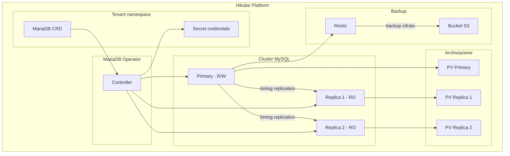
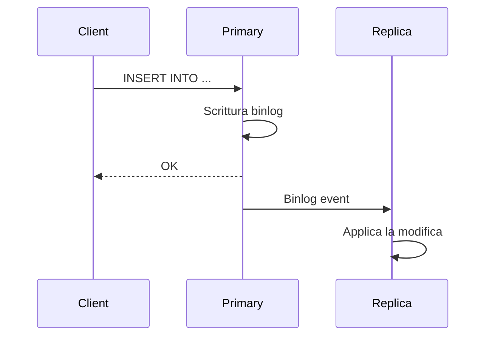

# Concetti — MySQL

## Architettura

MySQL su Hikube e un servizio gestito basato sull'operatore **MariaDB-Operator**. Sebbene l'operatore utilizzi MariaDB (un fork compatibile di MySQL), il servizio e completamente compatibile con i client e i protocolli MySQL. Ogni istanza distribuita tramite la risorsa `MariaDB` crea un cluster replicato con un primary e delle repliche per l'alta disponibilita.



---

## Terminologia

| Termine | Descrizione |
|---------|-------------|
| **MariaDB** | Risorsa Kubernetes (`apps.cozystack.io/v1alpha1`) che rappresenta un cluster MySQL gestito. Il CRD si chiama `MariaDB` perche il servizio si basa su MariaDB-Operator. |
| **Primary** | Nodo principale che accetta letture e scritture. |
| **Replica** | Nodo in sola lettura, sincronizzato dal primary tramite la replica binlog. |
| **MariaDB-Operator** | Operatore Kubernetes che gestisce il deployment, la replica, il failover e i backup. |
| **Restic** | Strumento di backup utilizzato per creare snapshot cifrati verso uno storage S3. |
| **Switchover** | Commutazione pianificata del ruolo primary verso un altro nodo del cluster. |
| **resourcesPreset** | Profilo di risorse predefinito (da nano a 2xlarge). |

---

## Replica e alta disponibilita

Il cluster MySQL utilizza la **replica binlog** di MariaDB:

1. **Il primary** scrive tutte le modifiche nel binary log
2. **Le repliche** consumano il binlog e applicano le modifiche
3. **In caso di guasto** del primary, l'operatore promuove automaticamente una replica



### Switchover manuale

Potete commutare il primary verso un altro nodo per effettuare una manutenzione:

```bash
kubectl edit mariadb <instance-name>
# Modificare spec.replication.primary.podIndex
```

:::warning
La commutazione del primary comporta una breve interruzione delle scritture. Le letture restano disponibili tramite le repliche.
:::

---

## Backup

MySQL su Hikube utilizza **Restic** per i backup:

- Gli snapshot sono **cifrati** con una password Restic
- Archiviati in un **bucket S3-compatible** (Hikube Object Storage, AWS S3, MinIO)
- La **strategia di retention** (`cleanupStrategy`) controlla la durata di conservazione

| Parametro | Descrizione |
|-----------|-------------|
| `backup.schedule` | Pianificazione cron (es: `0 2 * * *`) |
| `backup.cleanupStrategy` | Opzioni Restic di retention (es: `--keep-last=3 --keep-daily=7`) |
| `backup.resticPassword` | Password di cifratura dei backup |
| `backup.s3*` | Credenziali e bucket S3 |

:::tip
Testate regolarmente la procedura di ripristino. Un backup non testato non garantisce un ripristino riuscito.
:::

---

## Gestione di utenti e database

Il manifesto permette di dichiarare:

- **Utenti**: nome, password, limite di connessioni (`maxUserConnections`)
- **Database**: nome e assegnazione di ruoli
- **Ruoli**: `admin` (lettura/scrittura completa), `readonly` (solo SELECT)

Una password `root` viene generata automaticamente dall'operatore e memorizzata nel Secret `<instance>-credentials`.

---

## Preset di risorse

| Preset | CPU | Memoria |
|--------|-----|---------|
| `nano` | 250m | 128Mi |
| `micro` | 500m | 256Mi |
| `small` | 1 | 512Mi |
| `medium` | 1 | 1Gi |
| `large` | 2 | 2Gi |
| `xlarge` | 4 | 4Gi |
| `2xlarge` | 8 | 8Gi |

:::warning
Se il campo `resources` (CPU/memoria espliciti) e definito, `resourcesPreset` viene ignorato.
:::

---

## Limiti e quote

| Parametro | Valore |
|-----------|--------|
| Repliche max | Secondo la quota del tenant |
| Dimensione archiviazione (`size`) | Variabile (in Gi) |
| `maxUserConnections` | Configurabile per utente (0 = illimitato) |

---

## Per approfondire

- [Panoramica](./overview.md): presentazione del servizio
- [Riferimento API](./api-reference.md): tutti i parametri della risorsa MariaDB
