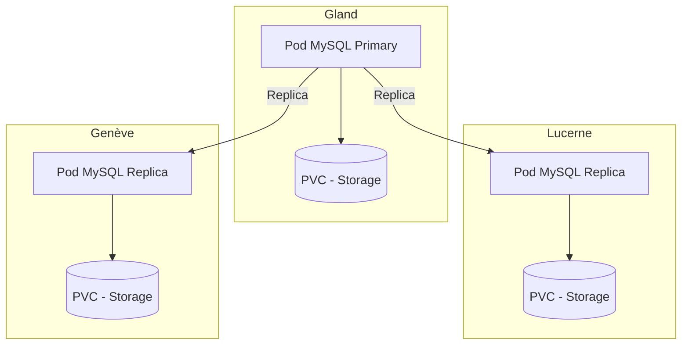

# MySQL su Hikube

Hikube offre un servizio **MySQL gestito**, basato sull'operatore **MariaDB-Operator**.
Assicura il deployment di un cluster replicato e auto-riparante, garantendo **alta disponibilità**, **semplicita di gestione** e **prestazioni affidabili**, senza sforzo lato utente.

---

## 🏗️ Architettura e Funzionamento

Il servizio **MySQL gestito** su Hikube si basa sull'operatore **MariaDB-Operator**, che automatizza la gestione completa del ciclo di vita del database: deployment, aggiornamento, replica e ripristino dopo un incidente.

L'architettura si basa su un **cluster replicato**:

- Un **nodo primario** (primary) gestisce tutte le operazioni di scrittura e assicura la coerenza dei dati.
- Una o più **repliche** (standby) ricevono in tempo reale le transazioni tramite la replica asincrona o semi-sincrona.
- Un meccanismo di **auto-failover** promuove automaticamente una replica come nuovo primario in caso di guasto, garantendo un'**alta disponibilità**.

Questo approccio offre:

- **Resilienza** in caso di guasto hardware o software
- **Scalabilita in lettura** grazie alla distribuzione delle query tra le repliche
- **Semplicita di gestione**, poiché la piattaforma si occupa del coordinamento e della manutenzione del cluster

---

## 💡 Casi d'uso

Il servizio **MySQL gestito su Hikube** e particolarmente adatto per:

- **Applicazioni web transazionali (OLTP)**: e-commerce, ERP, CRM, dove l'affidabilità e la rapidità delle transazioni sono essenziali.
- **Applicazioni SaaS multi-client**: ogni client può disporre del proprio database isolato beneficiando dell'alta disponibilità.
- **Carichi di lavoro con forte domanda in lettura**: la presenza di repliche permette di distribuire le query e migliorare le prestazioni globali.
- **Scenari di ripristino dopo un incidente**: grazie al meccanismo di auto-failover e ai backup S3 integrati.
