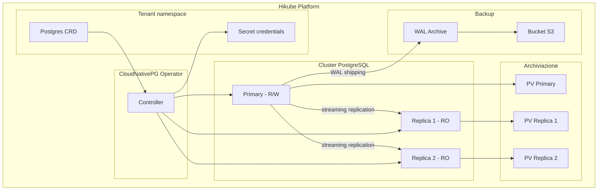
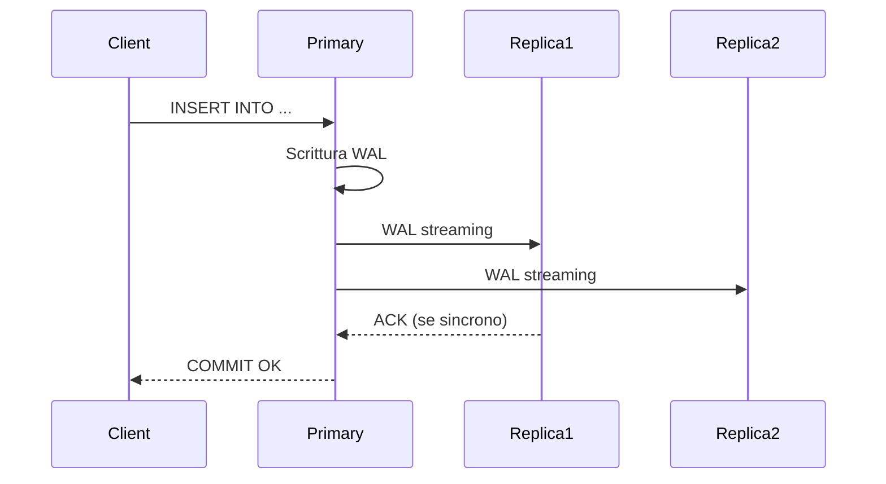

# Concetti — PostgreSQL

## Architettura

PostgreSQL su Hikube e un servizio gestito basato sull'operatore **CloudNativePG**. Ogni istanza distribuita tramite la risorsa `Postgres` crea un cluster replicato con failover automatico, replica streaming e backup integrato.

---

## Terminologia

| Termine | Descrizione |
|---------|-------------|
| **Postgres** | Risorsa Kubernetes (`apps.cozystack.io/v1alpha1`) che rappresenta un cluster PostgreSQL gestito. |
| **Primary** | Istanza principale che accetta letture e scritture. |
| **Replica** | Istanza in sola lettura, sincronizzata tramite streaming replication dal primary. |
| **CloudNativePG** | Operatore Kubernetes che gestisce il ciclo di vita dei cluster PostgreSQL (deployment, failover, backup). |
| **PITR** | Point-In-Time Recovery — ripristino a un istante preciso grazie all'archiviazione continua dei WAL. |
| **WAL** | Write-Ahead Log — registro delle transazioni PostgreSQL, base del PITR e della replica. |
| **Quorum** | Numero minimo di repliche sincrone richieste prima di confermare una scrittura. |
| **resourcesPreset** | Profilo di risorse predefinito (da nano a 2xlarge) per semplificare il dimensionamento. |

---

## Replica e alta disponibilita

CloudNativePG assicura l'alta disponibilita tramite:

1. **Streaming replication**: le repliche ricevono i WAL in tempo reale dal primary
2. **Failover automatico**: se il primary cade, una replica viene promossa automaticamente
3. **Replica sincrona** (opzionale): il primary attende la conferma di scrittura delle repliche prima di validare una transazione

Il campo `quorum` definisce il numero di repliche sincrone:
- `quorum: 0` (predefinito) — replica asincrona, migliori prestazioni
- `quorum: 1` — almeno 1 replica sincrona, protezione contro la perdita di dati

:::tip
Per la produzione, configurate `replicas: 3` e `quorum: 1` per un buon compromesso tra prestazioni e durabilita.
:::

---

## Backup e ripristino

PostgreSQL su Hikube supporta due meccanismi di backup:

### Backup continuo (WAL archiving)

I WAL vengono archiviati continuamente verso un bucket S3. Questo permette il **PITR** (Point-In-Time Recovery) — ripristinare il database a qualsiasi istante nel passato.

### Backup pianificato

Un cron schedule attiva backup completi (base backup) a intervalli regolari. La politica di retention (`retentionPolicy`) determina la durata di conservazione.

| Parametro | Descrizione |
|-----------|-------------|
| `backup.schedule` | Pianificazione cron (es: `0 2 * * *`) |
| `backup.retentionPolicy` | Durata di retention (es: `30d`) |
| `backup.s3*` | Credenziali e endpoint del bucket S3 |

---

## Gestione di utenti e database

Ogni cluster PostgreSQL permette di dichiarare:

- **Utenti** con password
- **Database** con owner
- **Ruoli**: `admin` (lettura/scrittura), `readonly` (sola lettura)

Le credenziali sono memorizzate in un **Secret Kubernetes** chiamato `<instance>-credentials`.

---

## Preset di risorse

| Preset | CPU | Memoria |
|--------|-----|---------|
| `nano` | 250m | 128Mi |
| `micro` | 500m | 256Mi |
| `small` | 1 | 512Mi |
| `medium` | 1 | 1Gi |
| `large` | 2 | 2Gi |
| `xlarge` | 4 | 4Gi |
| `2xlarge` | 8 | 8Gi |

:::warning
Se il campo `resources` (CPU/memoria espliciti) e definito, `resourcesPreset` viene ignorato. I due approcci sono mutuamente esclusivi.
:::

---

## Limiti e quote

| Parametro | Valore |
|-----------|--------|
| Repliche max | Secondo la quota del tenant |
| Dimensione archiviazione | Variabile (`size` in Gi) |
| Connessioni per utente | Configurabili per database |

---

## Per approfondire

- [Panoramica](./overview.md): presentazione del servizio
- [Riferimento API](./api-reference.md): tutti i parametri della risorsa Postgres
