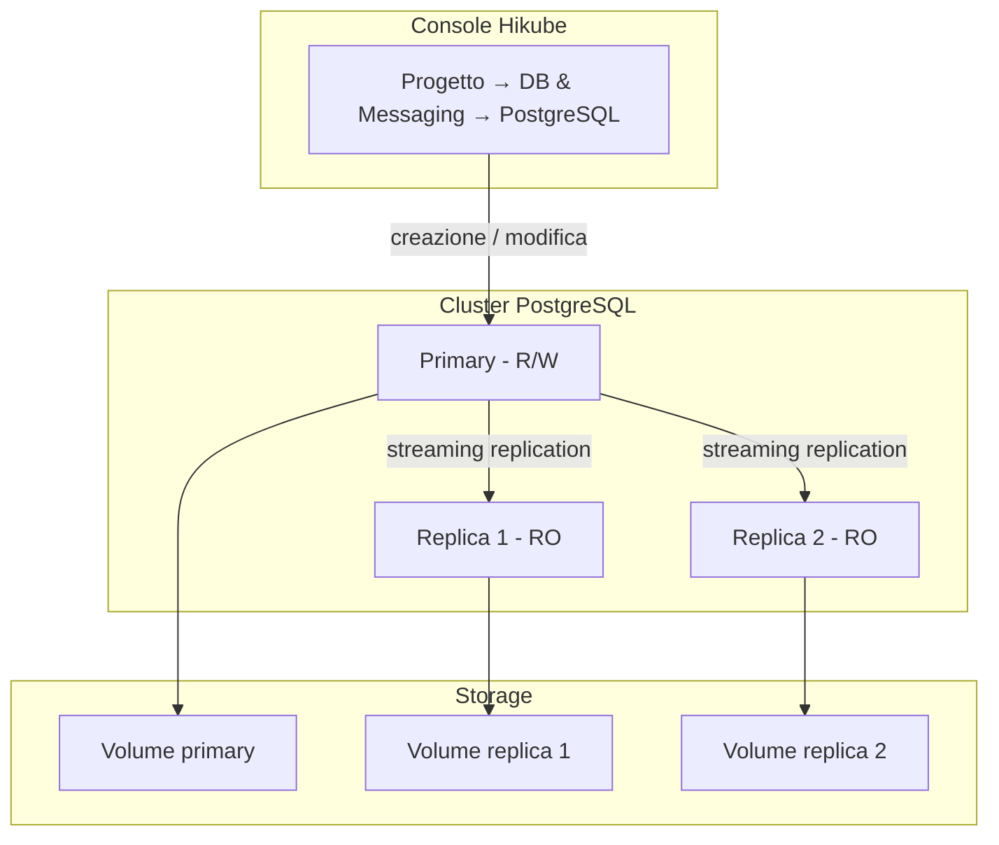
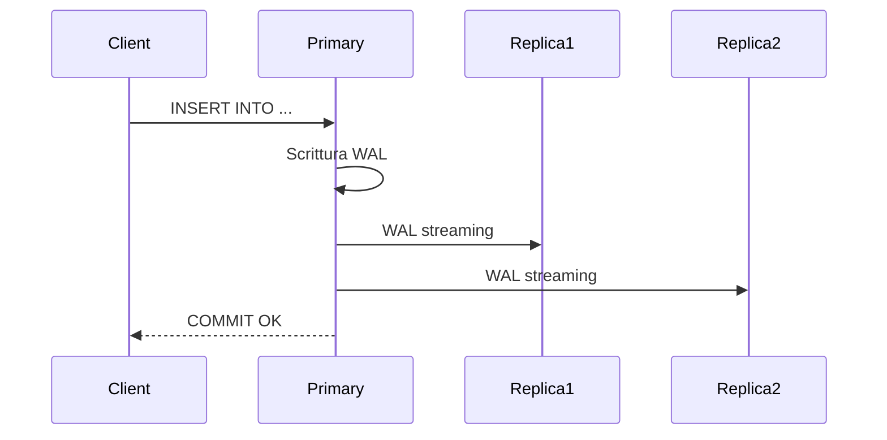

# Concetti — PostgreSQL

## Architettura

PostgreSQL su Hikube è un servizio gestito. Ogni cluster creato dalla console è un insieme di istanze PostgreSQL replicate, con failover automatico e streaming replication. Appartiene a un **progetto** e consuma la quota di tale progetto (CPU, memoria, storage).

```mermaid
graph TB
    subgraph "Console Hikube"
        UI[Progetto → DB & Messaging → PostgreSQL]
    end

    subgraph "Cluster PostgreSQL"
        P[Primary - R/W]
        R1[Replica 1 - RO]
        R2[Replica 2 - RO]
    end

    subgraph "Storage"
        PV1[Volume primary]
        PV2[Volume replica 1]
        PV3[Volume replica 2]
    end

    UI -->|creazione / modifica| P
    P -->|streaming replication| R1
    P -->|streaming replication| R2
    P --> PV1
    R1 --> PV2
    R2 --> PV3
```

---

## Terminologia

| Termine | Descrizione |
|---------|-------------|
| **Cluster PostgreSQL** | Istanza gestita creata dalla console, composta da un primary e da eventuali repliche. |
| **Progetto** | Spazio isolato che raggruppa le sue risorse e a cui è associata la quota. |
| **Primary** | Istanza principale che accetta letture e scritture. |
| **Replica** | Istanza in sola lettura, sincronizzata tramite streaming replication dal primary. |
| **Instance preset** | Profilo di risorse (CPU, memoria) assegnato a ogni nodo del cluster. |
| **Accesso esterno** | Opzione che espone il cluster su Internet tramite un indirizzo IP pubblico. |
| **Estensione** | Modulo PostgreSQL (ad esempio `pgcrypto`, `vector`) attivato per database. |
| **WAL** | Write-Ahead Log — registro delle transazioni PostgreSQL, base della replica. |

---

## Replica e alta disponibilità

L'alta disponibilità si basa su:

1. **Streaming replication**: le repliche ricevono i WAL in modo continuo dal primary
2. **Failover automatico**: se il primary cade, una replica viene promossa automaticamente

```mermaid
sequenceDiagram
    participant Client
    participant Primary
    participant Replica1
    participant Replica2

    Client->>Primary: INSERT INTO ...
    Primary->>Primary: Scrittura WAL
    Primary->>Replica1: WAL streaming
    Primary->>Replica2: WAL streaming
    Primary-->>Client: COMMIT OK
```

Il numero di repliche si sceglie al momento della creazione, nel campo **Number of replicas**:

| Valore proposto | Utilizzo |
|-----------------|----------|
| **1 (Standalone)** | Sviluppo, test |
| **2 (High Availability)** | Produzione con uno standby |
| **3 (Max High Availability)** | Produzione critica |

:::warning
Il numero di repliche non può essere modificato dopo la creazione (« The mode cannot be changed after creation »). Lo scelga in base alle sue esigenze di disponibilità. Per modificarlo, [contatti il supporto](mailto:support@hidora.io).
:::

La replica sincrona (quorum) non è proposta nella console; contatti il supporto.

---

## Database, utenti e diritti

Ogni cluster dispone di:

- un database **`postgres`** creato automaticamente;
- i **database** che lei aggiunge, alla creazione o in seguito (scheda **Databases**), con le relative **estensioni**;
- gli **utenti** che lei crea (scheda **Users**). Ogni utente riceve, database per database, uno dei due diritti seguenti:
  - **Administrator (Admin)**: lettura e scrittura;
  - **Read-only**: solo lettura.

La password di un utente è generata dalla piattaforma e mostrata **una sola volta**, alla creazione o dopo una rotazione. Non è più consultabile in seguito: in caso di smarrimento, ne generi una nuova con **Change Password**.

### Regole di denominazione

| Elemento | Regola |
|----------|--------|
| Nome del cluster | Da 3 a 16 caratteri: lettere minuscole, cifre e trattini; inizia con una lettera, termina con una lettera o una cifra |
| Nome utente | Da 3 a 16 caratteri: lettere minuscole, cifre e trattini bassi (`_`); inizia con una lettera minuscola o un trattino basso. Nessun trattino (`-`). |
| Nome del database | Da 1 a 63 caratteri: lettere minuscole, cifre e trattini bassi |

I nomi utente `postgres`, `admin`, `root`, `owner`, `superuser`, `streaming_replica`, `cnpg_pooler_pgbouncer` e quelli che iniziano con `pg_` sono riservati.

---

## Preset di istanza

L'**Instance preset** definisce la capacità assegnata a **ogni nodo** del cluster. Fa fede l'elenco mostrato dalla procedura guidata; a titolo indicativo:

| Preset | CPU | Memoria |
|--------|-----|---------|
| `nano` | 250m | 128Mi |
| `micro` | 500m | 256Mi |
| `small` | 1 | 512Mi |
| `medium` | 1 | 1Gi |
| `large` | 2 | 2Gi |
| `xlarge` | 4 | 4Gi |
| `2xlarge` | 8 | 8Gi |

Il preset predefinito della procedura guidata è `small`. La definizione di risorse CPU/memoria libere (al di fuori dei preset) non è proposta nella console; contatti il supporto.

---

## Accesso di rete

- **Accesso esterno disattivato** (impostazione predefinita): il cluster non è esposto su Internet. Il campo **Host** della pagina del cluster mostra **Not defined**.
- **Accesso esterno attivato**: la piattaforma assegna un indirizzo IP pubblico, mostrato nel campo **Host**. La porta è la porta PostgreSQL standard, `5432`.

L'accesso esterno può essere attivato o disattivato dopo la creazione, tramite **Edit**. Il suo costo (indirizzo IP pubblico) è incluso nell'**Estimated cost** della procedura guidata.

---

## Backup e ripristino

La configurazione dei backup e il ripristino non sono proposti nella console; contatti il supporto. Consulti [Configurare i backup](./how-to/configure-backups.md).

---

## Quota e costo

La procedura guidata di creazione mostra, già dal passaggio **Configuration**, l'**Estimated cost** (mensile e orario) e l'impatto del cluster sulla quota del progetto (CPU, memoria, storage). Il consumo tiene conto del preset, del numero di repliche e della dimensione del disco. Se il cluster supera la quota disponibile, il pulsante **Next** resta inattivo.

| Parametro | Valore |
|-----------|--------|
| Dimensione del disco | Da 1 a 4.096 GB, entro il limite della quota di storage del progetto |
| Repliche | 1, 2 o 3 |

---

## Per approfondire

- [Panoramica](./overview.md): presentazione del servizio
- [Avvio rapido](./quick-start.md): creare il suo primo cluster
