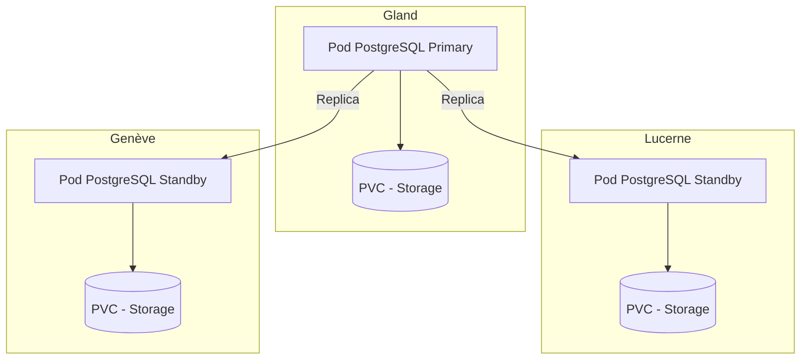

# PostgreSQL su Hikube

Hikube offre un servizio PostgreSQL gestito, basato sull'operatore **CloudNativePG**, riconosciuto e ampiamente adottato dalla comunita.
La piattaforma supporta il deployment e la gestione di un cluster PostgreSQL **replicato e auto-riparante**, garantendo robustezza, prestazioni e alta disponibilità senza sforzo lato utente.

---

## 🏗️ Architettura e Funzionamento

Il servizio PostgreSQL gestito su Hikube si basa sull'operatore **CloudNativePG**, che automatizza la gestione completa del ciclo di vita del database: creazione, aggiornamento, replica e ripristino dopo un incidente.

L'architettura è costruita attorno a un **cluster replicato**:

- Un **nodo primario** (primary) che gestisce le scritture e funge da riferimento per la coerenza dei dati.
- Una o più **repliche** (standby) che ricevono in tempo reale le modifiche grazie alla replica sincrona o asincrona.
- Un meccanismo di **auto-failover**, che permette di promuovere automaticamente una replica come nuovo primario in caso di guasto, assicurando cosi un'**alta disponibilità** senza intervento manuale.

Questo approccio garantisce:

- **Resilienza** di fronte a guasti hardware o software
- **Scalabilita in lettura** grazie alla distribuzione delle query tra le repliche
- **Semplicita operativa**, poiché la piattaforma gestisce il coordinamento e la manutenzione del cluster

---

## 💡 Casi d'uso

- **Applicazioni aziendali critiche** che necessitano di un database affidabile e ad alta disponibilità
- **E-commerce ed ERP**, dove la continuità del servizio e indispensabile
- **SaaS multi-tenant**, che permette di distribuire i carichi tra primario e repliche
- **Business Intelligence e reporting**, grazie alla lettura ottimizzata sulle repliche
- **Applicazioni cloud native**, integrate in ambienti Kubernetes
