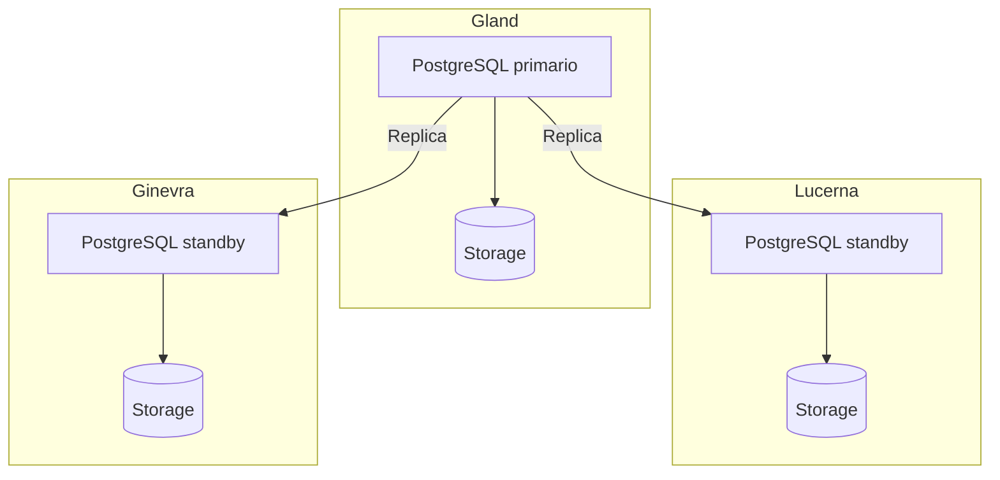

import NavigationFooter from '@site/src/components/NavigationFooter';

# PostgreSQL su Hikube

Hikube offre un servizio PostgreSQL gestito.
La piattaforma si occupa del deployment e della gestione di un cluster PostgreSQL **replicato e auto-riparante**, che lei crea e amministra dalla [console Hikube](https://console.hikube.cloud) (menu **DB & Messaging** → **PostgreSQL**).

---

## Architettura e funzionamento

La piattaforma automatizza la gestione del ciclo di vita del database: creazione, aggiornamento, replica e ripristino dopo un incidente.

L'architettura è costruita attorno a un **cluster replicato**:

- Un **nodo primario** (primary) che elabora le scritture e funge da riferimento per la coerenza dei dati.
- Una o più **repliche** (standby) che ricevono in modo continuo le modifiche tramite replica.
- Un meccanismo di **auto-failover**, che promuove automaticamente una replica a nuovo primario in caso di guasto, senza intervento manuale.

Questo approccio garantisce:

- **Resilienza** di fronte ai guasti hardware o software
- **Scalabilità in lettura** grazie alla distribuzione delle query tra le repliche
- **Semplicità operativa**, poiché la piattaforma gestisce il coordinamento e la manutenzione del cluster

```mermaid
graph TD
    subgraph Gland
        P1[PostgreSQL primario] --> PVC1[(Storage)]
    end

    subgraph Lucerna
        P2[PostgreSQL standby] --> PVC2[(Storage)]
    end

    subgraph Ginevra
        P3[PostgreSQL standby] --> PVC3[(Storage)]
    end

    P1 -->|Replica| P2
    P1 -->|Replica| P3
```

---

## Cosa gestisce dalla console

| Funzione | Disponibile |
|----------|-------------|
| Creazione di un cluster (versione da 15 a 18, preset, dimensione del disco, da 1 a 3 repliche, accesso esterno) | Sì |
| Database ed estensioni PostgreSQL | Sì |
| Utenti, diritti per database (admin / sola lettura), rotazione della password | Sì |
| Modifica della versione, del preset, della dimensione del disco e dell'accesso esterno | Sì |
| Modifica del numero di repliche dopo la creazione | No, [contatti il supporto](mailto:support@hidora.io) |
| Backup e ripristino | No, [contatti il supporto](mailto:support@hidora.io) |

---

## Casi d'uso

- **Applicazioni aziendali critiche** che richiedono un database affidabile e ad alta disponibilità
- **E-commerce ed ERP**, dove la continuità del servizio è indispensabile
- **SaaS multi-tenant**, con la possibilità di ripartire i carichi tra primario e repliche
- **Business Intelligence e reporting**, grazie alla lettura ottimizzata sulle repliche
- **Applicazioni cloud native**, distribuite sui suoi cluster Kubernetes Hikube

<NavigationFooter
  nextSteps={[
    {label: "Concetti", href: "../concepts"},
    {label: "Avvio rapido", href: "../quick-start"},
  ]}
  seeAlso={[
    {label: "Tutti i database", href: "../../"},
  ]}
/>
