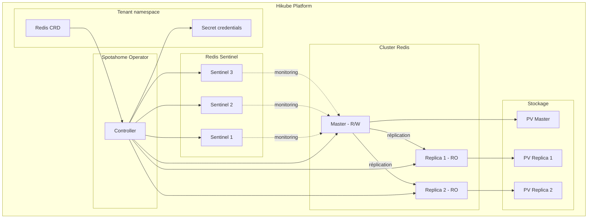

# Concepts — Redis

## Architettura

Redis sur Hikube est un service managé basé sur l'opérateur **Spotahome Redis Operator**. Chaque instance déployée via la ressource `Redis` crée un cluster master-réplica avec **Redis Sentinel** pour le failover automatique.

---

## Terminologia

| Terme | Description |
|-------|-------------|
| **Redis** | Ressource Kubernetes (`apps.cozystack.io/v1alpha1`) représentant un cluster Redis managé. |
| **Master** | Instance principale qui accepte les lectures et écritures. |
| **Replica** | Instance en lecture seule, synchronisée depuis le master. |
| **Sentinel** | Processus de supervision qui détecte les pannes du master et orchestre le failover automatique. |
| **Spotahome Redis Operator** | Opérateur Kubernetes qui gère le déploiement et le cycle de vie des clusters Redis. |
| **authEnabled** | Active l'authentification par mot de passe (`requirepass`). |
| **resourcesPreset** | Profil de ressources prédéfini (nano à 2xlarge). |

---

## Haute disponibilité avec Sentinel

Redis Sentinel assure la haute disponibilité en :

1. **Surveillant** en permanence le master et les réplicas
2. **Détectant** la panne du master par consensus (quorum entre Sentinels)
3. **Promouvant** automatiquement un réplica en nouveau master
4. **Reconfigurant** les autres réplicas pour suivre le nouveau master

:::tip
Configurez `replicas: 3` minimum pour garantir le quorum Sentinel et permettre le failover automatique.
:::

---

## Persistance

Redis sur Hikube supporte le stockage persistant :

| Paramètre | Description |
|-----------|-------------|
| `size` | Taille du volume persistant (ex: `10Gi`) |
| `storageClass` | `local` (performances) ou `replicated` (haute disponibilité) |

Les données Redis sont écrites sur disque via les mécanismes natifs Redis (RDB/AOF), garantissant la durabilité même en cas de redémarrage.

:::warning
Pour la production, utilisez toujours `storageClass: replicated` pour protéger les données contre une panne de nœud.
:::

---

## Authentification

Redis supporte l'authentification optionnelle :

- `authEnabled: true` — un mot de passe est généré et stocké dans le Secret `<instance>-credentials`
- `authEnabled: false` — accès sans mot de passe (à éviter en production)

---

## Presets de ressources

| Preset | CPU | Mémoire |
|--------|-----|---------|
| `nano` | 250m | 128Mi |
| `micro` | 500m | 256Mi |
| `small` | 1 | 512Mi |
| `medium` | 1 | 1Gi |
| `large` | 2 | 2Gi |
| `xlarge` | 4 | 4Gi |
| `2xlarge` | 8 | 8Gi |

:::warning
Si le champ `resources` (CPU/mémoire explicites) est défini, `resourcesPreset` est ignoré.
:::

---

## Limites et quotas

| Paramètre | Valeur |
|-----------|--------|
| Réplicas max | Selon quota tenant |
| Taille stockage (`size`) | Variable (en Gi) |
| Bases Redis | Base unique (db 0 par défaut) |

---

## Per approfondire

- [Overview](./overview.md) : présentation du service
- [Référence API](./api-reference.md) : tous les paramètres de la ressource Redis
