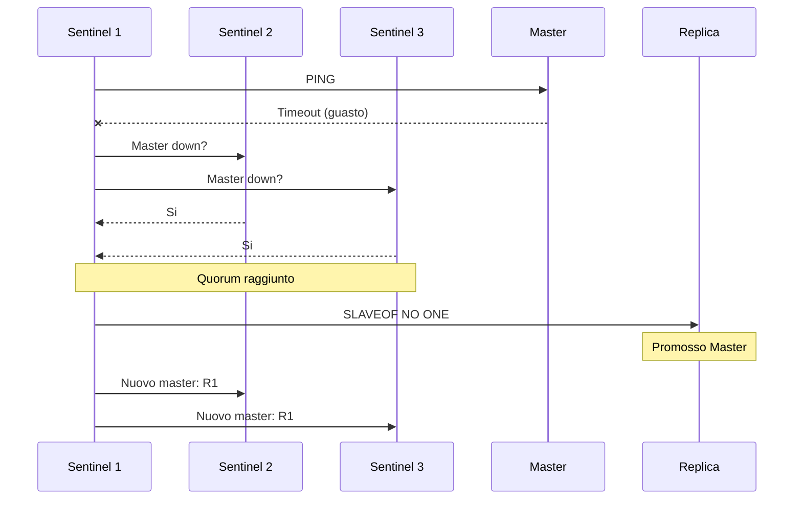

# Concetti — Redis

## Architettura

Redis su Hikube e un servizio gestito basato sull'operatore **Spotahome Redis Operator**. Ogni istanza distribuita tramite la risorsa `Redis` crea un cluster master-replica con **Redis Sentinel** per il failover automatico.

---

## Terminologia

| Termine | Descrizione |
|---------|-------------|
| **Redis** | Risorsa Kubernetes (`apps.cozystack.io/v1alpha1`) che rappresenta un cluster Redis gestito. |
| **Master** | Istanza principale che accetta letture e scritture. |
| **Replica** | Istanza in sola lettura, sincronizzata dal master. |
| **Sentinel** | Processo di supervisione che rileva i guasti del master e orchestra il failover automatico. |
| **Spotahome Redis Operator** | Operatore Kubernetes che gestisce il deployment e il ciclo di vita dei cluster Redis. |
| **authEnabled** | Attiva l'autenticazione tramite password (`requirepass`). |
| **resourcesPreset** | Profilo di risorse predefinito (da nano a 2xlarge). |

---

## Alta disponibilita con Sentinel

Redis Sentinel assicura l'alta disponibilita:

1. **Sorvegliando** permanentemente il master e le repliche
2. **Rilevando** il guasto del master tramite consenso (quorum tra Sentinel)
3. **Promuovendo** automaticamente una replica a nuovo master
4. **Riconfigurando** le altre repliche per seguire il nuovo master

:::tip
Configurate `replicas: 3` come minimo per garantire il quorum Sentinel e permettere il failover automatico.
:::

---

## Persistenza

Redis su Hikube supporta lo storage persistente:

| Parametro | Descrizione |
|-----------|-------------|
| `size` | Dimensione del volume persistente (es: `10Gi`) |
| `storageClass` | `local` (prestazioni) o `replicated` (alta disponibilita) |

I dati Redis vengono scritti su disco tramite i meccanismi nativi Redis (RDB/AOF), garantendo la durabilita anche in caso di riavvio.

:::warning
Per la produzione, usate sempre `storageClass: replicated` per proteggere i dati contro un guasto del nodo.
:::

---

## Autenticazione

Redis supporta l'autenticazione opzionale:

- `authEnabled: true` — una password viene generata e memorizzata nel Secret `<instance>-credentials`
- `authEnabled: false` — accesso senza password (da evitare in produzione)

---

## Preset di risorse

| Preset | CPU | Memoria |
|--------|-----|---------|
| `nano` | 250m | 128Mi |
| `micro` | 500m | 256Mi |
| `small` | 1 | 512Mi |
| `medium` | 1 | 1Gi |
| `large` | 2 | 2Gi |
| `xlarge` | 4 | 4Gi |
| `2xlarge` | 8 | 8Gi |

:::warning
Se il campo `resources` (CPU/memoria espliciti) e definito, `resourcesPreset` viene ignorato.
:::

---

## Limiti e quote

| Parametro | Valore |
|-----------|--------|
| Repliche max | Secondo la quota del tenant |
| Dimensione archiviazione (`size`) | Variabile (in Gi) |
| Database Redis | Database unico (db 0 per impostazione predefinita) |

---

## Per approfondire

- [Panoramica](./overview.md): presentazione del servizio
- [Riferimento API](./api-reference.md): tutti i parametri della risorsa Redis
