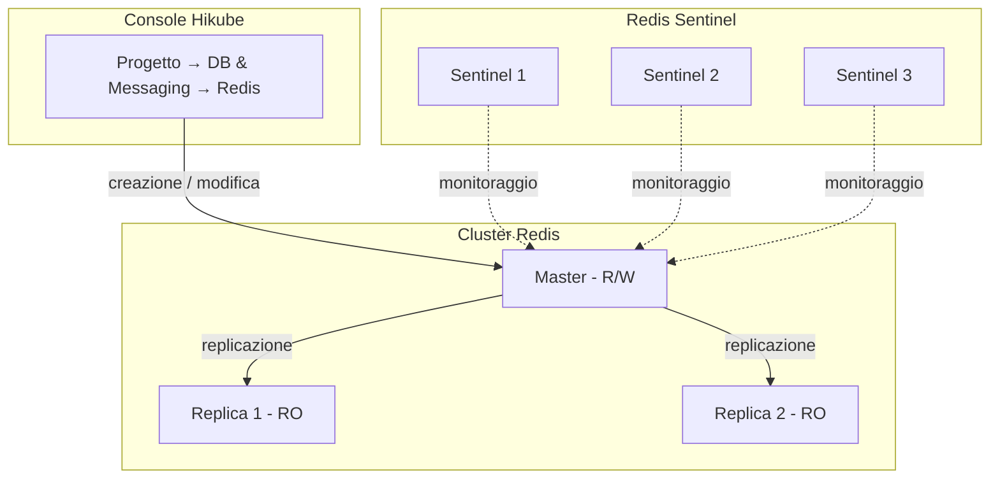
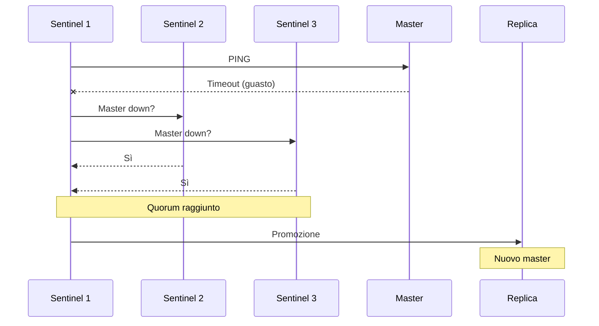

# Concetti — Redis

## Architettura

Redis su Hikube è un servizio gestito. Ogni cluster creato dalla console è un insieme master-repliche, supervisionato da **Redis Sentinel** per il failover automatico. Appartiene a un **progetto** e consuma le quote di tale progetto.

```mermaid
graph TB
    subgraph "Console Hikube"
        UI[Progetto → DB & Messaging → Redis]
    end

    subgraph "Cluster Redis"
        M[Master - R/W]
        R1[Replica 1 - RO]
        R2[Replica 2 - RO]
    end

    subgraph "Redis Sentinel"
        S1[Sentinel 1]
        S2[Sentinel 2]
        S3[Sentinel 3]
    end

    UI -->|creazione / modifica| M
    M -->|replicazione| R1
    M -->|replicazione| R2
    S1 -.->|monitoraggio| M
    S2 -.->|monitoraggio| M
    S3 -.->|monitoraggio| M
```

---

## Terminologia

| Termine | Descrizione |
|-------|-------------|
| **Cluster Redis** | Istanza gestita creata dalla console, composta da un master ed eventuali repliche. |
| **Progetto** | Spazio isolato che raggruppa le sue risorse e a cui si applicano le quote. |
| **Master** | Istanza principale che accetta letture e scritture. |
| **Replica** | Istanza in sola lettura, sincronizzata dal master. |
| **Sentinel** | Processo di supervisione che rileva i guasti del master e orchestra il failover automatico. |
| **Preset** | Modello di risorse (CPU, memoria) allocato a ogni nodo del cluster. |
| **Public network** | Opzione (chiamata anche **External access**) che espone il cluster su Internet tramite un indirizzo IP pubblico. |
| **Autenticazione** | Protezione dell'accesso tramite una password globale del cluster. |

---

## Alta disponibilità con Sentinel

Redis Sentinel garantisce l'alta disponibilità:

1. **Monitorando** costantemente il master e le repliche
2. **Rilevando** il guasto del master tramite consenso tra i Sentinel
3. **Promuovendo** automaticamente una replica a nuovo master
4. **Riconfigurando** le altre repliche affinché seguano il nuovo master

```mermaid
sequenceDiagram
    participant S1 as Sentinel 1
    participant S2 as Sentinel 2
    participant S3 as Sentinel 3
    participant M as Master
    participant R1 as Replica

    S1->>M: PING
    M--xS1: Timeout (guasto)
    S1->>S2: Master down?
    S1->>S3: Master down?
    S2-->>S1: Sì
    S3-->>S1: Sì
    Note over S1,S3: Quorum raggiunto
    S1->>R1: Promozione
    Note over R1: Nuovo master
```

Il valore **Number of replicas** si sceglie alla creazione (da 1 a 8).

:::tip
Il failover automatico funziona a partire da **2 repliche**: vengono sempre distribuiti tre Sentinel, che formano il quorum. Per la produzione scelga **3 repliche** o più, in modo da tollerare un numero maggiore di guasti.
:::

:::warning
Il numero di repliche non può essere modificato dopo la creazione («The mode cannot be changed after creation»). Per cambiarlo, [contatti il supporto](mailto:support@hidora.io).
:::

---

## Persistenza

Ogni nodo dispone di un volume persistente la cui capacità è definita dal campo **Volume size (GB)** («Storage capacity allocated to each node in the cluster.»). Redis scrive i dati su disco tramite i propri meccanismi nativi, il che consente loro di sopravvivere ai riavvii.

---

## Autenticazione

L'opzione **Enable authentication** è attiva per impostazione predefinita nella procedura guidata:

- **Attivata**: alla creazione viene generata una password, mostrata una sola volta insieme all'utente `default`. Può rinnovarla in qualsiasi momento dalla sezione **Security** della pagina del cluster (**Rotate password**).
- **Disattivata**: il cluster accetta connessioni senza password. Da evitare, in particolare con la rete pubblica attivata.

Redis su Hikube non offre nella console la gestione di più utenti (ACL): l'accesso si basa su questa password globale.

---

## Accesso di rete

- **Public network** disattivata (impostazione predefinita, «Private» nel riepilogo): il cluster non è esposto su Internet. La sezione **Connection** della pagina del cluster mostra «Waiting for allocation...» al posto dell'host.
- **Public network** attivata («Public»): la piattaforma assegna un indirizzo IP pubblico, mostrato nel campo **Host**. Dà accesso al master sulla porta standard di Redis, `6379`, e segue il master dopo una commutazione.

---

## Preset

Il **Preset** definisce la capacità allocata a **ogni nodo** del cluster. Fa fede l'elenco mostrato dalla procedura guidata; a titolo indicativo:

| Preset | CPU | Memoria |
|--------|-----|---------|
| `nano` | 250m | 128Mi |
| `micro` | 500m | 256Mi |
| `small` | 1 | 512Mi |
| `medium` | 1 | 1Gi |
| `large` | 2 | 2Gi |
| `xlarge` | 4 | 4Gi |
| `2xlarge` | 8 | 8Gi |

La memoria del preset limita la dimensione del dataset che Redis può mantenere in memoria. La definizione di risorse CPU/memoria personalizzate non è disponibile nella console; contatti il supporto.

---

## Quote e costi

La procedura guidata mostra l'**Estimated Cost** e l'impatto del cluster sulle quote del progetto. Se il cluster supera le quote disponibili, il pulsante **Next** resta inattivo.

| Parametro | Valore |
|-----------|--------|
| Repliche | Da 1 a 8 |
| Dimensione del volume | Da 1 a 4.096 GB per nodo, entro il limite della quota del progetto |
| Database Redis | Database logico `0` per impostazione predefinita |

---

## Per approfondire

- [Panoramica](./overview.md): presentazione del servizio
- [Avvio rapido](./quick-start.md): creare il suo primo cluster
