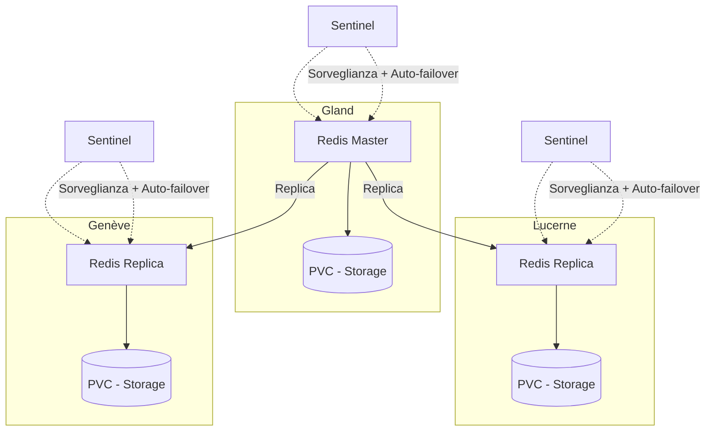

# Redis su Hikube

Hikube offre un servizio **Redis gestito**, basato sull'operatore **[Spotahome Redis Operator](https://github.com/spotahome/redis-operator)**, ampiamente utilizzato nella comunita.
La piattaforma supporta il deployment e la gestione di un cluster Redis **replicato e auto-riparante**, basandosi su **Redis Sentinel** per assicurare il rilevamento dei guasti e l'auto-failover.
Questo servizio garantisce rapidità, bassa latenza e alta disponibilità, senza sforzo lato utente.

---

## Struttura di Base

### **Risorsa Redis**

#### Esempio di configurazione YAML

```yaml
apiVersion: apps.cozystack.io/v1alpha1
kind: Redis
metadata:
  name: example
spec:
```

---

## 🏗️ Architettura e Funzionamento

Il servizio Redis gestito su Hikube è progettato per offrire **alta disponibilità** e **resilienza** grazie a un'architettura replicata.

- Un **nodo master** gestisce tutte le scritture e funge da fonte di verita per i dati.
- Uno o più **nodi replica** ricevono i dati in replica per assicurare la scalabilità in lettura.
- **Redis Sentinel** sorveglia permanentemente lo stato del cluster, rileva i guasti e può promuovere automaticamente una replica a nuovo master (**auto-failover**).

Questa combinazione garantisce:

- **Disponibilita continua** anche in caso di guasto del master
- **Prestazioni elevate** con la distribuzione delle letture tra le repliche
- **Semplicita operativa**, essendo la gestione automatizzata dalla piattaforma e dall'operatore Spotahome



## 🎯 Casi d'uso

Il servizio **Redis gestito su Hikube** e particolarmente adatto per:

- **Cache applicativa**: accelerare le applicazioni web (e-commerce, SaaS, API) riducendo il tempo di risposta grazie allo storage in memoria.
- **Sessioni distribuite**: gestire le sessioni utente in modo rapido e affidabile in ambienti multi-istanza.
- **Code di attesa e streaming leggero**: utilizzo di Redis come message broker (pub/sub, queues) per comunicazioni in tempo reale.
- **Analytics in tempo reale**: elaborazione rapida di metriche, log o eventi in streaming.
- **Gaming e IoT**: gestione di stati temporanei, classifiche e dati volatili con bassa latenza.
