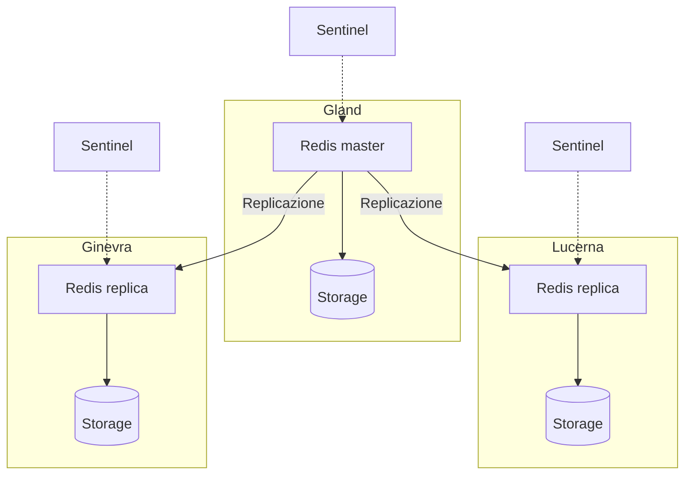

import NavigationFooter from '@site/src/components/NavigationFooter';

# Redis su Hikube

Hikube offre un servizio **Redis gestito**.
La piattaforma si occupa della distribuzione e della gestione di un cluster Redis **replicato e auto-riparante**, che si basa su **Redis Sentinel** per il rilevamento dei guasti e l'auto-failover. I cluster si creano e si amministrano dalla [console Hikube](https://console.hikube.cloud) (menu **DB & Messaging** → **Redis**).

---

## Architettura e funzionamento

Il servizio Redis gestito su Hikube è progettato per offrire **alta disponibilità** e **resilienza** grazie a un'architettura replicata:

- Un **nodo master** gestisce tutte le scritture e funge da fonte di verità per i dati.
- Uno o più **nodi replica** ricevono i dati in replica per garantire la scalabilità in lettura.
- **Redis Sentinel** monitora costantemente lo stato del cluster, rileva i guasti e può promuovere automaticamente una replica a nuovo master (**auto-failover**).

Questa combinazione garantisce:

- **Disponibilità continua** anche in caso di guasto del master
- **Prestazioni elevate** grazie alla ripartizione delle letture tra le repliche
- **Semplicità operativa**, poiché la gestione è automatizzata dalla piattaforma

```mermaid
graph TD
    subgraph Gland
        M1[Redis master] --> PVC1[(Storage)]
    end

    subgraph Lucerna
        R1[Redis replica] --> PVC2[(Storage)]
    end

    subgraph Ginevra
        R2[Redis replica] --> PVC3[(Storage)]
    end

    S1[Sentinel] -.-> M1
    S2[Sentinel] -.-> R1
    S3[Sentinel] -.-> R2

    M1 -->|Replicazione| R1
    M1 -->|Replicazione| R2
```

---

## Cosa si gestisce dalla console

| Funzione | Disponibile |
|----------|------------|
| Creazione di un cluster (versione 7 o 8, preset, da 1 a 8 repliche, dimensione del volume, rete pubblica, autenticazione) | Sì |
| Rotazione della password | Sì |
| Modifica della versione, del preset, della dimensione del volume, dell'accesso esterno e dell'autenticazione | Sì |
| Modifica del numero di repliche dopo la creazione | No, [contatti il supporto](mailto:support@hidora.io) |

---

## Casi d'uso

- **Cache applicativa**: accelerare le applicazioni web (e-commerce, SaaS, API) riducendo i tempi di risposta grazie all'archiviazione in memoria.
- **Sessioni distribuite**: gestire le sessioni utente in modo rapido e affidabile in ambienti multi-istanza.
- **Code e streaming leggero**: pub/sub, liste e stream per comunicazioni in tempo reale.
- **Analytics in tempo reale**: elaborazione rapida di metriche, contatori o eventi.
- **Gaming e IoT**: classifiche, stati temporanei e dati volatili a bassa latenza.

<NavigationFooter
  nextSteps={[
    {label: "Concetti", href: "../concepts"},
    {label: "Avvio rapido", href: "../quick-start"},
  ]}
  seeAlso={[
    {label: "Tutti i database", href: "../../"},
  ]}
/>
