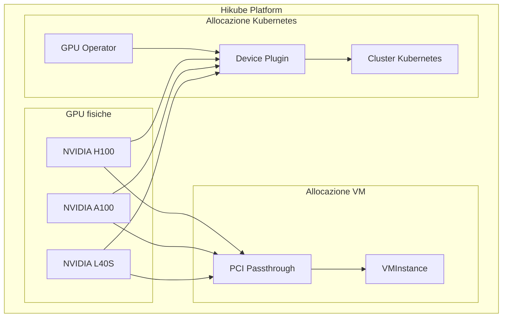
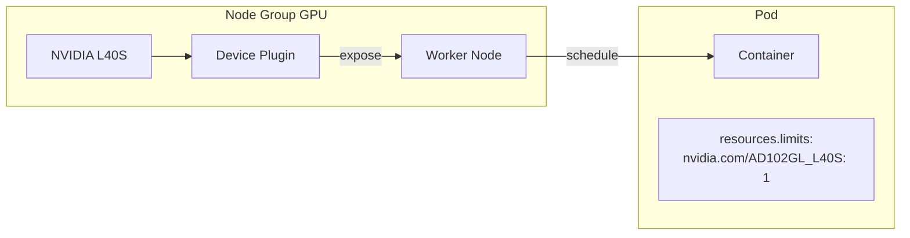

# Concetti — GPU

## Architettura

Hikube permette di collegare GPU NVIDIA direttamente alle macchine virtuali e ai cluster Kubernetes. L'allocazione GPU è gestita dal **NVIDIA GPU Operator** lato Kubernetes, e dal **passthrough PCI** lato macchine virtuali (KubeVirt).

---

## Terminologia

| Termine | Descrizione |
|-------|-------------|
| **GPU Operator** | NVIDIA GPU Operator — gestisce automaticamente i driver, il device plugin e il runtime GPU sui nodi Kubernetes. |
| **Device Plugin** | Plugin Kubernetes che espone le GPU come risorse pianificabili (`nvidia.com/<model>`). |
| **PCI Passthrough** | Tecnica che assegna una GPU fisica direttamente a una VM, offrendo prestazioni native. |
| **CUDA** | Piattaforma di calcolo parallelo NVIDIA, utilizzata per l'accelerazione GPU (ML, HPC, rendering). |
| **Instance Type** | Profilo di risorse CPU/RAM della VM. Dimensionato in funzione del numero di GPU (8-16 vCPU per GPU raccomandato). |

---

## Tipi di GPU disponibili

| GPU | Architettura | Memoria | Prestazioni (INT8) | Caso d'uso |
|-----|-------------|---------|-------------------|-------------|
| **L40S** | Ada Lovelace | 48 GB GDDR6 | 362 TOPS | Inferenza, sviluppo, prototipazione |
| **A100** | Ampere | 80 GB HBM2e | 312 TOPS | Addestramento ML, fine-tuning |
| **H100** | Hopper | 80 GB HBM3 | 1979 TOPS | LLM, calcolo exascale, addestramento distribuito |

### Identificativi GPU nei manifest

| GPU | Valore `gpus[].name` / `nvidia.com/` |
|-----|---------------------------------------|
| L40S | `nvidia.com/AD102GL_L40S` |
| A100 | `nvidia.com/GA100_A100_PCIE_80GB` |
| H100 | `nvidia.com/H100_94GB` |

---

## GPU su macchine virtuali

Le GPU sono collegate alle VM tramite **PCI passthrough**:

- La GPU fisica è dedicata alla VM (prestazioni native)
- Dichiarata in `spec.gpus[]` del manifest `VMInstance`
- Multi-GPU possibile (ripetere le voci in `gpus[]`)
- I driver NVIDIA devono essere installati nella VM

:::tip Rapporto CPU/GPU raccomandato
Prevedete **da 8 a 16 vCPU per GPU**. Per una singola GPU, un `u1.2xlarge` (8 vCPU, 32 GB RAM) è un buon punto di partenza.
:::

---

## GPU su Kubernetes

Le GPU sono esposte ai pod tramite il **NVIDIA Device Plugin**:

- Il GPU Operator deve essere attivato sul cluster (`plugins.gpu-operator.enabled: true`)
- I pod richiedono una GPU tramite `resources.limits` (es: `nvidia.com/AD102GL_L40S: 1`)
- Lo scheduler Kubernetes posiziona il pod su un nodo che dispone della GPU richiesta
- I nodi GPU sono configurati nei **node group** con il campo `gpus[]`

---

## Confronto VM vs Kubernetes

| Criterio | GPU su VM | GPU su Kubernetes |
|---------|-----------|-------------------|
| **Isolamento** | GPU dedicata (passthrough) | GPU condivisa tramite device plugin |
| **Prestazioni** | Prestazioni native | Prestazioni native |
| **Flessibilità** | OS completo, driver manuali | Container, scaling automatico |
| **Multi-GPU** | Tramite `spec.gpus[]` | Tramite `resources.limits` |
| **Caso d'uso** | Workstation, ambienti interattivi | Pipeline ML, inferenza su larga scala |

---

## Limiti e quote

| Parametro | Valore |
|-----------|--------|
| GPU per VM | Multipli (secondo disponibilità) |
| GPU per pod Kubernetes | Multipli (tramite `resources.limits`) |
| Tipi di GPU | L40S, A100, H100 |
| Memoria GPU max | 80 GB (A100/H100) |

---

## Per approfondire

- [Panoramica](./overview.md): presentazione del servizio GPU
- [Riferimento API](./api-reference.md): configurazione GPU dettagliata
