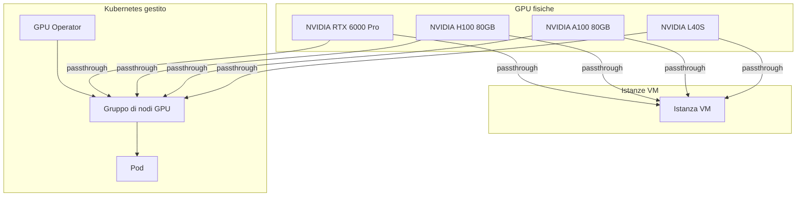
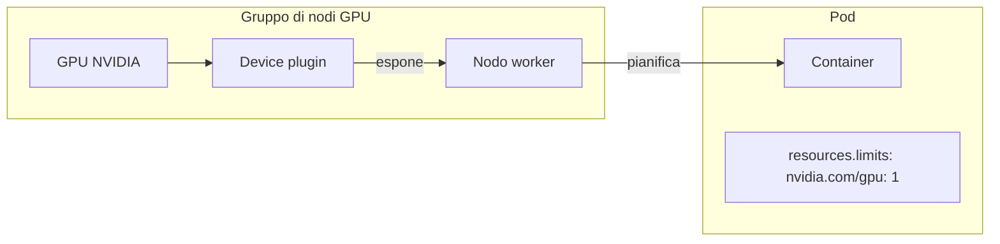

# Concetti — GPU

## Architettura

Hikube collega GPU NVIDIA fisiche alle macchine virtuali e ai nodi dei cluster Kubernetes. Lato VM, la GPU viene assegnata in **passthrough PCI**. Lato Kubernetes, il nodo riceve la GPU allo stesso modo, quindi il **NVIDIA GPU Operator** la espone ai pod.

```mermaid
graph TB
    subgraph "GPU fisiche"
        G1[NVIDIA L40S]
        G2[NVIDIA A100 80GB]
        G3[NVIDIA H100 80GB]
        G4[NVIDIA RTX 6000 Pro]
    end

    subgraph "Istanze VM"
        VMI[Istanza VM]
    end

    subgraph "Kubernetes gestito"
        NG[Gruppo di nodi GPU]
        GO[GPU Operator]
        POD[Pod]
    end

    G1 & G2 & G3 & G4 -->|passthrough| VMI
    G1 & G2 & G3 & G4 -->|passthrough| NG
    GO --> NG
    NG --> POD
```

---

## Terminologia

| Termine | Descrizione |
|-------|-------------|
| **Hardware Acceleration (GPU)** | Sezione della procedura guidata VM in cui si scelgono le GPU dell'istanza. |
| **Gruppo di nodi** | Insieme di nodi worker di un cluster Kubernetes che condividono un tipo di istanza e, se previsto, delle GPU. |
| **Passthrough PCI** | Assegnazione di una GPU fisica direttamente a una VM o a un nodo, con prestazioni native. |
| **GPU Operator** | Addon Kubernetes NVIDIA che installa i driver, il device plugin e il runtime GPU sui nodi. Attivato automaticamente non appena un gruppo di nodi dispone di GPU. |
| **Device plugin** | Componente che espone le GPU ai pod come risorsa pianificabile `nvidia.com/gpu`. |
| **HAMi** | Addon di virtualizzazione delle GPU: condivisione di una stessa GPU tra più pod. Richiede il GPU Operator. |
| **CUDA** | Piattaforma di calcolo parallelo NVIDIA, utilizzata per l'accelerazione (ML, HPC, rendering). |

---

## Modelli e disponibilità

| Modello | Memoria |
|--------|---------|
| **NVIDIA L40S** | 48 GB |
| **NVIDIA A100 80GB** | 80 GB |
| **NVIDIA H100 80GB** | 80 GB |
| **NVIDIA RTX 6000 Pro** | 96 GB |

Il selettore di GPU mostra tutti i modelli della piattaforma. Un modello senza unità libere è contrassegnato come **Unavailable** e non può essere selezionato. La disponibilità è globale: la console non mostra il numero di unità libere.

:::note Co-localizzazione
Una VM, così come un nodo Kubernetes, viene eseguita su un unico server fisico. Quando richiede più GPU per una stessa VM (o per ciascun nodo di un gruppo), devono essere tutte disponibili su uno stesso server. Altrimenti la creazione non riesce con il messaggio **The following GPUs are not available: …**, anche se ogni modello risulta disponibile.
:::

---

## GPU su macchina virtuale

- Selezione al passaggio **Configuration** della procedura guidata, in **Hardware Acceleration (GPU)**: faccia clic su una scheda per aggiungere una GPU, quindi usi **+** e **−** per modificarne il numero. Il badge indica il totale (ad esempio **2 GPUs total**).
- La sezione compare solo se la piattaforma offre GPU.
- Le GPU si modificano in seguito in **Edit** > **Resources (CPU / RAM)**; la VM viene riavviata.
- **Stop** su una VM libera le sue GPU. Al riavvio, se sono state assegnate altrove, la console propone di **Select an alternative GPU**.
- I driver NVIDIA non sono preinstallati nelle immagini.

:::tip Rapporto CPU/GPU
Preveda **da 8 a 16 vCPU per GPU**. Per una GPU, un `u1.2xlarge` (8 vCPU, 32 GB) è un buon punto di partenza.
:::

---

## GPU su Kubernetes

- Selezione al passaggio **Nodes** della procedura guidata del cluster, sezione **GPU** di ciascun gruppo di nodi. Ogni nodo del gruppo riceve le GPU selezionate.
- Non appena un gruppo dispone di GPU, l'addon **GPU Operator** viene attivato e non può più essere disattivato (**Required when a node group has GPUs**).
- I pod richiedono una GPU tramite `resources.limits` (`nvidia.com/gpu: 1`).
- Un gruppo creato **senza** GPU non può riceverne; un gruppo creato **con** GPU può cambiare modello o numero, ma deve mantenere almeno una GPU. Per cambiare categoria, aggiunga un nuovo gruppo di nodi.

```mermaid
graph LR
    subgraph "Gruppo di nodi GPU"
        N1[Nodo worker]
        GPU[GPU NVIDIA]
        DP[Device plugin]
    end

    subgraph "Pod"
        C[Container]
        RL["resources.limits: nvidia.com/gpu: 1"]
    end

    GPU --> DP
    DP -->|espone| N1
    N1 -->|pianifica| C
```

---

## Confronto tra VM e Kubernetes

| Criterio | GPU su VM | GPU su Kubernetes |
|---------|-----------|-------------------|
| **Accesso** | GPU dedicata alla VM | GPU assegnata ai pod dallo scheduler |
| **Driver** | Installati da lei nel sistema operativo | Installati dal GPU Operator |
| **Multi-GPU** | Più GPU nella VM | Più GPU per nodo, `resources.limits` per pod |
| **Condivisione** | No | Sì, con HAMi |
| **Casi d'uso** | Workstation, ambienti interattivi | Pipeline ML, inferenza su larga scala |

---

## Per approfondire

- [Panoramica](./overview.md)
- [Assegnare una GPU a una VM](./how-to/provision-gpu-vm.md)
- [Assegnare una GPU su Kubernetes](./how-to/provision-gpu-kubernetes.md)
