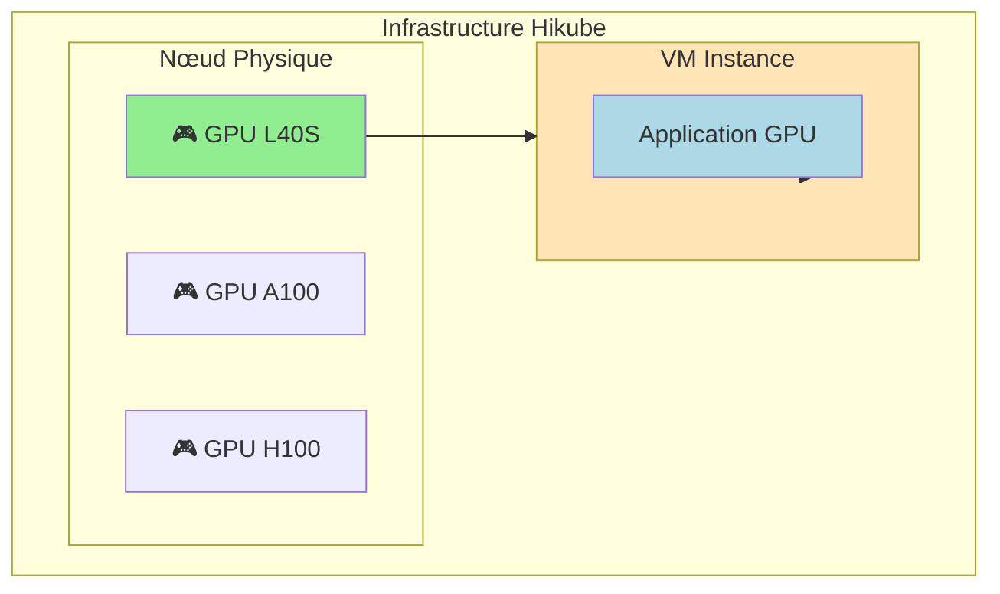
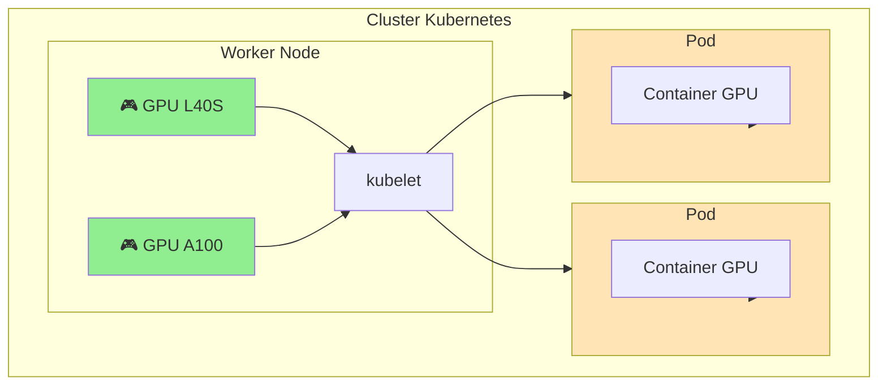

# GPU su Hikube

Hikube propone l'accesso agli acceleratori **NVIDIA** tramite GPU Passthrough, permettendo l'esecuzione di workload che necessitano di accelerazione hardware. Le GPU sono disponibili per due tipi di workload: macchine virtuali e pod Kubernetes.

---

## 🎯 Tipi di Utilizzo

### **GPU con Macchine Virtuali**

Le GPU possono essere collegate direttamente alle macchine virtuali tramite GPU passthrough VFIO-PCI, offrendo un accesso completo ed esclusivo all'acceleratore.

**Casi d'uso:**

- Applicazioni che necessitano un controllo completo della GPU
- Workload legacy o specializzati
- Ambienti di sviluppo isolati
- Applicazioni grafiche (rendering, CAD)

### **GPU con Kubernetes**

Le GPU possono essere allocate ai worker Kubernetes e poi assegnate ai pod tramite le resource requests/limits.

**Casi d'uso:**

- Workload containerizzati di IA/ML
- Scaling automatico delle applicazioni GPU
- Condivisione delle risorse GPU tra applicazioni
- Orchestrazione complessa di job paralleli

---

## 🖥️ Hardware Disponibile

Hikube propone tre tipi di GPU NVIDIA:

### **NVIDIA L40S**

- **Architettura**: Ada Lovelace
- **Memoria**: 48 GB GDDR6 con ECC
- **Prestazioni**: 362 TOPS (INT8), 91.6 TFLOPs (FP32)
- **Uso tipico**: IA generativa, inferenza, rendering tempo reale

### **NVIDIA A100**

- **Architettura**: Ampere
- **Memoria**: 80 GB HBM2e con ECC
- **Prestazioni**: 312 TOPS (INT8), 624 TFLOPs (Tensor)
- **Uso tipico**: Addestramento ML, calcolo ad alte prestazioni

### **NVIDIA H100**

- **Architettura**: Hopper
- **Memoria**: 80 GB HBM3 con ECC
- **Prestazioni**: 1979 TOPS (INT8), 989 TFLOPs (Tensor)
- **Uso tipico**: LLM, transformer, calcolo exascale

---

## 🏗️ Architettura

### **Allocazione GPU con VM**



### **Allocazione GPU con Kubernetes**



---

## ⚙️ Configurazione

### **GPU su VM**

```yaml
apiVersion: apps.cozystack.io/v1alpha1
kind: VirtualMachine
spec:
  instanceType: "u1.xlarge"
  gpus:
    - name: "nvidia.com/AD102GL_L40S"
```

### **GPU su Kubernetes Worker**

```yaml
apiVersion: apps.cozystack.io/v1alpha1
kind: Kubernetes
spec:
  nodeGroups:
    gpu-workers:
      instanceType: "u1.xlarge"
      gpus:
        - name: "nvidia.com/AD102GL_L40S"
```

### **GPU in Pod Kubernetes**

```yaml
apiVersion: v1
kind: Pod
spec:
  containers:
  - name: gpu-app
    image: nvidia/cuda:12.0-runtime-ubuntu20.04
    resources:
      limits:
        nvidia.com/gpu: 1
```

---

## 📋 Confronto degli Approcci

| **Aspetto** | **GPU su VM** | **GPU su Kubernetes** |
|------------|----------------|------------------------|
| **Isolamento** | Completo (1 GPU = 1 VM) | Condiviso (orchestrato) |
| **Prestazioni** | Native (passthrough) | Native (device plugin) |
| **Gestione** | Manuale | Automatizzata |
| **Scaling** | Solo verticale | Orizzontale + Verticale |
| **Condivisione** | No | Si (tra pod) |
| **Complessità** | Semplice | Complessa |

---

## 🚀 Prossimi Passi

### **Per le Macchine Virtuali**

- [Creare una VM GPU](./quick-start.md) → Guida pratica
- [Riferimento API](./api-reference.md) → Configurazione completa

### **Per Kubernetes**

- [Cluster GPU](../kubernetes/overview.md) → Worker con GPU
  - [Configurazione avanzata](../kubernetes/api-reference.md) → NodeGroup GPU
