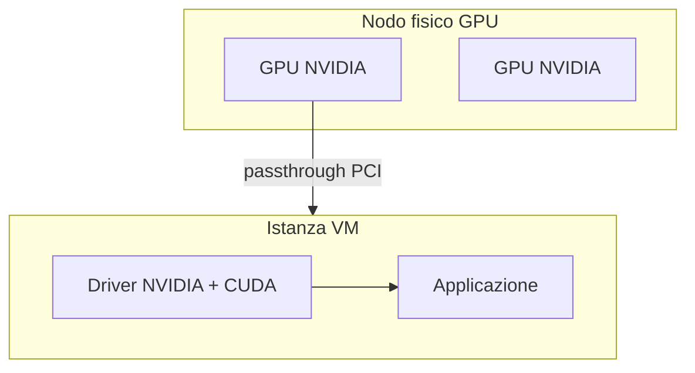
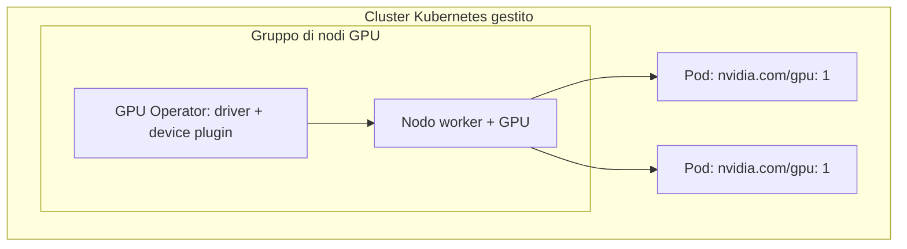

import NavigationFooter from '@site/src/components/NavigationFooter';

# GPU su Hikube

Hikube offre acceleratori **NVIDIA** collegati in passthrough, per due tipi di carichi di lavoro: le **macchine virtuali** e i **nodi dei cluster Kubernetes**. Nella console non esiste una pagina GPU: la GPU si sceglie nella procedura guidata della risorsa che la utilizza.

---

## Modalità di utilizzo

### GPU su macchina virtuale

La GPU fisica viene assegnata alla VM in passthrough PCI: la VM vi ha accesso esclusivo e prestazioni native.

- Scelta nella procedura guidata **Create an Instance**, passaggio **Configuration**, sezione **Hardware Acceleration (GPU)**.
- Una o più GPU per VM, di uno o più modelli.
- I driver NVIDIA si installano nel sistema operativo della VM (vedere [Installare CUDA](../compute/how-to/install-cuda-drivers.md)).

**Casi d'uso:** ambienti di sviluppo CUDA, applicazioni che richiedono il controllo completo della GPU, rendering grafico, carichi di lavoro specializzati.

### GPU su Kubernetes

Le GPU vengono collegate ai nodi di un **gruppo di nodi** del cluster, quindi assegnate ai pod tramite `resources.limits`.

- Scelta nella procedura guidata **Create cluster** (o **Edit**), passaggio **Nodes**, sezione **GPU** del gruppo di nodi.
- L'addon **GPU Operator** viene attivato automaticamente non appena un gruppo dispone di GPU; installa i driver e il device plugin.
- L'addon **HAMi** consente di condividere una stessa GPU tra più pod.

**Casi d'uso:** IA/ML containerizzata, inferenza su larga scala, job paralleli.

---

## Modelli offerti

| Modello (etichetta della console) | Memoria | Architettura | Utilizzo tipico |
|--------------------------------|---------|--------------|---------------|
| **NVIDIA L40S** | 48 GB | Ada Lovelace | Inferenza, IA generativa, rendering in tempo reale, prototipazione |
| **NVIDIA A100 80GB** | 80 GB | Ampere | Addestramento ML, fine-tuning, calcolo scientifico |
| **NVIDIA H100 80GB** | 80 GB | Hopper | Addestramento e inferenza di grandi modelli |
| **NVIDIA RTX 6000 Pro** | 96 GB | Blackwell | LLM, calcolo intensivo |

Ogni scheda del selettore mostra il nome del modello e la sua memoria (ad esempio **48 GB VRAM**). Un modello che non ha più unità libere appare disattivato e contrassegnato come **Unavailable**.

:::note Disponibilità
La console indica soltanto se un modello è disponibile o meno, senza mostrare il numero di unità libere. Le GPU sono risorse condivise tra i clienti della piattaforma: una GPU liberata (VM arrestata, nodo eliminato) può essere assegnata a un altro carico di lavoro. Per un'esigenza specifica di capacità GPU, contatti [sales@hidora.io](mailto:sales@hidora.io).
:::

---

## Architettura

### GPU su VM

```mermaid
flowchart TD
    subgraph NODE["Nodo fisico GPU"]
        GPU1["GPU NVIDIA"]
        GPU2["GPU NVIDIA"]
    end

    subgraph VM1["Istanza VM"]
        DRV["Driver NVIDIA + CUDA"]
        APP1["Applicazione"]
    end

    GPU1 -->|passthrough PCI| VM1
    DRV --> APP1
```

Una VM viene eseguita su un unico nodo fisico: tutte le GPU richieste per una VM devono essere disponibili **sullo stesso nodo**.

### GPU su Kubernetes

```mermaid
flowchart TD
    subgraph CLUSTER["Cluster Kubernetes gestito"]
        subgraph NG["Gruppo di nodi GPU"]
            W1["Nodo worker + GPU"]
            OP["GPU Operator: driver + device plugin"]
        end
        POD1["Pod: nvidia.com/gpu: 1"]
        POD2["Pod: nvidia.com/gpu: 1"]
    end

    OP --> W1
    W1 --> POD1
    W1 --> POD2
```

---

## Confronto

| Aspetto | GPU su VM | GPU su Kubernetes |
|--------|-----------|-------------------|
| **Isolamento** | GPU dedicata alla VM | GPU assegnata ai pod dallo scheduler |
| **Prestazioni** | Native (passthrough) | Native (device plugin) |
| **Driver** | Da installare nel sistema operativo | Installati dal GPU Operator |
| **Scalabilità** | Verticale (modificare la VM) | Orizzontale (numero di nodi del gruppo) |
| **Condivisione di una GPU** | No | Sì, con l'addon HAMi |
| **Modifica** | Aggiungere, rimuovere o cambiare GPU (riavvio) | Un gruppo esistente mantiene almeno una GPU; un gruppo senza GPU non può riceverne |

---

## Fatturazione e quote

La stima dei costi mostrata nelle procedure guidate VM e Kubernetes include le GPU selezionate. La GPU di una VM viene liberata quando la VM è arrestata.

---

## Passi successivi

- [Avvio rapido: una VM con GPU](./quick-start.md)
- [Assegnare una GPU su Kubernetes](./how-to/provision-gpu-kubernetes.md)
- [Concetti](./concepts.md)

<NavigationFooter
  nextSteps={[
    {label: "Concetti", href: "../concepts"},
    {label: "Avvio rapido", href: "../quick-start"},
  ]}
  seeAlso={[
    {label: "Risorse di calcolo", href: "../../compute/"},
  ]}
/>
