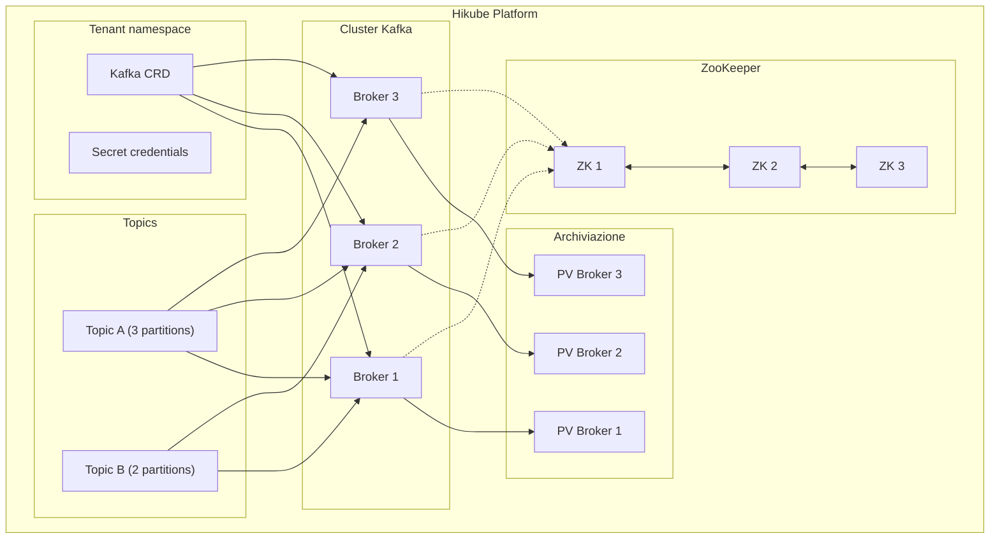
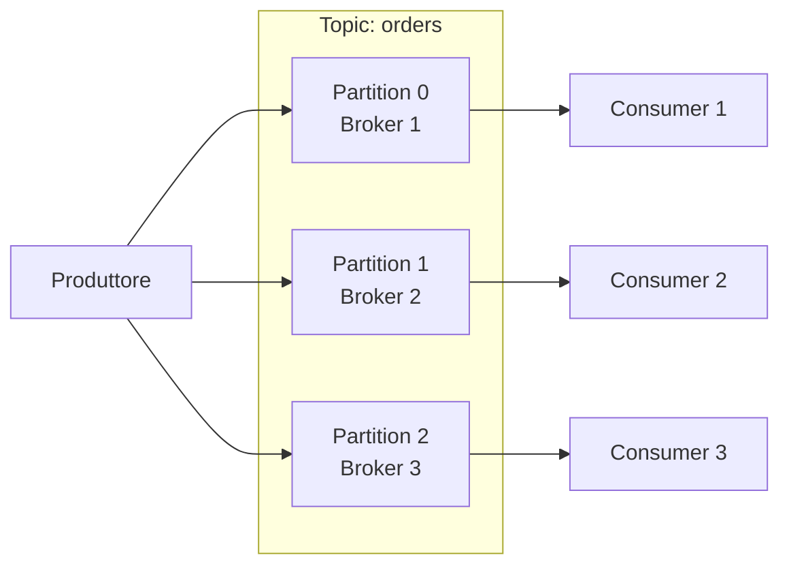

# Concetti — Kafka

## Architettura

Kafka su Hikube è un servizio gestito di streaming distribuito. Ogni istanza distribuita tramite la risorsa `Kafka` crea un cluster di **broker** coordinati da **ZooKeeper**, capace di gestire milioni di messaggi al secondo con persistenza garantita.

---

## Terminologia

| Termine | Descrizione |
|---------|-------------|
| **Kafka** | Risorsa Kubernetes (`apps.cozystack.io/v1alpha1`) che rappresenta un cluster Kafka gestito. |
| **Broker** | Istanza Kafka che archivia i messaggi e serve produttori/consumatori. |
| **ZooKeeper** | Servizio di coordinamento distribuito che gestisce i metadati del cluster, l'elezione del leader e la configurazione dei topic. |
| **Topic** | Canale di messaggi con un nome. I produttori scrivono in un topic, i consumatori leggono da un topic. |
| **Partizione** | Suddivisione di un topic. Ogni partizione è un log ordinato di messaggi, distribuito su un broker. |
| **Replication Factor** | Numero di copie di ogni partizione su diversi broker. |
| **Consumer Group** | Gruppo di consumatori che si ripartiscono le partizioni di un topic per l'elaborazione parallela. |
| **Retention** | Durata o dimensione massima di conservazione dei messaggi in un topic. |
| **resourcesPreset** | Profilo di risorse predefinito (da nano a 2xlarge). |

---

## Topic e partizioni

### Funzionamento

Un **topic** è suddiviso in **partizioni**, ciascuna distribuita su un broker diverso:

- Più partizioni = più parallelismo
- Ogni partizione ha un **leader** (un broker) e dei **follower** (repliche)
- Il `replicationFactor` determina il numero di copie di ogni partizione

### Configurazione dei topic

I topic sono dichiarati direttamente nel manifesto Kafka:

| Parametro | Descrizione |
|-----------|-------------|
| `topics[name].partitions` | Numero di partizioni del topic |
| `topics[name].config.replicationFactor` | Numero di repliche per partizione |
| `topics[name].config.retentionMs` | Durata di retention in ms (es: `604800000` = 7 giorni) |
| `topics[name].config.cleanupPolicy` | `delete` (eliminazione per TTL) o `compact` (conservazione dell'ultimo messaggio per chiave) |

---

## ZooKeeper

ZooKeeper garantisce il coordinamento del cluster Kafka:

- **Elezione del leader** per ogni partizione
- **Archiviazione dei metadati** (topic, partizioni, offset)
- **Rilevamento dei guasti** dei broker

:::tip
Configurate sempre un numero dispari di istanze ZooKeeper (`zookeeper.replicas: 3`) per garantire il quorum.
:::

Le risorse ZooKeeper sono configurate indipendentemente dai broker tramite `zookeeper.resources` o `zookeeper.resourcesPreset`.

---

## Preset di risorse

I preset si applicano separatamente ai **broker Kafka** e allo **ZooKeeper**:

| Preset | CPU | Memoria |
|--------|-----|---------|
| `nano` | 250m | 128Mi |
| `micro` | 500m | 256Mi |
| `small` | 1 | 512Mi |
| `medium` | 1 | 1Gi |
| `large` | 2 | 2Gi |
| `xlarge` | 4 | 4Gi |
| `2xlarge` | 8 | 8Gi |

---

## Limiti e quote

| Parametro | Valore |
|-----------|--------|
| Broker Kafka max | Secondo la quota del tenant |
| Istanze ZooKeeper | 3 raccomandato (dispari) |
| Topic per cluster | Illimitato (secondo le risorse) |
| Partizioni per topic | Configurabile |
| Dimensione archiviazione | Variabile (`kafka.size`, `zookeeper.size`) |

---

## Per approfondire

- [Panoramica](./overview.md): presentazione del servizio
- [Riferimento API](./api-reference.md): tutti i parametri della risorsa Kafka
