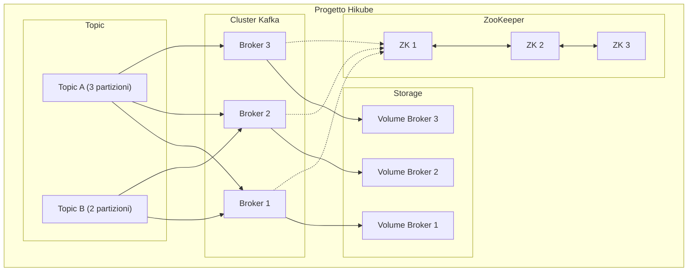
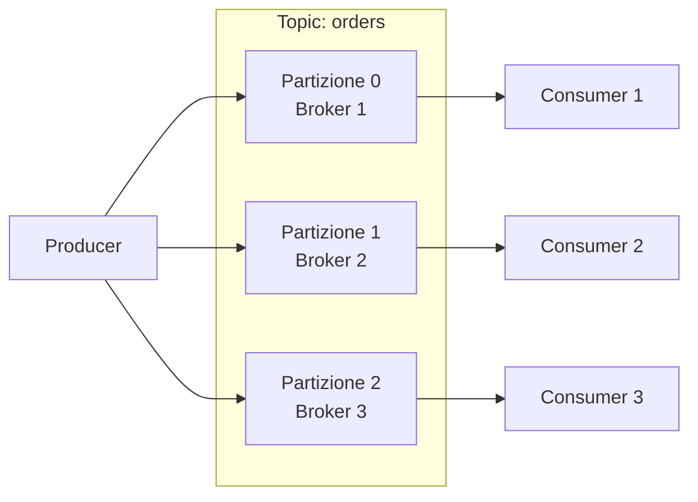

# Concetti — Kafka

:::info Disponibilità
Kafka non è ancora disponibile in modalità self-service nella [console Hikube](https://console.hikube.cloud).
Per effettuare il provisioning di un'istanza o modificarne la configurazione, [contatti il supporto](mailto:support@hidora.io).
:::

## Architettura

Kafka su Hikube è un servizio gestito di streaming distribuito. Ogni istanza è un cluster di **broker** coordinati da **ZooKeeper**, associato a un progetto Hikube, con uno storage persistente per ogni broker.

```mermaid
graph TB
    subgraph "Progetto Hikube"
        subgraph "Cluster Kafka"
            B1[Broker 1]
            B2[Broker 2]
            B3[Broker 3]
        end

        subgraph "ZooKeeper"
            Z1[ZK 1]
            Z2[ZK 2]
            Z3[ZK 3]
        end

        subgraph "Topic"
            T1["Topic A (3 partizioni)"]
            T2["Topic B (2 partizioni)"]
        end

        subgraph "Storage"
            PV1[Volume Broker 1]
            PV2[Volume Broker 2]
            PV3[Volume Broker 3]
        end
    end

    B1 --> PV1
    B2 --> PV2
    B3 --> PV3
    Z1 <--> Z2
    Z2 <--> Z3
    B1 -.-> Z1
    B2 -.-> Z1
    B3 -.-> Z1
    T1 --> B1
    T1 --> B2
    T1 --> B3
    T2 --> B1
    T2 --> B2
```

---

## Terminologia

| Termine | Descrizione |
|---------|-------------|
| **Kafka (istanza)** | Cluster Kafka gestito da Hikube, associato a un progetto. La sua configurazione viene definita alla creazione e modificata su richiesta al supporto. |
| **Broker** | Istanza Kafka che archivia i messaggi e serve producer e consumer. |
| **ZooKeeper** | Servizio di coordinamento distribuito che gestisce i metadati del cluster, l'elezione del leader e la configurazione dei topic. |
| **Topic** | Canale di messaggi con nome. I producer scrivono in un topic, i consumer leggono da un topic. |
| **Partizione** | Suddivisione di un topic. Ogni partizione è un log ordinato di messaggi, distribuito su un broker. |
| **Replication Factor** | Numero di copie di ogni partizione su broker diversi. |
| **Consumer Group** | Gruppo di consumer che si ripartiscono le partizioni di un topic per l'elaborazione parallela. |
| **Retention** | Durata o dimensione massima di conservazione dei messaggi in un topic. |
| **Preset di risorse** | Profilo CPU/memoria predefinito (da nano a 2xlarge) applicato ai broker e a ZooKeeper. |

---

## Topic e partizioni

### Funzionamento

Un **topic** è suddiviso in **partizioni**, ciascuna distribuita su un broker diverso:

```mermaid
graph LR
    subgraph "Topic: orders"
        P0[Partizione 0<br/>Broker 1]
        P1[Partizione 1<br/>Broker 2]
        P2[Partizione 2<br/>Broker 3]
    end

    Prod[Producer] --> P0
    Prod --> P1
    Prod --> P2

    P0 --> C1[Consumer 1]
    P1 --> C2[Consumer 2]
    P2 --> C3[Consumer 3]
```

- Più partizioni = più parallelismo
- Ogni partizione ha un **leader** (un broker) e dei **follower** (repliche)
- Il fattore di replica determina il numero di copie di ogni partizione

### Configurazione dei topic

I topic gestiti fanno parte della configurazione dell'istanza. Per ogni topic è possibile definire i seguenti parametri:

| Parametro | Descrizione |
|-----------|-------------|
| Partizioni | Numero di partizioni del topic |
| Repliche | Numero di copie di ogni partizione (non può superare il numero di broker) |
| `retention.ms` | Durata di conservazione in ms (es. `604800000` = 7 giorni) |
| `cleanup.policy` | `delete` (eliminazione dopo la conservazione) o `compact` (conservazione dell'ultimo messaggio per chiave) |
| `min.insync.replicas` | Numero minimo di repliche sincronizzate per confermare una scrittura |

Questa opzione non è disponibile nella console; contatti il supporto.

---

## ZooKeeper

ZooKeeper garantisce il coordinamento del cluster Kafka:

- **Elezione del leader** per ogni partizione
- **Archiviazione dei metadati** (topic, partizioni, offset)
- **Rilevamento dei guasti** dei broker

:::tip
Per garantire il quorum è necessario un numero dispari di istanze ZooKeeper (in genere 3). Lo precisi nella sua richiesta di istanza.
:::

Le risorse di ZooKeeper (numero di istanze, preset, dimensione dello storage) vengono definite indipendentemente da quelle dei broker.

---

## Preset di risorse

I preset si applicano separatamente ai **broker Kafka** e a **ZooKeeper**:

| Preset | CPU | Memoria |
|--------|-----|---------|
| `nano` | 250m | 128Mi |
| `micro` | 500m | 256Mi |
| `small` | 1 | 512Mi |
| `medium` | 1 | 1Gi |
| `large` | 2 | 2Gi |
| `xlarge` | 4 | 4Gi |
| `2xlarge` | 8 | 8Gi |

---

## Limiti e quote

| Parametro | Valore |
|-----------|--------|
| Broker Kafka max | In base alle quote del progetto |
| Istanze ZooKeeper | 3 consigliate (dispari) |
| Topic per cluster | Illimitati (in base alle risorse) |
| Partizioni per topic | Configurabile |
| Dimensione dello storage | Definita separatamente per i broker e per ZooKeeper |

---

## Per approfondire

- [Panoramica](./overview.md): presentazione del servizio
- [Avvio rapido](./quick-start.md): richiedere un'istanza e testarla
