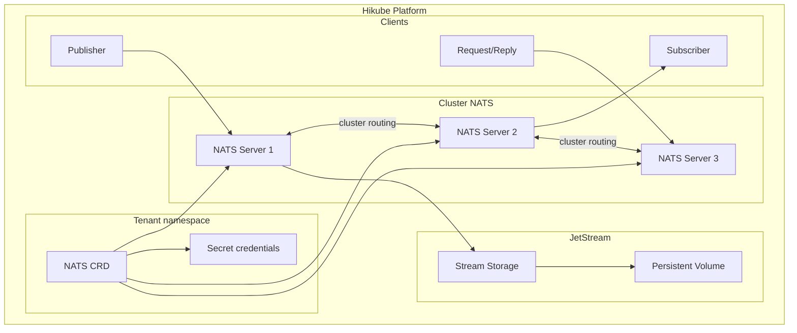
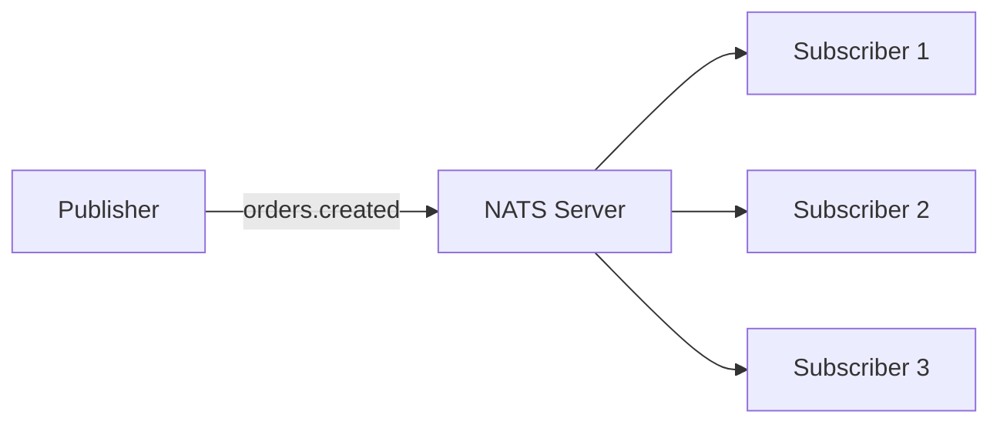
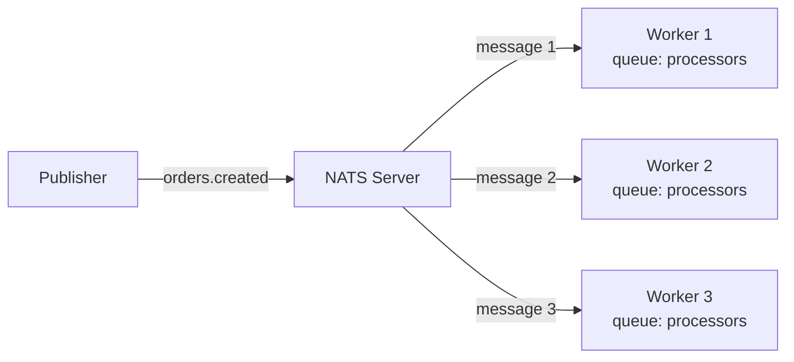
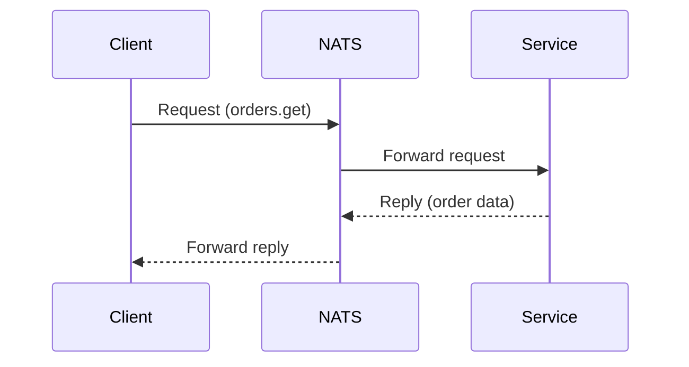

# Concepts — NATS

## Architettura

NATS sur Hikube est un service de messaging managé, ultra-léger et haute performance. Chaque instance déployée via la ressource `NATS` crée un cluster de serveurs avec support optionnel de **JetStream** pour la persistance des messages.

---

## Terminologia

| Terme | Description |
|-------|-------------|
| **NATS** | Ressource Kubernetes (`apps.cozystack.io/v1alpha1`) représentant un cluster NATS managé. |
| **Subject** | Adresse de routage des messages (ex: `orders.created`). Supporte les wildcards (`*`, `>`). |
| **Publish/Subscribe** | Modèle de communication où les publishers envoient des messages à un subject et les subscribers les reçoivent. |
| **JetStream** | Extension de persistance de NATS — stockage durable des messages avec replay, acknowledgment et consumers. |
| **Stream** | Collection persistante de messages dans JetStream, avec politique de rétention configurable. |
| **Consumer** | Abonnement durable dans JetStream avec suivi de la position (offset) et acknowledgment. |
| **Request/Reply** | Modèle de communication synchrone — un client envoie une requête et attend une réponse. |
| **resourcesPreset** | Profil de ressources prédéfini (nano à 2xlarge). |

---

## Modèles de communication

NATS supporte trois modèles de communication :

### Publish/Subscribe

Le modèle le plus simple — un publisher envoie un message, tous les subscribers reçoivent une copie :

### Queue Groups

Les subscribers d'un même queue group se répartissent les messages (load balancing) :

### Request/Reply

Communication synchrone avec réponse attendue :

---

## JetStream

JetStream ajoute la **persistance** à NATS :

- Les messages sont stockés sur disque dans des **streams**
- Les **consumers** suivent leur position et peuvent re-lire les messages
- Support du **at-least-once** et **exactly-once** delivery
- Rétention configurable par durée, nombre de messages ou taille

:::tip
Activez JetStream uniquement si vous avez besoin de persistance. Pour du pub/sub éphémère, le NATS de base est plus léger (< 10 MB de RAM par instance).
:::

---

## Gestion des utilisateurs

Les utilisateurs NATS sont déclarés dans le manifeste avec un mot de passe. Les credentials sont stockés dans le Secret `<instance>-credentials`.

---

## Presets de ressources

| Preset | CPU | Mémoire |
|--------|-----|---------|
| `nano` | 250m | 128Mi |
| `micro` | 500m | 256Mi |
| `small` | 1 | 512Mi |
| `medium` | 1 | 1Gi |
| `large` | 2 | 2Gi |
| `xlarge` | 4 | 4Gi |
| `2xlarge` | 8 | 8Gi |

---

## Limites et quotas

| Paramètre | Valeur |
|-----------|--------|
| Réplicas max | Selon quota tenant |
| Empreinte mémoire minimale | < 10 MB par instance (sans JetStream) |
| Taille stockage JetStream | Variable (en Gi) |
| Latence typique | < 1 ms (même datacenter) |

---

## Per approfondire

- [Overview](./overview.md) : présentation du service
- [Référence API](./api-reference.md) : tous les paramètres de la ressource NATS
