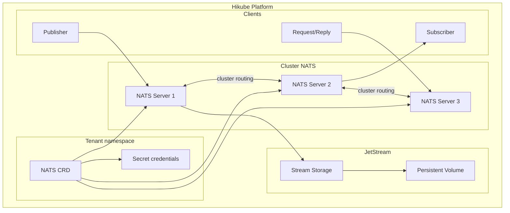
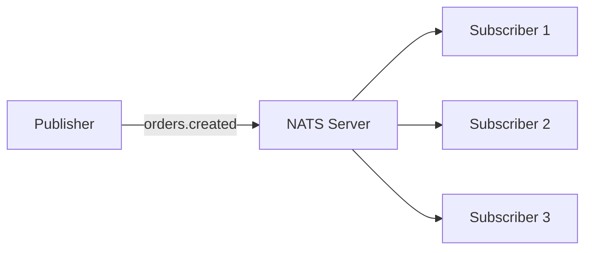
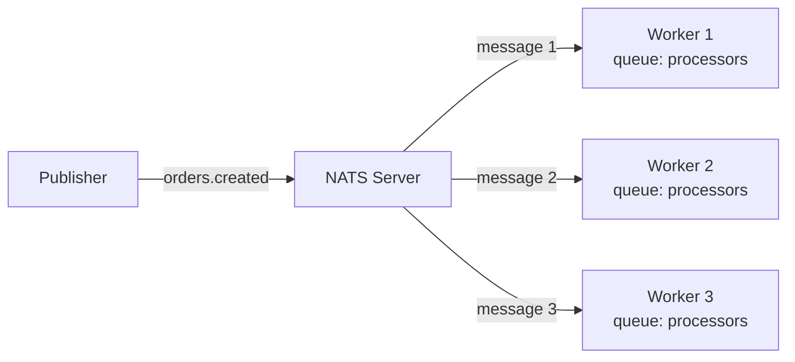
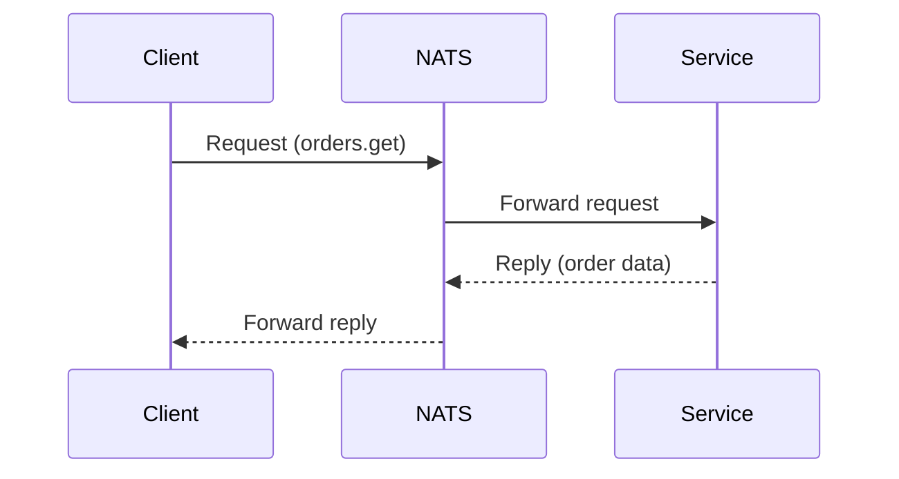

# Concetti — NATS

## Architettura

NATS su Hikube è un servizio di messaggistica gestito, ultra-leggero e ad alte prestazioni. Ogni istanza distribuita tramite la risorsa `NATS` crea un cluster di server con supporto opzionale di **JetStream** per la persistenza dei messaggi.

---

## Terminologia

| Termine | Descrizione |
|---------|-------------|
| **NATS** | Risorsa Kubernetes (`apps.cozystack.io/v1alpha1`) che rappresenta un cluster NATS gestito. |
| **Subject** | Indirizzo di routing dei messaggi (es: `orders.created`). Supporta i wildcard (`*`, `>`). |
| **Publish/Subscribe** | Modello di comunicazione in cui i publisher inviano messaggi a un subject e i subscriber li ricevono. |
| **JetStream** | Estensione di persistenza di NATS — archiviazione durevole dei messaggi con replay, acknowledgment e consumer. |
| **Stream** | Collezione persistente di messaggi in JetStream, con politica di retention configurabile. |
| **Consumer** | Abbonamento durevole in JetStream con tracciamento della posizione (offset) e acknowledgment. |
| **Request/Reply** | Modello di comunicazione sincrono — un client invia una richiesta e attende una risposta. |
| **resourcesPreset** | Profilo di risorse predefinito (da nano a 2xlarge). |

---

## Modelli di comunicazione

NATS supporta tre modelli di comunicazione:

### Publish/Subscribe

Il modello più semplice — un publisher invia un messaggio, tutti i subscriber ricevono una copia:

### Queue Groups

I subscriber di uno stesso queue group si ripartiscono i messaggi (load balancing):

### Request/Reply

Comunicazione sincrona con risposta attesa:

---

## JetStream

JetStream aggiunge la **persistenza** a NATS:

- I messaggi sono archiviati su disco negli **stream**
- I **consumer** tracciano la propria posizione e possono rileggere i messaggi
- Supporto per la consegna **at-least-once** e **exactly-once**
- Retention configurabile per durata, numero di messaggi o dimensione

:::tip
Attivate JetStream solo se avete bisogno di persistenza. Per il pub/sub effimero, il NATS di base è più leggero (< 10 MB di RAM per istanza).
:::

---

## Gestione degli utenti

Gli utenti NATS sono dichiarati nel manifesto con una password. Le credenziali sono archiviate nel Secret `<istanza>-credentials`.

---

## Preset di risorse

| Preset | CPU | Memoria |
|--------|-----|---------|
| `nano` | 250m | 128Mi |
| `micro` | 500m | 256Mi |
| `small` | 1 | 512Mi |
| `medium` | 1 | 1Gi |
| `large` | 2 | 2Gi |
| `xlarge` | 4 | 4Gi |
| `2xlarge` | 8 | 8Gi |

---

## Limiti e quote

| Parametro | Valore |
|-----------|--------|
| Repliche max | Secondo la quota del tenant |
| Impronta di memoria minima | < 10 MB per istanza (senza JetStream) |
| Dimensione archiviazione JetStream | Variabile (in Gi) |
| Latenza tipica | < 1 ms (stesso datacenter) |

---

## Per approfondire

- [Panoramica](./overview.md): presentazione del servizio
- [Riferimento API](./api-reference.md): tutti i parametri della risorsa NATS
