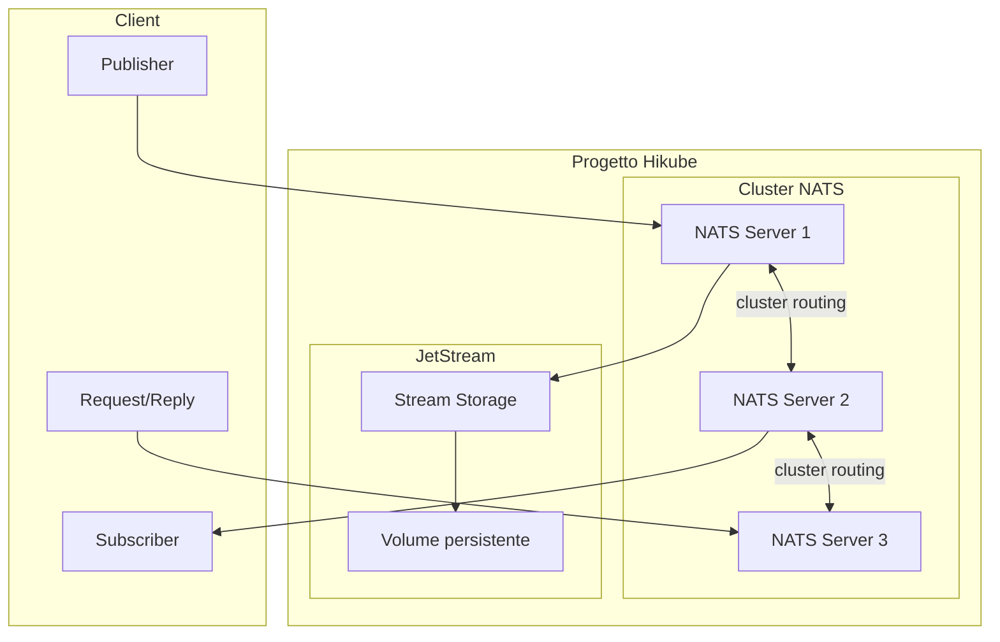
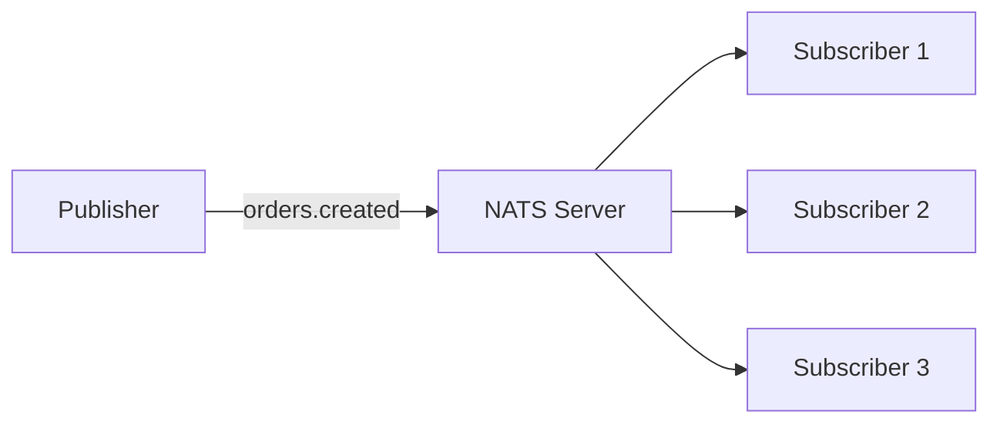
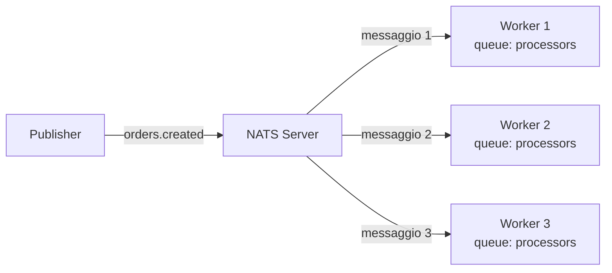
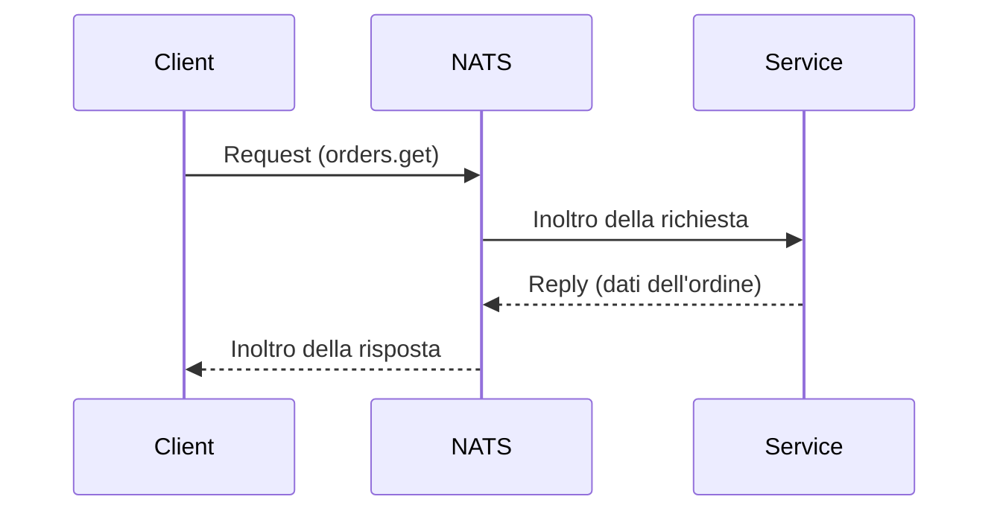

# Concetti — NATS

:::info Disponibilità
NATS non è ancora disponibile in self-service nella [console Hikube](https://console.hikube.cloud).
Per effettuare il provisioning di un'istanza o modificarne la configurazione, [contatti il supporto](mailto:support@hidora.io).
:::

## Architettura

NATS su Hikube è un servizio di messaggistica gestito, ultraleggero e ad alte prestazioni. Ogni istanza è un cluster di server NATS associato a un progetto Hikube, con supporto opzionale di **JetStream** per la persistenza dei messaggi.

```mermaid
graph TB
    subgraph "Progetto Hikube"
        subgraph "Cluster NATS"
            N1[NATS Server 1]
            N2[NATS Server 2]
            N3[NATS Server 3]
        end

        subgraph "JetStream"
            JS[Stream Storage]
            PV[Volume persistente]
        end
    end

    subgraph "Client"
        PUB[Publisher]
        SUB[Subscriber]
        REQ[Request/Reply]
    end

    N1 <-->|cluster routing| N2
    N2 <-->|cluster routing| N3
    N1 --> JS
    JS --> PV
    PUB --> N1
    N2 --> SUB
    REQ --> N3
```

---

## Terminologia

| Termine | Descrizione |
|---------|-------------|
| **NATS (istanza)** | Cluster NATS gestito da Hikube, associato a un progetto. La sua configurazione viene definita alla creazione e modificata su richiesta al supporto. |
| **Subject** | Indirizzo di instradamento dei messaggi (es. `orders.created`). Supporta i caratteri jolly (`*`, `>`). |
| **Publish/Subscribe** | Modello di comunicazione in cui i publisher inviano messaggi a un subject e i subscriber li ricevono. |
| **JetStream** | Estensione di persistenza di NATS: archiviazione durevole dei messaggi con replay, acknowledgment e consumer. |
| **Stream** | Raccolta persistente di messaggi in JetStream, con politica di conservazione configurabile. |
| **Consumer** | Sottoscrizione durevole in JetStream con tracciamento della posizione (offset) e acknowledgment. |
| **Request/Reply** | Modello di comunicazione sincrono: un client invia una richiesta e attende una risposta. |
| **Preset di risorse** | Profilo CPU/memoria predefinito (da nano a 2xlarge). |

---

## Modelli di comunicazione

NATS supporta tre modelli di comunicazione:

### Publish/Subscribe

Il modello più semplice: un publisher invia un messaggio e tutti i subscriber ne ricevono una copia:

```mermaid
graph LR
    PUB[Publisher] -->|"orders.created"| NATS[NATS Server]
    NATS --> SUB1[Subscriber 1]
    NATS --> SUB2[Subscriber 2]
    NATS --> SUB3[Subscriber 3]
```

### Queue Groups

I subscriber di uno stesso queue group si ripartiscono i messaggi (load balancing):

```mermaid
graph LR
    PUB[Publisher] -->|"orders.created"| NATS[NATS Server]
    NATS -->|"messaggio 1"| S1[Worker 1<br/>queue: processors]
    NATS -->|"messaggio 2"| S2[Worker 2<br/>queue: processors]
    NATS -->|"messaggio 3"| S3[Worker 3<br/>queue: processors]
```

### Request/Reply

Comunicazione sincrona con risposta attesa:

```mermaid
sequenceDiagram
    participant Client
    participant NATS
    participant Service

    Client->>NATS: Request (orders.get)
    NATS->>Service: Inoltro della richiesta
    Service-->>NATS: Reply (dati dell'ordine)
    NATS-->>Client: Inoltro della risposta
```

---

## JetStream

JetStream aggiunge la **persistenza** a NATS:

- I messaggi vengono archiviati su disco in **stream**
- I **consumer** tengono traccia della propria posizione e possono rileggere i messaggi
- Supporto della consegna **at-least-once** ed **exactly-once**
- Conservazione configurabile per durata, numero di messaggi o dimensione

L'attivazione di JetStream e la dimensione del suo volume fanno parte della configurazione dell'istanza. Stream e consumer si creano poi dai propri client (CLI `nats` o SDK).

:::tip
JetStream è utile solo se ha bisogno di persistenza. Per un pub/sub effimero, il NATS di base è più leggero.
:::

---

## Gestione degli utenti

Gli utenti NATS (nome e password) fanno parte della configurazione dell'istanza. La loro creazione o modifica va richiesta al supporto, che le trasmette le credenziali.

---

## Preset di risorse

| Preset | CPU | Memoria |
|--------|-----|---------|
| `nano` | 250m | 128Mi |
| `micro` | 500m | 256Mi |
| `small` | 1 | 512Mi |
| `medium` | 1 | 1Gi |
| `large` | 2 | 2Gi |
| `xlarge` | 4 | 4Gi |
| `2xlarge` | 8 | 8Gi |

---

## Limiti e quote

| Parametro | Valore |
|-----------|--------|
| Repliche max | In base alle quote del progetto |
| Ingombro di memoria minimo | Ridotto (pochi MB per istanza senza JetStream) |
| Dimensione dello storage JetStream | Definita alla creazione dell'istanza |
| Latenza tipica | < 1 ms (stesso datacenter) |

---

## Per approfondire

- [Panoramica](./overview.md): presentazione del servizio
- [Avvio rapido](./quick-start.md): richiedere un'istanza e testarla
